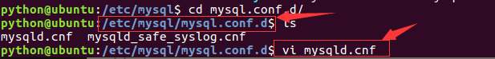
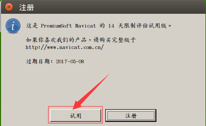

# 一、安装

## 1. 服务器端安装

- 安装服务器端：在终端中输入如下命令，回车后，然后按照提示输入

```
sudo apt-get install mysql-server
```

- 当前使用的ubuntu镜像中已经安装好了mysql服务器端，无需再安装，并且设置成了开机自启动
- 服务器用于接收客户端的请求、执行sql语句、管理数据库
- 服务器端一般以服务方式管理，名称为mysql
- 启动服务

```
sudo service mysql start
```

- 查看进程中是否存在mysql服务

```
ps ajx|grep mysql
```


- 停止服务

```
sudo service mysql stop
```

- 重启服务

```
sudo service mysql restart
```

### 配置

- 配置文件目录为/etc/mysql/mysql.cnf


- 进入conf.d目录，打开mysql.cnf，发现并没有配置
- 进入mysql.conf.d目录，打开mysql.cnf，可以看到配置项



- 主要配置项如下

```
bind-address表示服务器绑定的ip，默认为127.0.0.1

port表示端口，默认为3306

datadir表示数据库目录，默认为/var/lib/mysql

general_log_file表示普通日志，默认为/var/log/mysql/mysql.log

log_error表示错误日志，默认为/var/log/mysql/error.log
```

## 2. 客户端安装

- 客户端为开发人员与dba使用，通过socket方式与服务端通信，常用的有navicat、命令行mysql

#### 图形化界面客户端navicat

- 可以到[Navicat官网](https://www.navicat.com.cn/)下载
- 将压缩文件拷贝到ubuntu虚拟机中，放到桌面上，解压

```
tar zxvf navicat112_mysql_cs_x64.tar.gz
```

- 进入解压的目录，运行如下命令

```
./start_navicat
```

- 启动如下图，详细功能见下节


- 点击两次“取消”按钮后如下图



- 点击“试用”按钮后如下图


- 问题一：中文乱码
- 解决：打开start_navicat文件

```
将export LANG="en_US.UTF-8"改为export LANG="zh_CN.UTF-8"
```

- 问题二：试用期
- 解决：删除用户目录下的.navicat64目录

```
cd ~
rm -r .navicat64
```

#### 命令行客户端

- 在终端运行如下命令，按提示填写信息

```
sudo apt-get install mysql-client
```

- 当前使用的ubuntu镜像中已经安装好了mysql客户端，无需再安装
- 详细连接的命令可以查看帮助文档

```
mysql --help
```

- 最基本的连接命令如下，输入后回车

```
mysql -u root -p密码
```

- 连接成功后提示如下图


- 按ctrl+d或输入如下命令退出

```
quit 或者 exit
```

------


# 二、数据完整性

- 一个数据库就是一个完整的业务单元，可以包含多张表，数据被存储在表中
- 在表中为了更加准确的存储数据，保证数据的正确有效，可以在创建表的时候，为表添加一些强制性的验证，包括数据字段的类型、约束

## 数据类型

- 可以通过查看帮助文档查阅所有支持的数据类型
- 使用数据类型的原则是：够用就行，尽量使用取值范围小的，而不用大的，这样可以更多的节省存储空间
- 常用数据类型如下：
  - 整数：int，bit
  - 小数：decimal
  - 字符串：varchar,char
  - 日期时间: date, time, datetime
  - 枚举类型(enum)
- 特别说明的类型如下：
  - decimal表示浮点数，如decimal(5,2)表示共存5位数，小数占2位
  - char表示固定长度的字符串，如char(3)，如果填充'ab'时会补一个空格为`'ab '`
  - varchar表示可变长度的字符串，如varchar(3)，填充'ab'时就会存储'ab'
  - 字符串text表示存储大文本，当字符大于4000时推荐使用
  - 对于图片、音频、视频等文件，不存储在数据库中，而是上传到某个服务器上，然后在表中存储这个文件的保存路径
- 更全的数据类型可以参考http://blog.csdn.net/anxpp/article/details/51284106

## 约束

- 主键primary key：物理上存储的顺序
- 非空not null：此字段不允许填写空值
- 惟一unique：此字段的值不允许重复
- 默认default：当不填写此值时会使用默认值，如果填写时以填写为准
- 外键foreign key：对关系字段进行约束，当为关系字段填写值时，会到关联的表中查询此值是否存在，如果存在则填写成功，如果不存在则填写失败并抛出异常
- 说明：虽然外键约束可以保证数据的有效性，但是在进行数据的crud（增加、修改、删除、查询）时，都会降低数据库的性能，所以不推荐使用，那么数据的有效性怎么保证呢？答：可以在逻辑层进行控制

> 数值类型(常用)

| 类型        | 字节大小 | 有符号范围(Signed)                         | 无符号范围(Unsigned)     |
| :---------- | :------- | :----------------------------------------- | :----------------------- |
| TINYINT     | 1        | -128 ~ 127                                 | 0 ~ 255                  |
| SMALLINT    | 2        | -32768 ~ 32767                             | 0 ~ 65535                |
| MEDIUMINT   | 3        | -8388608 ~ 8388607                         | 0 ~ 16777215             |
| INT/INTEGER | 4        | -2147483648 ~2147483647                    | 0 ~ 4294967295           |
| BIGINT      | 8        | -9223372036854775808 ~ 9223372036854775807 | 0 ~ 18446744073709551615 |

> 字符串

| 类型    | 字节大小 | 示例                                                         |
| :------ | :------- | :----------------------------------------------------------- |
| CHAR    | 0-255    | 类型:char(3) 输入 'ab', 实际存储为'ab ', 输入'abcd' 实际存储为 'abc' |
| VARCHAR | 0-255    | 类型:varchar(3) 输 'ab',实际存储为'ab', 输入'abcd',实际存储为'abc' |
| TEXT    | 0-65535  | 大文本                                                       |

> 日期时间类型

| 类型      | 字节大小 | 示例                                                  |
| :-------- | :------- | :---------------------------------------------------- |
| DATE      | 4        | '2020-01-01'                                          |
| TIME      | 3        | '12:29:59'                                            |
| DATETIME  | 8        | '2020-01-01 12:29:59'                                 |
| YEAR      | 1        | '2017'                                                |
| TIMESTAMP | 4        | '1970-01-01 00:00:01' UTC ~ '2038-01-01 00:00:01' UTC |