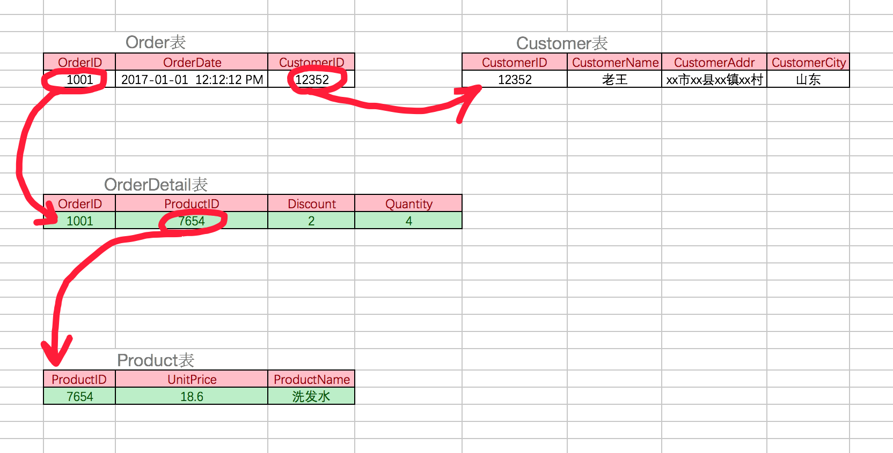

# 数据库设计

- 关系型数据库建议在E-R模型的基础上，我们需要根据产品经理的设计策划，抽取出来模型与关系，制定出表结构，这是项目开始的第一步
- 在开发中有很多设计数据库的软件，常用的如power designer，db desinger等，这些软件可以直观的看到实体及实体间的关系
- 设计数据库，可能是由专门的数据库设计人员完成，也可能是由开发组成员完成，一般是项目经理带领组员来完成
- 现阶段不需要独立完成数据库设计，但是要注意积累一些这方面的经验

## 三范式

- 经过研究和对使用中问题的总结，对于设计数据库提出了一些规范，这些规范被称为范式(Normal Form)

- 目前有迹可寻的共有8种范式，一般需要遵守3范式即可

- ◆ 第一范式（1NF）：强调的是列的原子性，即列不能够再分成其他几列。

  > 考虑这样一个表：【联系人】（姓名，性别，电话） 如果在实际场景中，一个联系人有家庭电话和公司电话，那么这种表结构设计就没有达到 1NF。要符合 1NF 我们只需把列（电话）拆分，即：【联系人】（姓名，性别，家庭电话，公司电话）。1NF 很好辨别，但是 2NF 和 3NF 就容易搞混淆。

- ◆ 第二范式（2NF）：首先是 1NF，另外包含两部分内容，一是表必须有一个主键；二是没有包含在主键中的列必须完全依赖于主键，而不能只依赖于主键的一部分。

  > 考虑一个订单明细表：【OrderDetail】（OrderID，ProductID，UnitPrice，Discount，Quantity，ProductName）。 因为我们知道在一个订单中可以订购多种产品，所以单单一个 OrderID 是不足以成为主键的，主键应该是（OrderID，ProductID）。显而易见 Discount（折扣），Quantity（数量）完全依赖（取决）于主键（OderID，ProductID），而 UnitPrice，ProductName 只依赖于 ProductID。所以 OrderDetail 表不符合 2NF。不符合 2NF 的设计容易产生冗余数据。
  >
  > 可以把【OrderDetail】表拆分为【OrderDetail】（OrderID，ProductID，Discount，Quantity）和【Product】（ProductID，UnitPrice，ProductName）来消除原订单表中UnitPrice，ProductName多次重复的情况。

- ◆ 第三范式（3NF）：首先是 2NF，另外非主键列必须直接依赖于主键，不能存在传递依赖。即不能存在：非主键列 A 依赖于非主键列 B，非主键列 B 依赖于主键的情况。

  > 考虑一个订单表【Order】（OrderID，OrderDate，CustomerID，CustomerName，CustomerAddr，CustomerCity）主键是（OrderID）。 其中 OrderDate，CustomerID，CustomerName，CustomerAddr，CustomerCity 等非主键列都完全依赖于主键（OrderID），所以符合 2NF。不过问题是 CustomerName，CustomerAddr，CustomerCity 直接依赖的是 CustomerID（非主键列），而不是直接依赖于主键，它是通过传递才依赖于主键，所以不符合 3NF。 通过拆分【Order】为【Order】（OrderID，OrderDate，CustomerID）和【Customer】（CustomerID，CustomerName，CustomerAddr，CustomerCity）从而达到 3NF。 *第二范式（2NF）和第三范式（3NF）的概念很容易混淆，区分它们的关键点在于，2NF：非主键列是否完全依赖于主键，还是依赖于主键的一部分；3NF：非主键列是直接依赖于主键，还是直接依赖于非主键列。

### 不遵循1NF


### 不遵循2NF


### 不遵循3NF


### 最终表



#### E-R模型

- E表示entry，实体，设计实体就像定义一个类一样，指定从哪些方面描述对象，一个实体转换为数据库中的一个表
- R表示relationship，关系，关系描述两个实体之间的对应规则，关系的类型包括包括一对一、一对多、多对多
- 关系也是一种数据，需要通过一个字段存储在表中
- 实体A对实体B为1对1，则在表A或表B中创建一个字段，存储另一个表的主键值


- 实体A对实体B为1对多：在表B中创建一个字段，存储表A的主键值


- 实体A对实体B为多对多：新建一张表C，这个表只有两个字段，一个用于存储A的主键值，一个用于存储B的主键值


- 想一想：举些例子，满足一对一、一对多、多对多的对应关系

#### 逻辑删除

- 对于重要数据，并不希望物理删除，一旦删除，数据无法找回
- 删除方案：设置isDelete的列，类型为bit，表示逻辑删除，默认值为0
- 对于非重要数据，可以进行物理删除
- 数据的重要性，要根据实际开发决定

#### 示例

- 设计两张表：班级表、学生表
- 班级表classes
  - id
  - name
  - isdelete
- 学生表students
  - id
  - name
  - birthday
  - gender
  - clsid
  - isdelete


## 多表关系

```sql
1. 多表之间的关系
	1. 分类：
		1. 一对一(了解)：
			* 如：人和身份证
			* 分析：一个人只有一个身份证，一个身份证只能对应一个人
		2. 一对多(多对一)：
			* 如：部门和员工
			* 分析：一个部门有多个员工，一个员工只能对应一个部门
		3. 多对多：
			* 如：学生和课程
			* 分析：一个学生可以选择很多门课程，一个课程也可以被很多学生选择
	2. 实现关系：
		1. 一对多(多对一)：
			* 如：部门和员工
			* 实现方式：在多的一方建立外键，指向一的一方的主键。
		2. 多对多：
			* 如：学生和课程
			* 实现方式：多对多关系实现需要借助第三张中间表。中间表至少包含两个字段，这两个字段作为第三张表的外键，分别指向两张表的主键
		3. 一对一(了解)：
			* 如：人和身份证
			* 实现方式：一对一关系实现，可以在任意一方添加唯一外键指向另一方的主键。

	3. 案例
		-- 创建旅游线路分类表 tab_category
		-- cid 旅游线路分类主键，自动增长
		-- cname 旅游线路分类名称非空，唯一，字符串 100
		CREATE TABLE tab_category (
			cid INT PRIMARY KEY AUTO_INCREMENT,
			cname VARCHAR(100) NOT NULL UNIQUE
		);
		
		-- 创建旅游线路表 tab_route
		/*
		rid 旅游线路主键，自动增长
		rname 旅游线路名称非空，唯一，字符串 100
		price 价格
		rdate 上架时间，日期类型
		cid 外键，所属分类
		*/
		CREATE TABLE tab_route(
			rid INT PRIMARY KEY AUTO_INCREMENT,
			rname VARCHAR(100) NOT NULL UNIQUE,
			price DOUBLE,
			rdate DATE,
			cid INT,
			FOREIGN KEY (cid) REFERENCES tab_category(cid)
		);
		
		/*创建用户表 tab_user
		uid 用户主键，自增长
		username 用户名长度 100，唯一，非空
		password 密码长度 30，非空
		name 真实姓名长度 100
		birthday 生日
		sex 性别，定长字符串 1
		telephone 手机号，字符串 11
		email 邮箱，字符串长度 100
		*/
		CREATE TABLE tab_user (
			uid INT PRIMARY KEY AUTO_INCREMENT,
			username VARCHAR(100) UNIQUE NOT NULL,
			PASSWORD VARCHAR(30) NOT NULL,
			NAME VARCHAR(100),
			birthday DATE,
			sex CHAR(1) DEFAULT '男',
			telephone VARCHAR(11),
			email VARCHAR(100)
		);
		
		/*
		创建收藏表 tab_favorite
		rid 旅游线路 id，外键
		date 收藏时间
		uid 用户 id，外键
		rid 和 uid 不能重复，设置复合主键，同一个用户不能收藏同一个线路两次
		*/
		CREATE TABLE tab_favorite (
			rid INT, -- 线路id
			DATE DATETIME,
			uid INT, -- 用户id
			-- 创建复合主键
			PRIMARY KEY(rid,uid), -- 联合主键
			FOREIGN KEY (rid) REFERENCES tab_route(rid),
			FOREIGN KEY(uid) REFERENCES tab_user(uid)
		);
```


#### 扩展阅读

- 看看别人家设计的规范
- [58到家数据库30条军规解读](http://mp.weixin.qq.com/s/Yjh_fPgrjuhhOZyVtRQ-SA)