## 一、视图

### 1. 问题

对于复杂的查询，往往是有多个数据表进行关联查询而得到，如果数据库因为需求等原因发生了改变，为了保证查询出来的数据与之前相同，则需要在多个地方进行修改，维护起来非常麻烦

解决办法：定义视图

### 2. 视图是什么

通俗的讲，视图就是一条SELECT语句执行后返回的结果集。所以我们在创建视图的时候，主要的工作就落在创建这条SQL查询语句上。

视图是对若干张基本表的引用，一张虚表，查询语句执行的结果，不存储具体的数据（基本表数据发生了改变，视图也会跟着改变）；

方便操作，特别是查询操作，减少复杂的SQL语句，增强可读性；

### 3. 定义视图

建议以v_开头

```sql
create view 视图名称 as select语句;
```

### 4. 查看视图

查看表会将所有的视图也列出来

```sql
show tables;
```

### 5. 使用视图

视图的用途就是查询

```sql
select * from v_stu_score;
```

### 6. 删除视图

```sql
drop view 视图名称;
例：
drop view v_stu_sco;
```

### 7. 视图demo

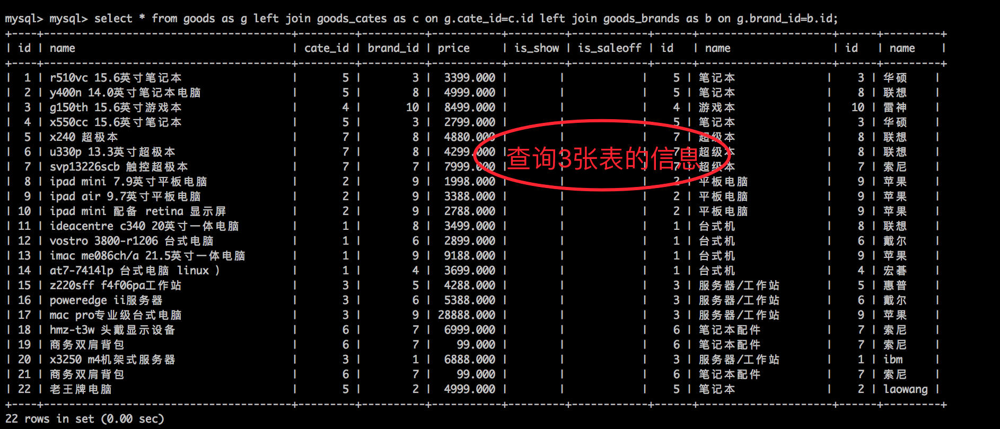

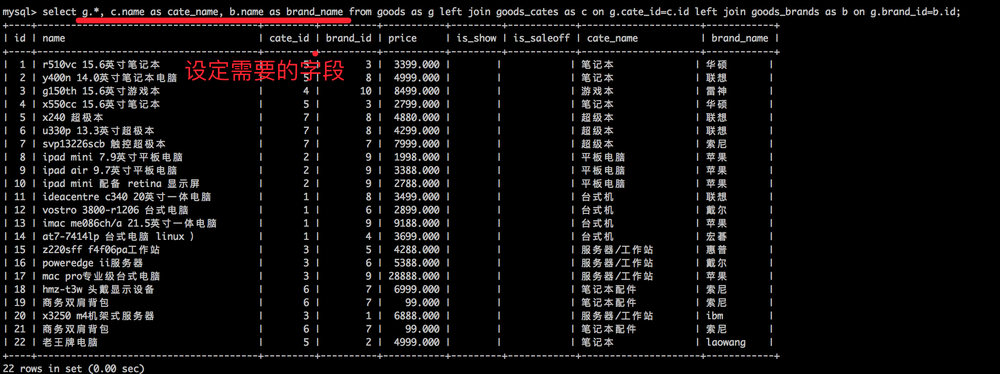

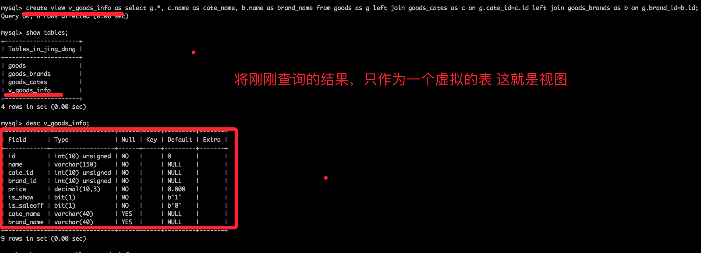

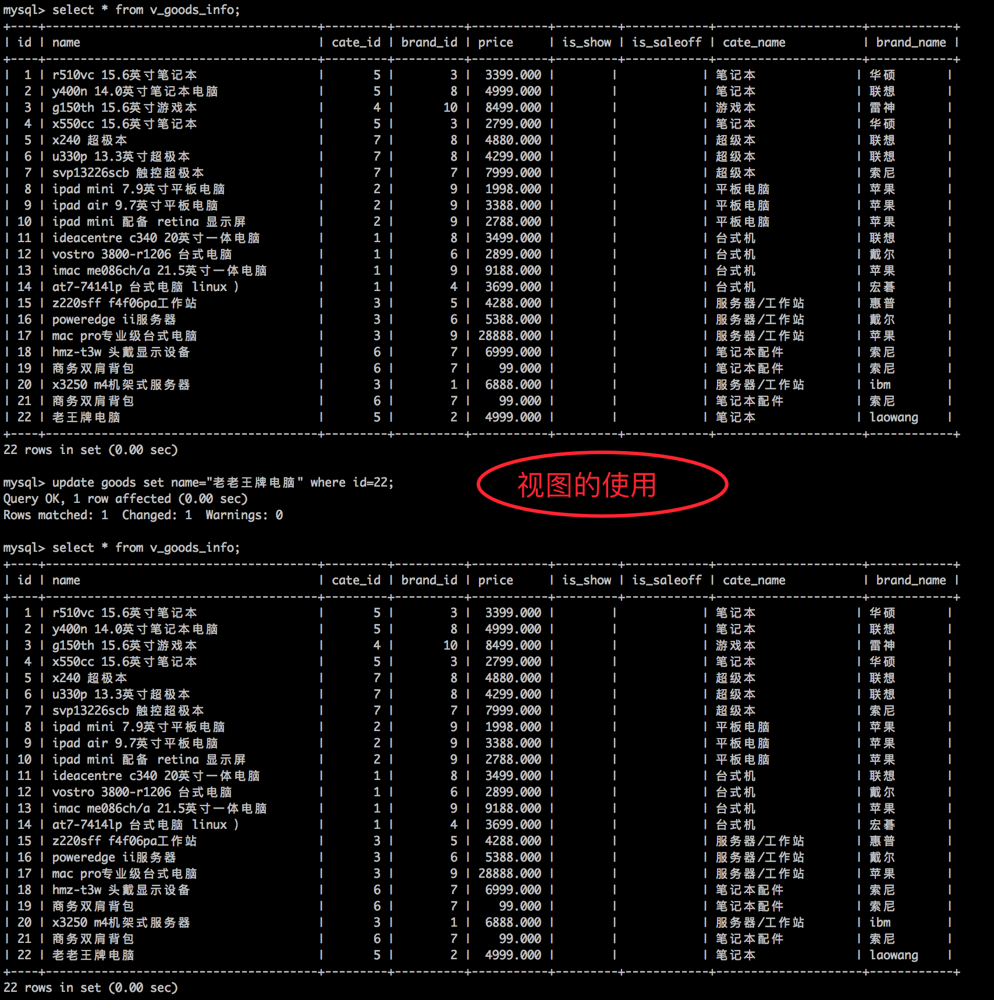

### 8. 视图的作用

1. 提高了重用性，就像一个函数
2. 对数据库重构，却不影响程序的运行
3. 提高了安全性能，可以对不同的用户
4. 让数据更加清晰


## 二、事务

### 1. 为什么要有事务

事务广泛的运用于订单系统、银行系统等多种场景

例如：

> A用户和B用户是银行的储户，现在A要给B转账500元，那么需要做以下几件事：
>
> 1. 检查A的账户余额>500元；
> 2. A 账户中扣除500元;
> 3. B 账户中增加500元;

正常的流程走下来，A账户扣了500，B账户加了500，皆大欢喜。

那如果A账户扣了钱之后，系统出故障了呢？A白白损失了500，而B也没有收到本该属于他的500。

以上的案例中，隐藏着一个前提条件：A扣钱和B加钱，要么同时成功，要么同时失败。事务的需求就在于此

所谓事务,它是一个操作序列，这些操作要么都执行，要么都不执行，它是一个不可分割的工作单位。

例如，银行转帐工作：从一个帐号扣款并使另一个帐号增款，这两个操作要么都执行，要么都不执行。所以，应该把他们看成一个事务。事务是数据库维护数据一致性的单位，在每个事务结束时，都能保持数据一致性

### 2. 事务四大特性(简称ACID)

- 原子性(Atomicity)
- 一致性(Consistency)
- 隔离性(Isolation)
- 持久性(Durability)

以下内容出自《高性能MySQL》第三版，了解事务的ACID及四种隔离级有助于我们更好的理解事务运作。

下面举一个银行应用是解释事务必要性的一个经典例子。假如一个银行的数据库有两张表：支票表（checking）和储蓄表（savings）。现在要从用户Jane的支票账户转移200美元到她的储蓄账户，那么至少需要三个步骤：

1. 检查支票账户的余额高于或者等于200美元。
2. 从支票账户余额中减去200美元。
3. 在储蓄帐户余额中增加200美元。

上述三个步骤的操作必须打包在一个事务中，任何一个步骤失败，则必须回滚所有的步骤。

可以用START TRANSACTION语句开始一个事务，然后要么使用COMMIT提交将修改的数据持久保存，要么使用ROLLBACK撤销所有的修改。事务SQL的样本如下：

1. start transaction;
2. select balance from checking where customer_id = 10233276;
3. update checking set balance = balance - 200.00 where customer_id = 10233276;
4. update savings set balance = balance + 200.00 where customer_id = 10233276;
5. commit;

一个很好的事务处理系统，必须具备这些标准特性：

- 原子性（atomicity）

> 一个事务必须被视为一个不可分割的最小工作单元，整个事务中的所有操作要么全部提交成功，要么全部失败回滚，对于一个事务来说，不可能只执行其中的一部分操作，这就是事务的原子性

- 一致性（consistency）

> 数据库总是从一个一致性的状态转换到另一个一致性的状态。（在前面的例子中，一致性确保了，即使在执行第三、四条语句之间时系统崩溃，支票账户中也不会损失200美元，因为事务最终没有提交，所以事务中所做的修改也不会保存到数据库中。）

- 隔离性（isolation）

> 通常来说，一个事务所做的修改在最终提交以前，对其他事务是不可见的。（在前面的例子中，当执行完第三条语句、第四条语句还未开始时，此时有另外的一个账户汇总程序开始运行，则其看到支票帐户的余额并没有被减去200美元。）

- 持久性（durability）

> 一旦事务提交，则其所做的修改会永久保存到数据库。（此时即使系统崩溃，修改的数据也不会丢失。）

### 3. 事务命令

表的引擎类型必须是innodb类型才可以使用事务，这是mysql表的默认引擎

#### 查看表的创建语句，可以看到engine=innodb

```sql
-- 选择数据库
use jing_dong;
-- 查看goods表
show create table goods;
```

#### 开启事务，命令如下：

- 开启事务后执行修改命令，变更会维护到本地缓存中，而不维护到物理表中

```sql
begin;
或者
start transaction;
```

#### 提交事务，命令如下

- 将缓存中的数据变更维护到物理表中

```sql
commit;
```

#### 回滚事务，命令如下：

- 放弃缓存中变更的数据

```sql
rollback;
```

#### 注意

1. 修改数据的命令会自动的触发事务，包括insert、update、delete
2. 而在SQL语句中有手动开启事务的原因是：可以进行多次数据的修改，如果成功一起成功，否则一起会滚到之前的数据

### 4. 提交

- 为了演示效果，需要打开两个终端窗口，使用同一个数据库，操作同一张表（用到之前的jing_dong数据，可以回到mysql第3天中查看）

#### step1：连接

- 终端1：查询商品分类信息

```sql
select * from goods_cates;
```

#### step2：增加数据

- 终端2：开启事务，插入数据

```sql
begin;
insert into goods_cates(name) values('小霸王游戏机');
```

- 终端2：查询数据，此时有新增的数据

```sql
select * from goods_cates;
```

#### step3：查询

- 终端1：查询数据，发现并没有新增的数据

```sql
select * from goods_cates;
```

#### step4：提交

- 终端2：完成提交

```sql
commit;
```

#### step5：查询

- 终端1：查询，发现有新增的数据

```sql
select * from goods_cates;
```

### 5. 回滚

- 为了演示效果，需要打开两个终端窗口，使用同一个数据库，操作同一张表

#### step1：连接

- 终端1

```sql
select * from goods_cates;
```

#### step2：增加数据

- 终端2：开启事务，插入数据

```sql
begin;
insert into goods_cates(name) values('小霸王游戏机');
```

- 终端2：查询数据，此时有新增的数据

```sql
select * from goods_cates;
```

#### step3：查询

- 终端1：查询数据，发现并没有新增的数据

```sql
select * from goods_cates;
```

#### step4：回滚

- 终端2：完成回滚

```sql
rollback;
```

#### step5：查询

- 终端1：查询数据，发现没有新增的数据

```sql
select * from goods_cates;
```

### 6. 完整案列

```sql
		SELECT * FROM account;
		UPDATE account SET balance = 1000;
		-- 张三给李四转账 500 元
		
		-- 0. 开启事务
		START TRANSACTION;
		-- 1. 张三账户 -500
		
		UPDATE account SET balance = balance - 500 WHERE NAME = 'zhangsan';
		-- 2. 李四账户 +500
		-- 出错了...
		UPDATE account SET balance = balance + 500 WHERE NAME = 'lisi';
		
		-- 发现执行没有问题，提交事务
		COMMIT;
		
		-- 发现出问题了，回滚事务
		ROLLBACK;
	4. MySQL数据库中事务默认自动提交
		
		* 事务提交的两种方式：
			* 自动提交：
				* mysql就是自动提交的
				* 一条DML(增删改)语句会自动提交一次事务。
			* 手动提交：
				* Oracle 数据库默认是手动提交事务
				* 需要先开启事务，再提交
		* 修改事务的默认提交方式：
			* 查看事务的默认提交方式：SELECT @@autocommit; -- 1 代表自动提交  0 代表手动提交
			* 修改默认提交方式： set @@autocommit = 0;
```


## 三、索引

### 1. 思考

> 在图书馆中是如何找到一本书的？

一般的应用系统对比数据库的读写比例在10:1左右(即有10次查询操作时有1次写的操作)，

而且插入操作和更新操作很少出现性能问题，

遇到最多、最容易出问题还是一些复杂的查询操作，所以查询语句的优化显然是重中之重

### 2. 解决办法

当数据库中数据量很大时，查找数据会变得很慢

优化方案：索引

### 3. 索引是什么

索引是一种特殊的文件(InnoDB数据表上的索引是表空间的一个组成部分)，它们包含着对数据表里所有记录的引用指针。

更通俗的说，数据库索引好比是一本书前面的目录，能加快数据库的查询速度

### 4. 索引目的

索引的目的在于提高查询效率，可以类比字典，如果要查“mysql”这个单词，我们肯定需要定位到m字母，然后从下往下找到y字母，再找到剩下的sql。如果没有索引，那么你可能需要把所有单词看一遍才能找到你想要的，如果我想找到m开头的单词呢？或者ze开头的单词呢？是不是觉得如果没有索引，这个事情根本无法完成？

### 5. 索引原理

除了词典，生活中随处可见索引的例子，如火车站的车次表、图书的目录等。它们的原理都是一样的，通过不断的缩小想要获得数据的范围来筛选出最终想要的结果，同时把随机的事件变成顺序的事件，也就是我们总是通过同一种查找方式来锁定数据。

数据库也是一样，但显然要复杂许多，因为不仅面临着等值查询，还有范围查询(>、<、between、in)、模糊查询(like)、并集查询(or)等等。数据库应该选择怎么样的方式来应对所有的问题呢？我们回想字典的例子，能不能把数据分成段，然后分段查询呢？最简单的如果1000条数据，1到100分成第一段，101到200分成第二段，201到300分成第三段……这样查第250条数据，只要找第三段就可以了，一下子去除了90%的无效数据。


### 6. 索引的使用

- 查看索引

```sql
show index from 表名;
```

- 创建索引
  - 如果指定字段是字符串，需要指定长度，建议长度与定义字段时的长度一致
  - 字段类型如果不是字符串，可以不填写长度部分

```sql
create index 索引名称 on 表名(字段名称(长度))
```

- 删除索引：

```sql
drop index 索引名称 on 表名;
```

### 7. 索引demo

#### 7.1. 创建测试表testindex

```sql
create table test_index(title varchar(10));
```

#### 7.2 使用python程序（ipython也可以）通过pymsql模块 向表中加入十万条数据

```python
from pymysql import connect

def main():
    # 创建Connection连接
    conn = connect(host='localhost',port=3306,database='jing_dong',user='root',password='mysql',charset='utf8')
    # 获得Cursor对象
    cursor = conn.cursor()
    # 插入10万次数据
    for i in range(100000):
        cursor.execute("insert into test_index values('ha-%d')" % i)
    # 提交数据
    conn.commit()

if __name__ == "__main__":
    main()
```

#### 7.3. 查询

- 开启运行时间监测：

```sql
set profiling=1;
```

- 查找第1万条数据ha-99999

```sql
select * from test_index where title='ha-99999';
```

- 查看执行的时间：

```sql
show profiles;
```

- 为表title_index的title列创建索引：

```sql
create index title_index on test_index(title(10));
```

- 执行查询语句：

```sql
select * from test_index where title='ha-99999';
```

- 再次查看执行的时间

```sql
show profiles;
```

### 8. 注意：

> 要注意的是，建立太多的索引将会影响更新和插入的速度，因为它需要同样更新每个索引文件。对于一个经常需要更新和插入的表格，就没有必要为一个很少使用的where字句单独建立索引了，对于比较小的表，排序的开销不会很大，也没有必要建立另外的索引。
>
> 建立索引会占用磁盘空间


## 四、账户管理

- 在生产环境下操作数据库时，绝对不可以使用root账户连接，而是创建特定的账户，授予这个账户特定的操作权限，然后连接进行操作，主要的操作就是数据的crud
- MySQL账户体系：根据账户所具有的权限的不同，MySQL的账户可以分为以下几种
  - 服务实例级账号：，启动了一个mysqld，即为一个数据库实例；如果某用户如root,拥有服务实例级分配的权限，那么该账号就可以删除所有的数据库、连同这些库中的表
  - 数据库级别账号：对特定数据库执行增删改查的所有操作
  - 数据表级别账号：对特定表执行增删改查等所有操作
  - 字段级别的权限：对某些表的特定字段进行操作
  - 存储程序级别的账号：对存储程序进行增删改查的操作
- 账户的操作主要包括创建账户、删除账户、修改密码、授权权限等

注意：

1. 进行账户操作时，需要使用root账户登录，这个账户拥有最高的实例级权限
2. 通常都使用数据库级操作权限

### 1）授予权限

需要使用实例级账户登录后操作，以root为例

主要操作包括：

- 查看所有用户
- 修改密码
- 删除用户

### 1. 查看所有用户

- 所有用户及权限信息存储在mysql数据库的user表中
- 查看user表的结构

```sql
desc user;
```

- 主要字段说明：
  - Host表示允许访问的主机
  - User表示用户名
  - authentication_string表示密码，为加密后的值

查看所有用户

```sql
select host,user,authentication_string from user;
```

结果

```sql
mysql> select host,user,authentication_string from user;
+-----------+------------------+-------------------------------------------+
| host      | user             | authentication_string                     |
+-----------+------------------+-------------------------------------------+
| localhost | root             | *E74858DB86EBA20BC33D0AECAE8A8108C56B17FA |
| localhost | mysql.sys        | *THISISNOTAVALIDPASSWORDTHATCANBEUSEDHERE |
| localhost | debian-sys-maint | *EFED9C764966EDB33BB7318E1CBD122C0DFE4827 |
+-----------+------------------+-------------------------------------------+
3 rows in set (0.00 sec)
```

### 2. 创建账户、授权

- 需要使用实例级账户登录后操作，以root为例
- 常用权限主要包括：create、alter、drop、insert、update、delete、select
- 如果分配所有权限，可以使用all privileges

#### 2.1 创建账户&授权

```sql
grant 权限列表 on 数据库 to '用户名'@'访问主机' identified by '密码';
```

#### 2.2 示例1

创建一个`laowang`的账号，密码为`123456`，只能通过本地访问, 并且只能对`jing_dong`数据库中的所有表进行`读`操作

##### step1：使用root登录

```sql
mysql -uroot -p
回车后写密码，然后回车
```

##### step2：创建账户并授予所有权限

```sql
grant select on jing_dong.* to 'laowang'@'localhost' identified by '123456';
```

说明

- 可以操作python数据库的所有表，方式为:`jing_dong.*`
- 访问主机通常使用 百分号% 表示此账户可以使用任何ip的主机登录访问此数据库
- 访问主机可以设置成 localhost或具体的ip，表示只允许本机或特定主机访问

- 查看用户有哪些权限

```sql
show grants for laowang@localhost;
```

##### step3：退出root的登录

```sql
quit
```

##### step4：使用laowang账户登录

```sql
mysql -ulaowang -p
回车后写密码，然后回车
```

- 登录后效果如下图

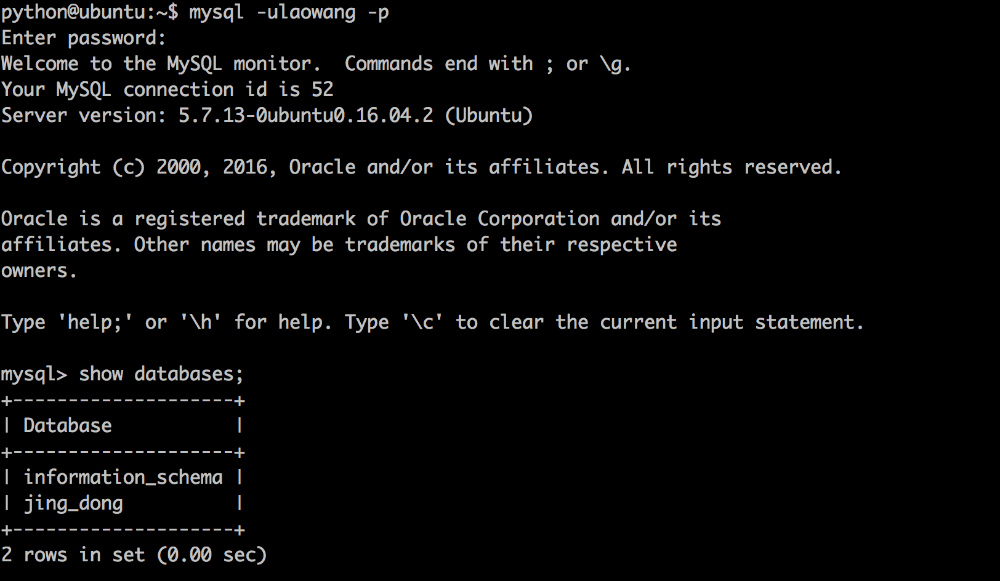

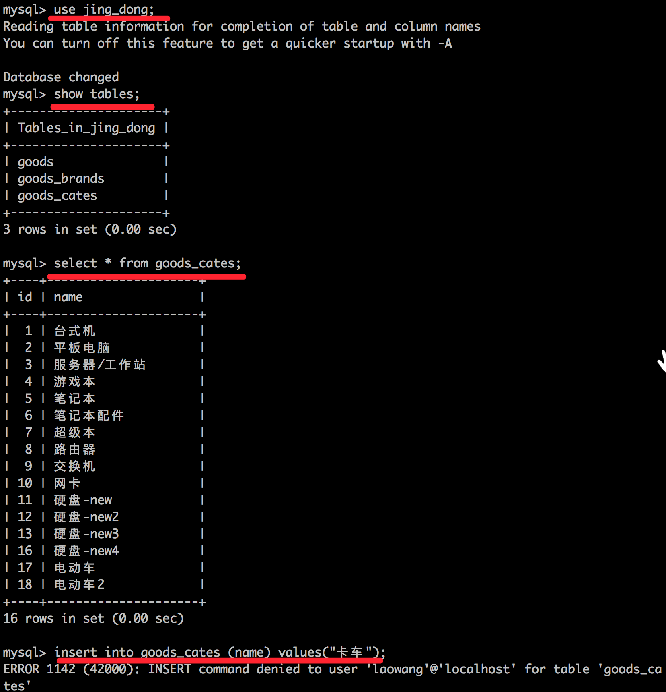


#### 2.3 示例2

创建一个`laoli`的账号，密码为`12345678`，可以任意电脑进行链接访问, 并且对`jing_dong`数据库中的所有表拥有所有权限

```sql
grant all privileges on jing_dong.* to "laoli"@"%" identified by "12345678"
```

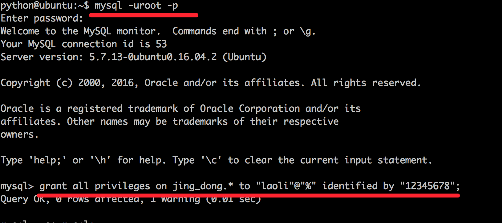


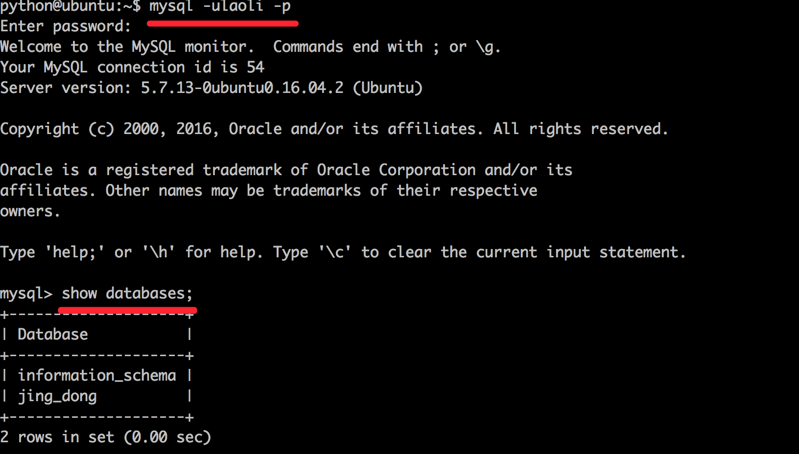

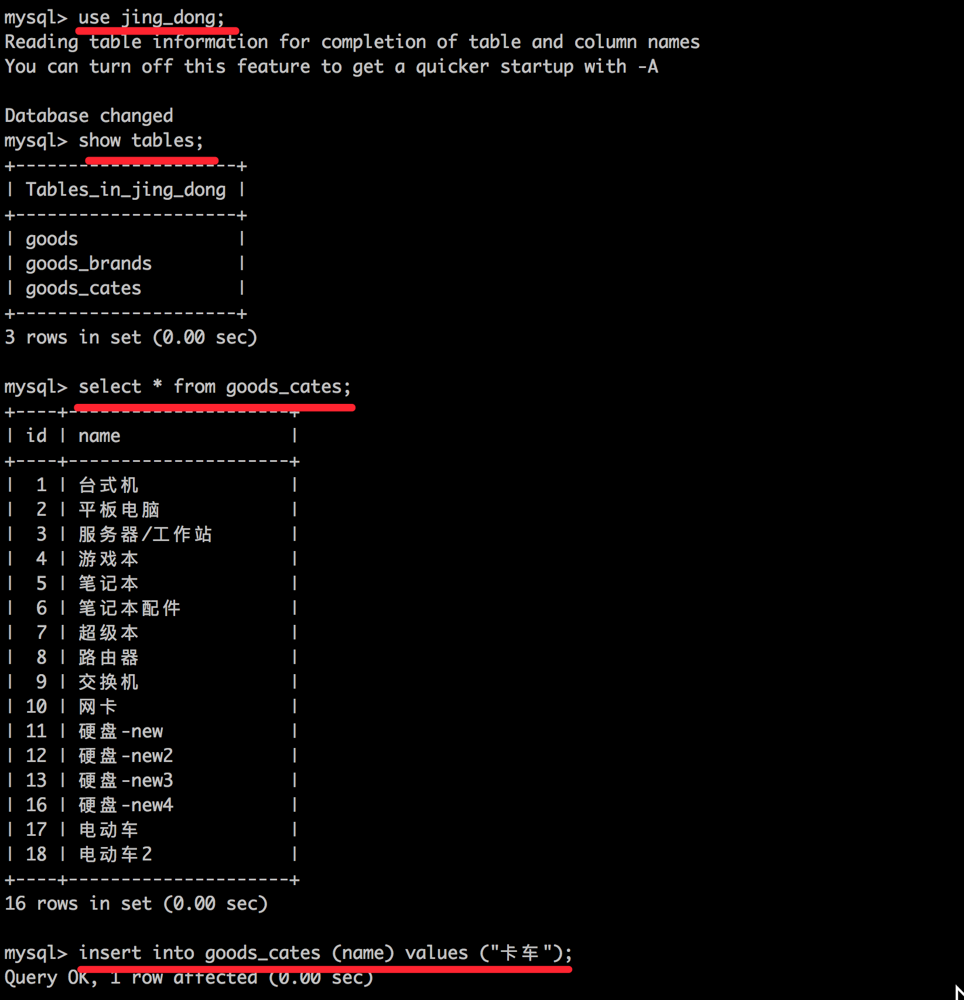


### 2）账户操作

### 1. 修改权限

```sql
grant 权限名称 on 数据库 to 账户@主机 with grant option;
```


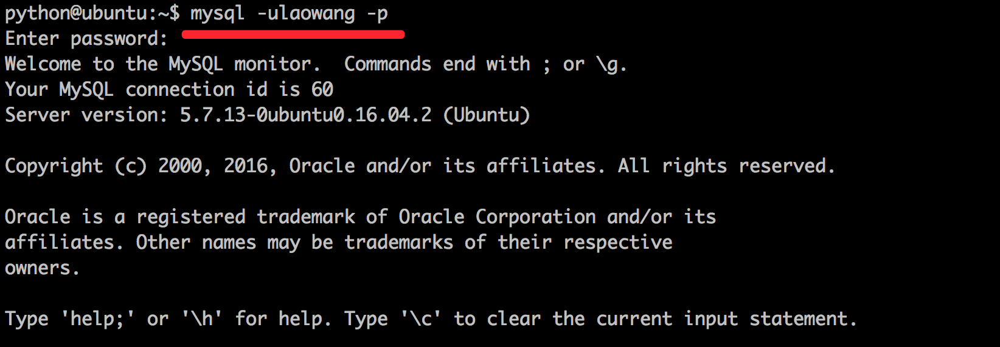

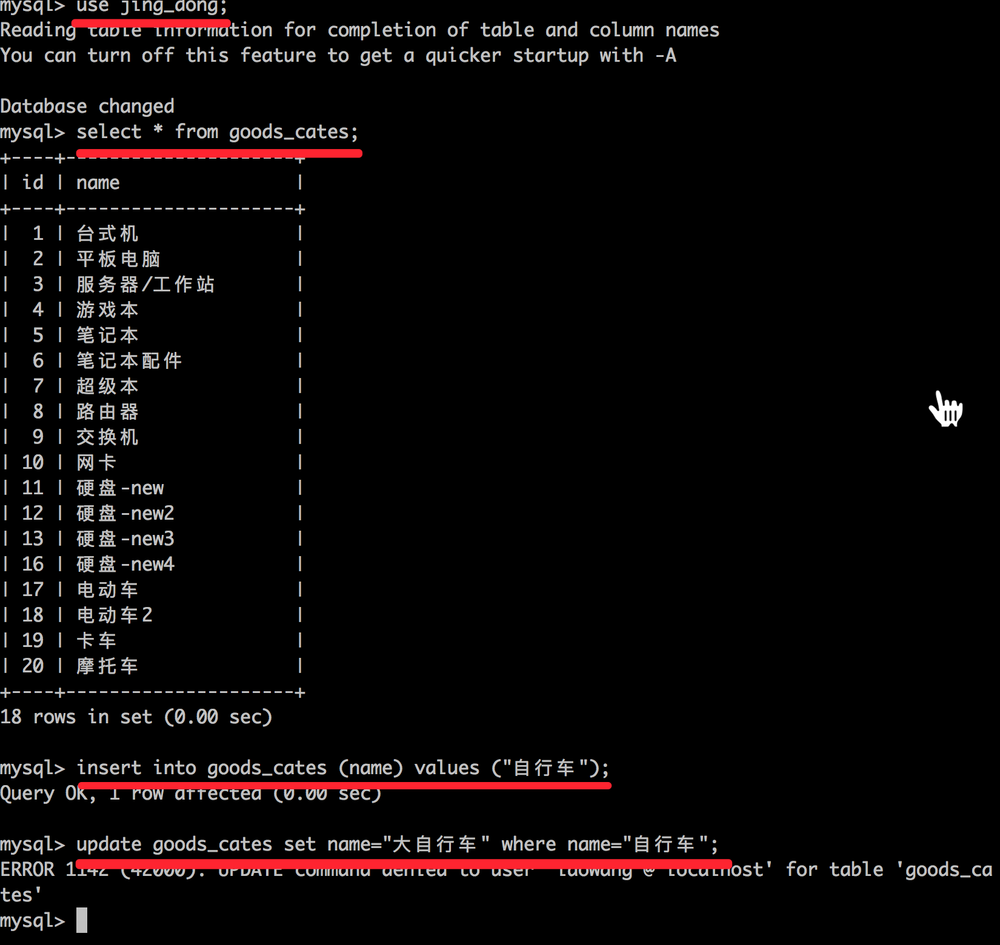


### 2. 修改密码

使用root登录，修改mysql数据库的user表

- 使用password()函数进行密码加密

  ```sql
  update user set authentication_string=password('新密码') where user='用户名';
  例：
  update user set authentication_string=password('123') where user='laowang';
  ```

- 注意修改完成后需要刷新权限

  ```sql
  刷新权限：flush privileges
  ```

### 3. 远程登录（危险慎用）

如果向在一个Ubuntu中使用msyql命令远程连接另外一台mysql服务器的话，通过以下方式即可完成，但是此方法仅仅了解就好了，不要在实际生产环境中使用

修改 /etc/mysql/mysql.conf.d/mysqld.cnf 文件

```
vim /etc/mysql/mysql.conf.d/mysqld.cnf
```

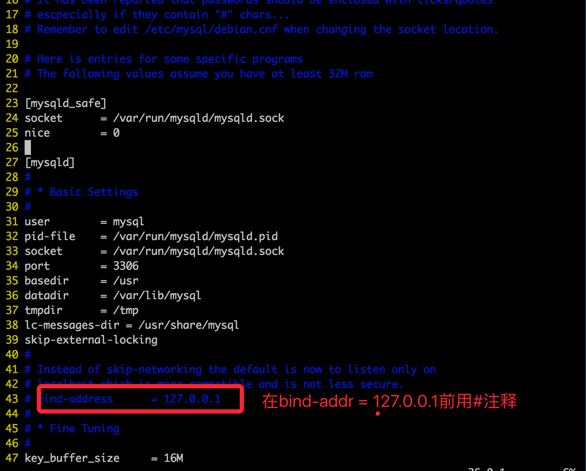

然后重启msyql

```sql
service mysql restart
```

在另外一台Ubuntu中进行连接测试

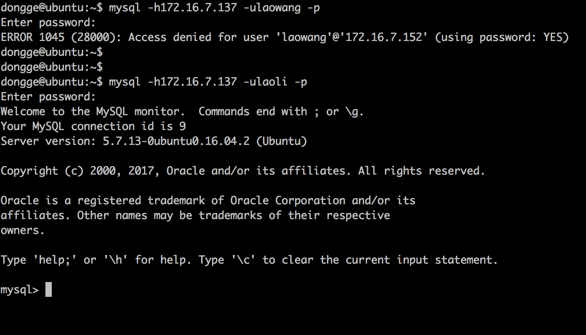

如果依然连不上，可能原因：

1) 网络不通

> 通过 ping xxx.xxx.xx.xxx可以发现网络是否正常

2)查看数据库是否配置了bind_address参数

> 本地登录数据库查看my.cnf文件和数据库当前参数show variables like 'bind_address';
>
> 如果设置了bind_address=127.0.0.1 那么只能本地登录

3)查看数据库是否设置了skip_networking参数

> 如果设置了该参数，那么只能本地登录mysql数据库

4)端口指定是否正确

### 4. 删除账户

- 语法1：使用root登录

```sql
drop user '用户名'@'主机';
例：
drop user 'laowang'@'%';
```

- 语法2：使用root登录，删除mysql数据库的user表中数据

```sql
delete from user where user='用户名';
例：
delete from user where user='laowang';

-- 操作结束之后需要刷新权限
flush privileges
```

- 推荐使用语法1删除用户, 如果使用语法1删除失败，采用语法2方式

### 3. 忘记 root 账户密码怎么办 !!

- 一般也轮不到我们来管理 root 账户,所以别瞎卖白粉的心了
- 万一呢? 到时候再来查http://blog.csdn.net/lxpbs8851/article/details/10895085

## 五、MySQL主从同步配置

### 1. 主从同步的定义

主从同步使得数据可以从一个数据库服务器复制到其他服务器上，在复制数据时，一个服务器充当主服务器（master），其余的服务器充当从服务器（slave）。因为复制是异步进行的，所以从服务器不需要一直连接着主服务器，从服务器甚至可以通过拨号断断续续地连接主服务器。通过配置文件，可以指定复制所有的数据库，某个数据库，甚至是某个数据库上的某个表。

使用主从同步的好处：

- 通过增加从服务器来提高数据库的性能，在主服务器上执行写入和更新，在从服务器上向外提供读功能，可以动态地调整从服务器的数量，从而调整整个数据库的性能。
- 提高数据安全，因为数据已复制到从服务器，从服务器可以终止复制进程，所以，可以在从服务器上备份而不破坏主服务器相应数据
- 在主服务器上生成实时数据，而在从服务器上分析这些数据，从而提高主服务器的性能

### 2. 主从同步的机制

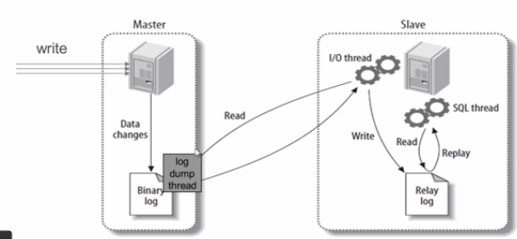

Mysql服务器之间的主从同步是基于二进制日志机制，主服务器使用二进制日志来记录数据库的变动情况，从服务器通过读取和执行该日志文件来保持和主服务器的数据一致。

在使用二进制日志时，主服务器的所有操作都会被记录下来，然后从服务器会接收到该日志的一个副本。从服务器可以指定执行该日志中的哪一类事件（譬如只插入数据或者只更新数据），默认会执行日志中的所有语句。

每一个从服务器会记录关于二进制日志的信息：文件名和已经处理过的语句，这样意味着不同的从服务器可以分别执行同一个二进制日志的不同部分，并且从服务器可以随时连接或者中断和服务器的连接。

主服务器和每一个从服务器都必须配置一个唯一的ID号（在my.cnf文件的[mysqld]模块下有一个server-id配置项），另外，每一个从服务器还需要通过CHANGE MASTER TO语句来配置它要连接的主服务器的ip地址，日志文件名称和该日志里面的位置（这些信息存储在主服务器的数据库里）

### 3. 配置主从同步的基本步骤

有很多种配置主从同步的方法，可以总结为如下的步骤：

1. 在主服务器上，必须开启二进制日志机制和配置一个独立的ID
2. 在每一个从服务器上，配置一个唯一的ID，创建一个用来专门复制主服务器数据的账号
3. 在开始复制进程前，在主服务器上记录二进制文件的位置信息
4. 如果在开始复制之前，数据库中已经有数据，就必须先创建一个数据快照（可以使用mysqldump导出数据库，或者直接复制数据文件）
5. 配置从服务器要连接的主服务器的IP地址和登陆授权，二进制日志文件名和位置

### 4. 详细配置主从同步的方法

主和从的身份可以自己指定，我们将虚拟机Ubuntu中MySQL作为主服务器，将Windows中的MySQL作为从服务器。 在主从设置前，要保证Ubuntu与Windows间的网络连通。

#### 4.1 备份主服务器原有数据到从服务器

如果在设置主从同步前，主服务器上已有大量数据，可以使用mysqldump进行数据备份并还原到从服务器以实现数据的复制。

#### 4.1.1 在主服务器Ubuntu上进行备份，执行命令：

```
mysqldump -uroot -pmysql --all-databases --lock-all-tables > ~/master_db.sql
```


说明

- -u ：用户名
- -p ：示密码
- --all-databases ：导出所有数据库
- --lock-all-tables ：执行操作时锁住所有表，防止操作时有数据修改
- ~/master_db.sql :导出的备份数据（sql文件）位置，可自己指定

#### 4.1.2 在从服务器Windows上进行数据还原

找到Windows上mysql命令的位置

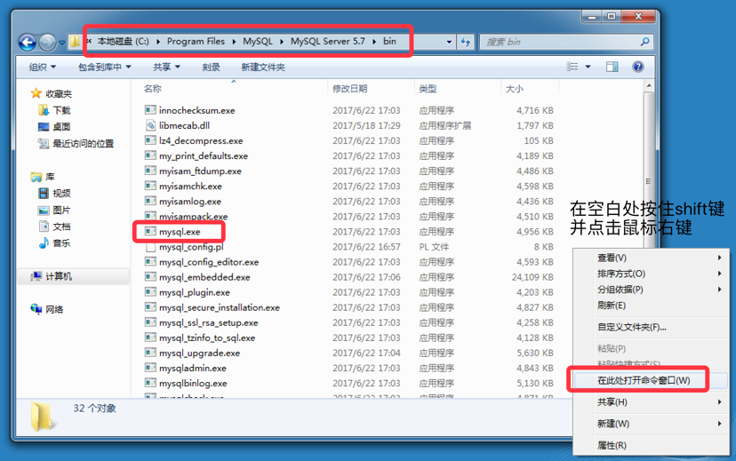

新打开的命令窗口，在这个窗口中可以执行类似在Ubuntu终端中执行的mysql命令


将从主服务器Ubuntu中导出的文件复制到从服务器Windows中，可以将其放在上面mysql命令所在的文件夹中，方便还原使用

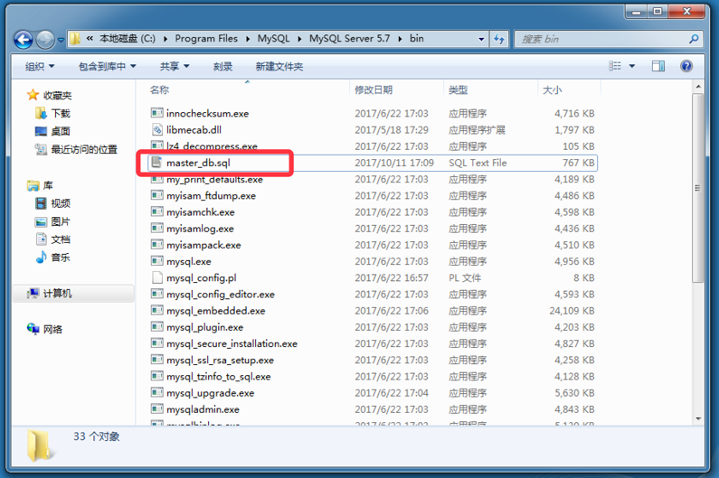

在刚打开的命令黑窗口中执行还原操作:

```
mysql –uroot –pmysql < master_db.sql
```

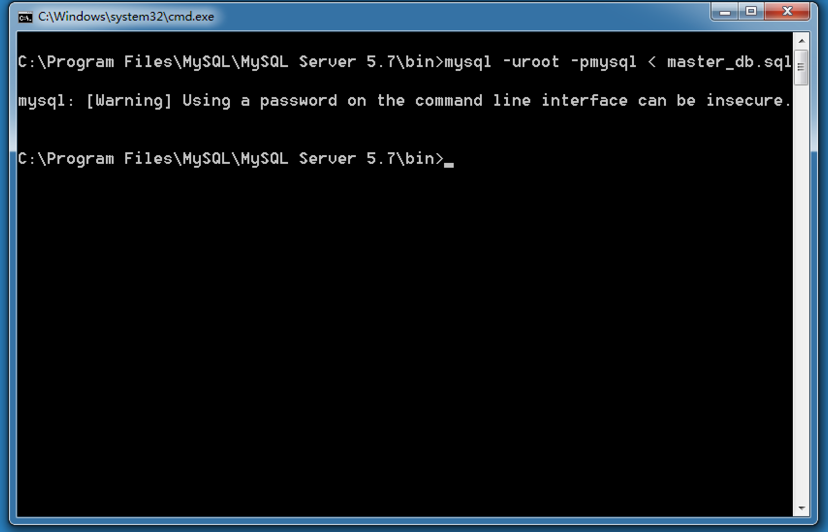

#### 4.2 配置主服务器master（Ubuntu中的MySQL）

#### 4.2.1 编辑设置mysqld的配置文件，设置log_bin和server-id

```
sudo vim /etc/mysql/mysql.conf.d/mysqld.cnf
```


#### 4.2.2 重启mysql服务

```
sudo service mysql restart
```


#### 4.2.3 登入主服务器Ubuntu中的mysql，创建用于从服务器同步数据使用的帐号

```
mysql –uroot –pmysql
GRANT REPLICATION SLAVE ON *.* TO 'slave'@'%' identified by 'slave';
FLUSH PRIVILEGES;
```

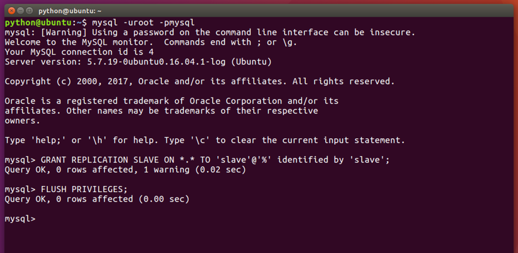

#### 4.2.4 获取主服务器的二进制日志信息

```
SHOW MASTER STATUS;
```


File为使用的日志文件名字，Position为使用的文件位置，这两个参数须记下，配置从服务器时会用到

#### 4.3 配置从服务器slave（Windows中的MySQL）

#### 4.3.1 找到Windows中MySQL的配置文件


#### 4.3.2 编辑my.ini文件，将server-id修改为2，并保存退出。

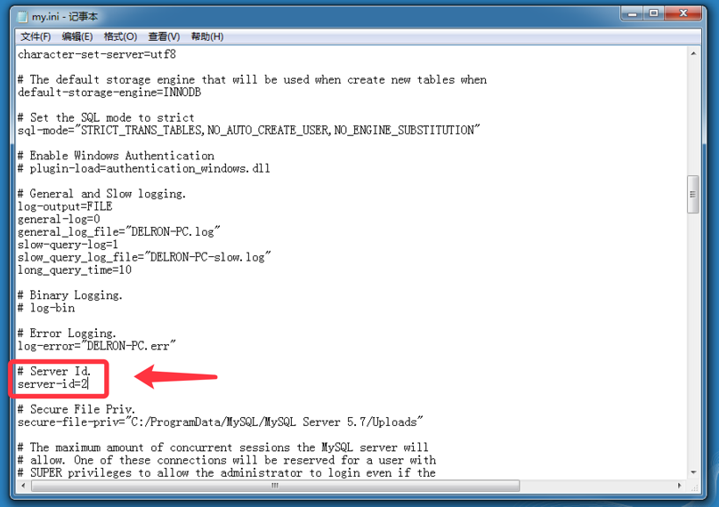

#### 4.3.3 打开windows服务管理

可以在开始菜单中输入services.msc找到并运行


#### 4.3.4 在打开的服务管理中找到MySQL57，并重启该服务


### 5. 进入windows的mysql，设置连接到master主服务器

```
change master to master_host='10.211.55.5', master_user='slave', master_password='slave',master_log_file='mysql-bin.000006', master_log_pos=590;
```

注：

- master_host：主服务器Ubuntu的ip地址
- master_log_file: 前面查询到的主服务器日志文件名
- master_log_pos: 前面查询到的主服务器日志文件位置


### 6. 开启同步，查看同步状态


### 7. 测试主从同步

在Ubuntu的MySQL中（主服务器）创建一个数据库 


在Windows的MySQL中（从服务器）查看新建的数据库是否存在 

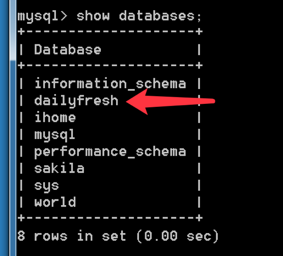