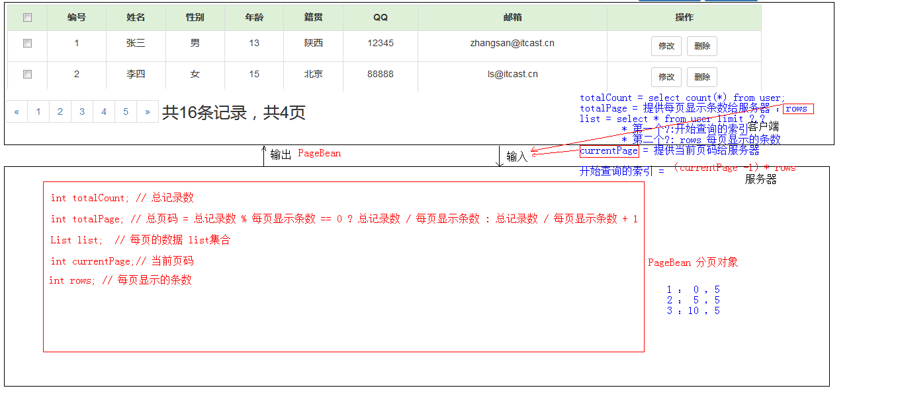

## 案例：用户信息列表展示

1. 需求：用户信息的增删改查操作
2. 设计：
	1. 技术选型：Servlet+JSP+MySQL+JDBCTempleat+Duird+BeanUtilS+tomcat
	2. 数据库设计：
		create database day17; -- 创建数据库
		use day17; 			   -- 使用数据库
		create table user(   -- 创建表
			id int primary key auto_increment,
			name varchar(20) not null,
			gender varchar(5),
			age int,
			address varchar(32),
			qq	varchar(20),
			email varchar(50)
		);

3. 开发：
	1. 环境搭建
		1. 创建数据库环境
		2. 创建项目，导入需要的jar包
2. 编码
	   1. 综合练习
	   	1. 简单功能
	   		1. 列表查询
	   		2. 登录
	   		3. 添加
	   		4. 删除
	   		5. 修改
	   		
	   	2. 复杂功能
	   		1. 删除选中
	   		2. 分页查询
	   			* 好处：
	   				1. 减轻服务器内存的开销
	   				2. 提升用户体验
	   		3. 复杂条件查询

