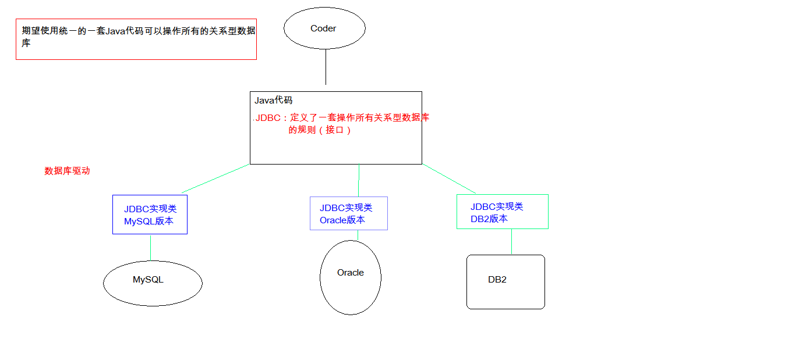

## 一、JDBC入门

1. 概念：Java DataBase Connectivity  Java 数据库连接， Java语言操作数据库

  * JDBC本质：其实是官方（sun公司）定义的一套操作所有关系型数据库的规则，即接口。各个数据库厂商去实现这套接口，提供数据库驱动jar包。我们可以使用这套接口（JDBC）编程，真正执行的代码是驱动jar包中的实现类。



2. 快速入门：
  * 步骤：
  	1. 导入驱动jar包 mysql-connector-java-5.1.37-bin.jar  
    		1.复制mysql-connector-java-5.1.37-bin.jar到项目的libs目录下
    		2.右键-->Add As Library
  	2. 注册驱动
  	3. 获取数据库连接对象 Connection
  	4. 定义sql
  	5. 获取执行sql语句的对象 Statement
  	6. 执行sql，接受返回结果
  	7. 处理结果
  	8. 释放资源

  * 代码实现：
    	
     ```java
     //1. 导入驱动jar包
       //2.注册驱动
       Class.forName("com.mysql.jdbc.Driver");
       //3.获取数据库连接对象
       Connection conn = DriverManager.getConnection("jdbc:mysql://localhost:3306/db3", "root", "root");
       //4.定义sql语句
       String sql = "update account set balance = 500 where id = 1";
       //5.获取执行sql的对象 Statement
       Statement stmt = conn.createStatement();
       //6.执行sql
       int count = stmt.executeUpdate(sql);
       //7.处理结果
       System.out.println(count);
       //8.释放资源
       stmt.close();
       conn.close();
     ```
     
     

3. 详解各个对象：
  1. `DriverManager`：驱动管理对象

  	* 功能：
  		1. 注册驱动：告诉程序该使用哪一个数据库驱动jar

  		

```java

static void registerDriver(Driver driver) :注册与给定的驱动程序 DriverManager 。 
写代码使用：  Class.forName("com.mysql.jdbc.Driver");
通过查看源码发现：在com.mysql.jdbc.Driver类中存在静态代码块
 static {
        try {
            java.sql.DriverManager.registerDriver(new Driver());
        } catch (SQLException E) {
        throw new RuntimeException("Can't register driver!");
}
    }

```


  			注意：mysql5之后的驱动jar包可以省略注册驱动的步骤。
  			

  		2. 获取数据库连接：

  			```java
  			* 方法：static Connection getConnection(String url, String user, String password) 
    			* 参数：
      			  * url：指定连接的路径
        			    * 语法：jdbc:mysql://ip地址(域名):端口号/数据库名称
          			    * 例子：jdbc:mysql://localhost:3306/db3
            			    * 细节：如果连接的是本机mysql服务器，并且mysql服务默认端口是3306，则url可以简写为：jdbc:mysql:///数据库名称
              			  * user：用户名
                			  * password：密码 
                  			```


  	
  2. Connection：数据库连接对象
  	1. 功能：
    		1. 获取执行sql 的对象
  			* Statement createStatement()
    			* PreparedStatement prepareStatement(String sql)  
  		2. 管理事务：
  			* 开启事务：setAutoCommit(boolean autoCommit) ：调用该方法设置参数为false，即开启事务
    			* 提交事务：commit() 
      			* 回滚事务：rollback() 

  3. Statement：执行sql的对象
  	1. 执行sql
    		1. boolean execute(String sql) ：可以执行任意的sql 了解 
      		2. int executeUpdate(String sql) ：执行DML（insert、update、delete）语句、DDL(create，alter、drop)语句
  			* 返回值：影响的行数，可以通过这个影响的行数判断DML语句是否执行成功 返回值>0的则执行成功，反之，则失败。
  		3. ResultSet executeQuery(String sql)  ：执行DQL（select)语句
  
  	2. 练习：
    		1. account表 添加一条记录
      		2. account表 修改记录
  	3. account表 删除一条记录

  		代码：

```java
		

  	   Statement stmt = null;
  	   Connection conn = null;
  	   try {
  	       //1. 注册驱动
  	       Class.forName("com.mysql.jdbc.Driver");
  	       //2. 定义sql
  	       String sql = "insert into account values(null,'王五',3000)";
  	       //3.获取Connection对象
  	       conn = DriverManager.getConnection("jdbc:mysql:///db3", "root", "root");
  	       //4.获取执行sql的对象 Statement
  	       stmt = conn.createStatement();
  	       //5.执行sql
  	       int count = stmt.executeUpdate(sql);//影响的行数
  	       //6.处理结果
  	       System.out.println(count);
  	       if(count > 0){
  	           System.out.println("添加成功！");
  	       }else{
  	        System.out.println("添加失败！");
  	       }
  	   
  	   } catch (ClassNotFoundException e) {
  	       e.printStackTrace();
  	   } catch (SQLException e) {
  	       e.printStackTrace();
  	   }finally {
  	       //stmt.close();
  	       //7. 释放资源
  	       //避免空指针异常
  	       if(stmt != null){
  	           try {
  	               stmt.close();
  	           } catch (SQLException e) {
  	               e.printStackTrace();
  	        }
  	       }
  	   
  	       if(conn != null){
  	           try {
  	               conn.close();
  	           } catch (SQLException e) {
  	               e.printStackTrace();
  	           }
  	       }
  	   }

  	   
  	   
  	
```


  4. ResultSet：结果集对象,封装查询结果
  	* boolean next(): 游标向下移动一行，判断当前行是否是最后一行末尾(是否有数据)，如果是，则返回false，如果不是则返回true
  	* getXxx(参数):获取数据
    		* Xxx：代表数据类型   如： int getInt() ,	String getString()
    		* 参数：
  			1. int：代表列的编号,从1开始   如： getString(1)
    			2. String：代表列名称。 如： getDouble("balance")

  	* 注意：
    		* 使用步骤：
  			1. 游标向下移动一行
    			2. 判断是否有数据
      			3. 获取数据


```java
//循环判断游标是否是最后一行末尾。
while(rs.next()){
    //获取数据
    //6.2 获取数据
    int id = rs.getInt(1);
    String name = rs.getString("name");
    double balance = rs.getDouble(3);

    System.out.println(id + "---" + name + "---" + balance);
}

```


* 定义一个方法，查询emp表的数据将其封装为对象，然后装载集合，返回。
	1. 定义Emp类
	2. 定义方法 public List<Emp> findAll(){}
	3. 实现方法 select * from emp;

1. PreparedStatement：执行sql的对象
  1. SQL注入问题：在拼接sql时，有一些sql的特殊关键字参与字符串的拼接。会造成安全性问题
  	1. 输入用户随便，输入密码：a' or 'a' = 'a
  	2. sql：select * from user where username = 'fhdsjkf' and password = 'a' or 'a' = 'a' 

  2. 解决sql注入问题：使用PreparedStatement对象来解决
  3. 预编译的SQL：参数使用?作为占位符
  4. 步骤：
  	1. 导入驱动jar包 mysql-connector-java-5.1.37-bin.jar
  	2. 注册驱动
  	3. 获取数据库连接对象 Connection
  	4. 定义sql
  		* 注意：sql的参数使用？作为占位符。 如：`select * from user where username = ? and password = ?;`
  	5. 获取执行sql语句的对象 `PreparedStatement  Connection.prepareStatement(String sql)` 
  	6. 给？赋值：
  		* 方法： setXxx(参数1,参数2)
    			* 参数1：？的位置编号 从1 开始
      			* 参数2：？的值
  	7. 执行sql，接受返回结果，不需要传递sql语句
  	8. 处理结果
  	9. 释放资源

  5. 注意：后期都会使用PreparedStatement来完成增删改查的所有操作
  	1. 可以防止SQL注入
  	2. 效率更高