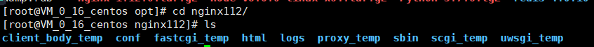

[TOC]

## [nginx入门与实战](https://www.cnblogs.com/pyyu/p/9468680.html)

# 一、nginx安装配置

- ngnix只能处理服务器上的静态资源，如css，js，html，mp4等

> nginx-1.12.0

## 1. 编译安装nginx软件

### 1）安装环境准备

```python
yum install gcc patch libffi-devel python-devel  zlib-devel bzip2-devel openssl-devel ncurses-devel sqlite-devel readline-devel tk-devel gdbm-devel db4-devel libpcap-devel xz-devel openssl openssl-devel -y
```

### 2）安装，启动nginx

```python
1.下载源码包
wget -c https://nginx.org/download/nginx-1.12.0.tar.gz

2.解压缩源码
tar -zxvf nginx-1.12.0.tar.gz

3.配置，编译安装  开启nginx状态监测功能
./configure --prefix=/opt/nginx112/


4.启动nginx，进入sbin目录,找到nginx启动命令

cd sbin
./nginx #启动
./nginx -s stop #关闭
./nginx -s reload #平滑重启 ，修改了nginx.conf之后，可以不重启服务，加载新的配置
```


# 二、分析nginx的工作目录，内容



- `conf` ：存放 `nginx` 的配置文件
  - `nginx.conf`：控制`nginx`所有功能的文件
- `html`：存放网页`html`的目录，如`index.html`、`error.html`等
  - index.html
- `logs`：存放`log`日志文件
- `sbin`：存放`nginx`可执行命令


# 三、nginx.conf配置文件解析

```
vim /opt/nginx112/conf/nginx.conf
```


#### 重点解析

```python
# CoreModule核心模块

user www;                       #Nginx进程所使用的用户
worker_processes 1;             #Nginx运行的work进程数量(建议与CPU数量一致或auto)
error_log /log/nginx/error.log  #Nginx错误日志存放路径
pid /var/run/nginx.pid          #Nginx服务运行后产生的pid进程号
```

```python
# events事件模块

events {            
    worker_connections  # 每个worker进程支持的最大连接数
    use epool;          # 事件驱动模型, epoll默认
}
```

```python
# http内核模块

# 公共的配置定义在http{}
http {
    include       mime.types;
    default_type  application/octet-stream;
	#定义nginx的访问日志功能
	#nginx会有一个accses.log功能，查看用户访问的记录
	
    log_format  main  '$remote_addr - $remote_user [$time_local] "$request" '
                      '$status $body_bytes_sent "$http_referer" '
                      '"$http_user_agent" "$http_x_forwarded_for"';

	#开启日志功能
    access_log  logs/access.log  main;
    sendfile        on;
    keepalive_timeout  65;
	#开启gzip压缩传输
    gzip  on;
	#虚拟主机1  定义一个 斗鱼网站 
    server {
		#定义nginx的访问入口端口，访问地址是  192.168.11.37:80
        listen       80;
		#定义网站的域名www.woshidouyu.tv
		#如果没有域名，就填写服务器的ip地址  192.168.11.37
        server_name  www.woshidouyu.tv;
		#nginx的url域名匹配
		#只要请求来自于www.woshidouyu.tv/111111111
		#只要请求来自于www.woshidouyu.tv/qweqwewqe
		#只要请求来自于www.woshidouyu.tv/qweqwewqe
		#最低级的匹配，只要来自于www.woshidouyu.tv这个域名，都会走到这个location
        location / {
			#这个root参数，也是关键字，定义网页的根目录
			#以nginx安装的目录为相对路径  /opt/nginx112/html 
			#可以自由修改这个root定义的网页根目录
            root   html;
			#index参数定义网站的首页文件名，默认的文件名
            index  index.html index.htm;
        }
		#错误页面的优化
        error_page  400 401  402  403  404   /40x.html;
}

}

```

[
  ](javascript:void(0);)


#### 完全参数解析

```python
######Nginx配置文件nginx.conf中文详解#####

#定义Nginx运行的用户和用户组
user www www;

★★★★★
#nginx进程数，建议设置为等于CPU总核心数。
worker_processes 8;
 
#全局错误日志定义类型，[ debug | info | notice | warn | error | crit ]
error_log /usr/local/nginx/logs/error.log info;

#进程pid文件
pid /usr/local/nginx/logs/nginx.pid;

#指定进程可以打开的最大描述符：数目
#工作模式与连接数上限
#这个指令是指当一个nginx进程打开的最多文件描述符数目，理论值应该是最多打开文件数（ulimit -n）与nginx进程数相除，但是nginx分配请求并不是那么均匀，所以最好与ulimit -n 的值保持一致。
#现在在linux 2.6内核下开启文件打开数为65535，worker_rlimit_nofile就相应应该填写65535。
#这是因为nginx调度时分配请求到进程并不是那么的均衡，所以假如填写10240，总并发量达到3-4万时就有进程可能超过10240了，这时会返回502错误。
worker_rlimit_nofile 65535;


events
{
    #参考事件模型，use [ kqueue | rtsig | epoll | /dev/poll | select | poll ]; epoll模型
    #是Linux 2.6以上版本内核中的高性能网络I/O模型，linux建议epoll，如果跑在FreeBSD上面，就用kqueue模型。
    #补充说明：
    #与apache相类，nginx针对不同的操作系统，有不同的事件模型
    #A）标准事件模型
    #Select、poll属于标准事件模型，如果当前系统不存在更有效的方法，nginx会选择select或poll
    #B）高效事件模型
    #Kqueue：使用于FreeBSD 4.1+, OpenBSD 2.9+, NetBSD 2.0 和 MacOS X.使用双处理器的MacOS X系统使用kqueue可能会造成内核崩溃。
    #Epoll：使用于Linux内核2.6版本及以后的系统。
    #/dev/poll：使用于Solaris 7 11/99+，HP/UX 11.22+ (eventport)，IRIX 6.5.15+ 和 Tru64 UNIX 5.1A+。
    #Eventport：使用于Solaris 10。 为了防止出现内核崩溃的问题， 有必要安装安全补丁。
    use epoll;

    #单个进程最大连接数（最大连接数=连接数*进程数）
    #根据硬件调整，和前面工作进程配合起来用，尽量大，但是别把cpu跑到100%就行。每个进程允许的最多连接数，理论上每台nginx服务器的最大连接数为。
    worker_connections 65535;

    #keepalive超时时间。
    keepalive_timeout 60;

    #客户端请求头部的缓冲区大小。这个可以根据你的系统分页大小来设置，一般一个请求头的大小不会超过1k，不过由于一般系统分页都要大于1k，所以这里设置为分页大小。
    #分页大小可以用命令getconf PAGESIZE 取得。
    #[root@web001 ~]# getconf PAGESIZE
    #4096
    #但也有client_header_buffer_size超过4k的情况，但是client_header_buffer_size该值必须设置为“系统分页大小”的整倍数。
    client_header_buffer_size 4k;

    #这个将为打开文件指定缓存，默认是没有启用的，max指定缓存数量，建议和打开文件数一致，inactive是指经过多长时间文件没被请求后删除缓存。
    open_file_cache max=65535 inactive=60s;

    #这个是指多长时间检查一次缓存的有效信息。
    #语法:open_file_cache_valid time 默认值:open_file_cache_valid 60 使用字段:http, server, location 这个指令指定了何时需要检查open_file_cache中缓存项目的有效信息.
    open_file_cache_valid 80s;

    #open_file_cache指令中的inactive参数时间内文件的最少使用次数，如果超过这个数字，文件描述符一直是在缓存中打开的，如上例，如果有一个文件在inactive时间内一次没被使用，它将被移除。
    #语法:open_file_cache_min_uses number 默认值:open_file_cache_min_uses 1 使用字段:http, server, location  这个指令指定了在open_file_cache指令无效的参数中一定的时间范围内可以使用的最小文件数,如果使用更大的值,文件描述符在cache中总是打开状态.
    open_file_cache_min_uses 1;
    
    #语法:open_file_cache_errors on | off 默认值:open_file_cache_errors off 使用字段:http, server, location 这个指令指定是否在搜索一个文件是记录cache错误.
    open_file_cache_errors on;
}
 
 
★★★★★
#设定http服务器，利用它的反向代理功能提供负载均衡支持
http
{
    #文件扩展名与文件类型映射表
    include mime.types;

    #默认文件类型
    default_type application/octet-stream;

    #默认编码
    #charset utf-8;

    #服务器名字的hash表大小
    #保存服务器名字的hash表是由指令server_names_hash_max_size 和server_names_hash_bucket_size所控制的。参数hash bucket size总是等于hash表的大小，并且是一路处理器缓存大小的倍数。在减少了在内存中的存取次数后，使在处理器中加速查找hash表键值成为可能。如果hash bucket size等于一路处理器缓存的大小，那么在查找键的时候，最坏的情况下在内存中查找的次数为2。第一次是确定存储单元的地址，第二次是在存储单元中查找键 值。因此，如果Nginx给出需要增大hash max size 或 hash bucket size的提示，那么首要的是增大前一个参数的大小.
    server_names_hash_bucket_size 128;

    #客户端请求头部的缓冲区大小。这个可以根据你的系统分页大小来设置，一般一个请求的头部大小不会超过1k，不过由于一般系统分页都要大于1k，所以这里设置为分页大小。分页大小可以用命令getconf PAGESIZE取得。
    client_header_buffer_size 32k;

    #客户请求头缓冲大小。nginx默认会用client_header_buffer_size这个buffer来读取header值，如果header过大，它会使用large_client_header_buffers来读取。
    large_client_header_buffers 4 64k;

    #设定通过nginx上传文件的大小
    client_max_body_size 8m;

    #开启高效文件传输模式，sendfile指令指定nginx是否调用sendfile函数来输出文件，对于普通应用设为 on，如果用来进行下载等应用磁盘IO重负载应用，可设置为off，以平衡磁盘与网络I/O处理速度，降低系统的负载。注意：如果图片显示不正常把这个改成off。
    #sendfile指令指定 nginx 是否调用sendfile 函数（zero copy 方式）来输出文件，对于普通应用，必须设为on。如果用来进行下载等应用磁盘IO重负载应用，可设置为off，以平衡磁盘与网络IO处理速度，降低系统uptime。
    sendfile on;

    #开启目录列表访问，合适下载服务器，默认关闭。
    autoindex on;

    #此选项允许或禁止使用socke的TCP_CORK的选项，此选项仅在使用sendfile的时候使用
    tcp_nopush on;
     
    tcp_nodelay on;

    #长连接超时时间，单位是秒
    keepalive_timeout 120;

    #FastCGI相关参数是为了改善网站的性能：减少资源占用，提高访问速度。下面参数看字面意思都能理解。
    fastcgi_connect_timeout 300;
    fastcgi_send_timeout 300;
    fastcgi_read_timeout 300;
    fastcgi_buffer_size 64k;
    fastcgi_buffers 4 64k;
    fastcgi_busy_buffers_size 128k;
    fastcgi_temp_file_write_size 128k;

    #gzip模块设置
    gzip on; #开启gzip压缩输出
    gzip_min_length 1k;    #最小压缩文件大小
    gzip_buffers 4 16k;    #压缩缓冲区
    gzip_http_version 1.0;    #压缩版本（默认1.1，前端如果是squid2.5请使用1.0）
    gzip_comp_level 2;    #压缩等级
    gzip_types text/plain application/x-javascript text/css application/xml;    #压缩类型，默认就已经包含textml，所以下面就不用再写了，写上去也不会有问题，但是会有一个warn。
    gzip_vary on;

    #开启限制IP连接数的时候需要使用
    #limit_zone crawler $binary_remote_addr 10m;


    #负载均衡配置
    upstream jh.w3cschool.cn {
     
        #upstream的负载均衡，weight是权重，可以根据机器配置定义权重。weigth参数表示权值，权值越高被分配到的几率越大。
        server 192.168.80.121:80 weight=3;
        server 192.168.80.122:80 weight=2;
        server 192.168.80.123:80 weight=3;

        #nginx的upstream目前支持4种方式的分配
        #1、轮询（默认）
        #每个请求按时间顺序逐一分配到不同的后端服务器，如果后端服务器down掉，能自动剔除。
        #2、weight
        #指定轮询几率，weight和访问比率成正比，用于后端服务器性能不均的情况。
        #例如：
        #upstream bakend {
        #    server 192.168.0.14 weight=10;
        #    server 192.168.0.15 weight=10;
        #}
        #2、ip_hash
        #每个请求按访问ip的hash结果分配，这样每个访客固定访问一个后端服务器，可以解决session的问题。
        #例如：
        #upstream bakend {
        #    ip_hash;
        #    server 192.168.0.14:88;
        #    server 192.168.0.15:80;
        #}
        #3、fair（第三方）
        #按后端服务器的响应时间来分配请求，响应时间短的优先分配。
        #upstream backend {
        #    server server1;
        #    server server2;
        #    fair;
        #}
        #4、url_hash（第三方）
        #按访问url的hash结果来分配请求，使每个url定向到同一个后端服务器，后端服务器为缓存时比较有效。
        #例：在upstream中加入hash语句，server语句中不能写入weight等其他的参数，hash_method是使用的hash算法
        #upstream backend {
        #    server squid1:3128;
        #    server squid2:3128;
        #    hash $request_uri;
        #    hash_method crc32;
        #}

        #tips:
        #upstream bakend{#定义负载均衡设备的Ip及设备状态}{
        #    ip_hash;
        #    server 127.0.0.1:9090 down;
        #    server 127.0.0.1:8080 weight=2;
        #    server 127.0.0.1:6060;
        #    server 127.0.0.1:7070 backup;
        #}
        #在需要使用负载均衡的server中增加 proxy_pass http://bakend/;

        #每个设备的状态设置为:
        #1.down表示单前的server暂时不参与负载
        #2.weight为weight越大，负载的权重就越大。
        #3.max_fails：允许请求失败的次数默认为1.当超过最大次数时，返回proxy_next_upstream模块定义的错误
        #4.fail_timeout:max_fails次失败后，暂停的时间。
        #5.backup： 其它所有的非backup机器down或者忙的时候，请求backup机器。所以这台机器压力会最轻。

        #nginx支持同时设置多组的负载均衡，用来给不用的server来使用。
        #client_body_in_file_only设置为On 可以讲client post过来的数据记录到文件中用来做debug
        #client_body_temp_path设置记录文件的目录 可以设置最多3层目录
        #location对URL进行匹配.可以进行重定向或者进行新的代理 负载均衡
    }
     
     
     
    #虚拟主机的配置
    server
    {
        #监听端口
        listen 80;

        #域名可以有多个，用空格隔开
        server_name www.w3cschool.cn w3cschool.cn;
        index index.html index.htm index.php;
        root /data/www/w3cschool;

        #对******进行负载均衡
        location ~ .*.(php|php5)?$
        {
            fastcgi_pass 127.0.0.1:9000;
            fastcgi_index index.php;
            include fastcgi.conf;
        }
         
        #图片缓存时间设置
        location ~ .*.(gif|jpg|jpeg|png|bmp|swf)$
        {
            expires 10d;
        }
         
        #JS和CSS缓存时间设置
        location ~ .*.(js|css)?$
        {
            expires 1h;
        }
         
        #日志格式设定
        #$remote_addr与$http_x_forwarded_for用以记录客户端的ip地址；
        #$remote_user：用来记录客户端用户名称；
        #$time_local： 用来记录访问时间与时区；
        #$request： 用来记录请求的url与http协议；
        #$status： 用来记录请求状态；成功是200，
        #$body_bytes_sent ：记录发送给客户端文件主体内容大小；
        #$http_referer：用来记录从那个页面链接访问过来的；
        #$http_user_agent：记录客户浏览器的相关信息；
        #通常web服务器放在反向代理的后面，这样就不能获取到客户的IP地址了，通过$remote_add拿到的IP地址是反向代理服务器的iP地址。反向代理服务器在转发请求的http头信息中，可以增加x_forwarded_for信息，用以记录原有客户端的IP地址和原来客户端的请求的服务器地址。
        log_format access '$remote_addr - $remote_user [$time_local] "$request" '
        '$status $body_bytes_sent "$http_referer" '
        '"$http_user_agent" $http_x_forwarded_for';
         
        #定义本虚拟主机的访问日志
        access_log  /usr/local/nginx/logs/host.access.log  main;
        access_log  /usr/local/nginx/logs/host.access.404.log  log404;
         
        #对 "/" 启用反向代理
        location / {
            proxy_pass http://127.0.0.1:88;
            proxy_redirect off;
            proxy_set_header X-Real-IP $remote_addr;
             
            #后端的Web服务器可以通过X-Forwarded-For获取用户真实IP
            proxy_set_header X-Forwarded-For $proxy_add_x_forwarded_for;
             
            #以下是一些反向代理的配置，可选。
            proxy_set_header Host $host;

            #允许客户端请求的最大单文件字节数
            client_max_body_size 10m;

            #缓冲区代理缓冲用户端请求的最大字节数，
            #如果把它设置为比较大的数值，例如256k，那么，无论使用firefox还是IE浏览器，来提交任意小于256k的图片，都很正常。如果注释该指令，使用默认的client_body_buffer_size设置，也就是操作系统页面大小的两倍，8k或者16k，问题就出现了。
            #无论使用firefox4.0还是IE8.0，提交一个比较大，200k左右的图片，都返回500 Internal Server Error错误
            client_body_buffer_size 128k;

            #表示使nginx阻止HTTP应答代码为400或者更高的应答。
            proxy_intercept_errors on;

            #后端服务器连接的超时时间_发起握手等候响应超时时间
            #nginx跟后端服务器连接超时时间(代理连接超时)
            proxy_connect_timeout 90;

            #后端服务器数据回传时间(代理发送超时)
            #后端服务器数据回传时间_就是在规定时间之内后端服务器必须传完所有的数据
            proxy_send_timeout 90;

            #连接成功后，后端服务器响应时间(代理接收超时)
            #连接成功后_等候后端服务器响应时间_其实已经进入后端的排队之中等候处理（也可以说是后端服务器处理请求的时间）
            proxy_read_timeout 90;

            #设置代理服务器（nginx）保存用户头信息的缓冲区大小
            #设置从被代理服务器读取的第一部分应答的缓冲区大小，通常情况下这部分应答中包含一个小的应答头，默认情况下这个值的大小为指令proxy_buffers中指定的一个缓冲区的大小，不过可以将其设置为更小
            proxy_buffer_size 4k;

            #proxy_buffers缓冲区，网页平均在32k以下的设置
            #设置用于读取应答（来自被代理服务器）的缓冲区数目和大小，默认情况也为分页大小，根据操作系统的不同可能是4k或者8k
            proxy_buffers 4 32k;

            #高负荷下缓冲大小（proxy_buffers*2）
            proxy_busy_buffers_size 64k;

            #设置在写入proxy_temp_path时数据的大小，预防一个工作进程在传递文件时阻塞太长
            #设定缓存文件夹大小，大于这个值，将从upstream服务器传
            proxy_temp_file_write_size 64k;
        }
         
         
        #设定查看Nginx状态的地址
        location /NginxStatus {
            stub_status on;
            access_log on;
            auth_basic "NginxStatus";
            auth_basic_user_file confpasswd;
            #htpasswd文件的内容可以用apache提供的htpasswd工具来产生。
        }
         
        #本地动静分离反向代理配置
        #所有jsp的页面均交由tomcat或resin处理
        location ~ .(jsp|jspx|do)?$ {
            proxy_set_header Host $host;
            proxy_set_header X-Real-IP $remote_addr;
            proxy_set_header X-Forwarded-For $proxy_add_x_forwarded_for;
            proxy_pass http://127.0.0.1:8080;
        }
         
        #所有静态文件由nginx直接读取不经过tomcat或resin
        location ~ .*.(htm|html|gif|jpg|jpeg|png|bmp|swf|ioc|rar|zip|txt|flv|mid|doc|ppt|
        pdf|xls|mp3|wma)$
        {
            expires 15d; 
        }
         
        location ~ .*.(js|css)?$
        {
            expires 1h;
        }
    }
}
######Nginx配置文件nginx.conf中文详解#####
```

# 四、nginx多虚拟主机的配置（配置多个站点）

### 1. 在nginx.conf中添加两个虚拟主机标签 

```python
http {
    include       mime.types;
    default_type  application/octet-stream;
	#定义nginx的访问日志功能
	#nginx会有一个accses.log功能，查看用户访问的记录
	
    log_format  main  '$remote_addr - $remote_user [$time_local] "$request" '
                      '$status $body_bytes_sent "$http_referer" '
                      '"$http_user_agent" "$http_x_forwarded_for"';

	#开启日志功能
    access_log  logs/access.log  main;
    sendfile        on;
    keepalive_timeout  65;
	#开启gzip压缩传输
    gzip  on;
	#虚拟主机1  定义一个 斗鱼网站 
    server {
		#定义nginx的访问入口端口，访问地址是  192.168.11.37:80
        listen       80;
		#定义网站的域名www.woshidouyu.tv
		#如果没有域名，就填写服务器的ip地址  192.168.11.37
        server_name  www.woshidouyu.tv;
		#nginx的url域名匹配
		#只要请求来自于www.woshidouyu.tv/111111111
		#只要请求来自于www.woshidouyu.tv/qweqwewqe
		#只要请求来自于www.woshidouyu.tv/qweqwewqe
		#最低级的匹配，只要来自于www.woshidouyu.tv这个域名，都会走到这个location
        location / {
			#这个root参数，也是关键字，定义网页的根目录
			#以nginx安装的目录为相对路径  /opt/nginx112/html 
			#可以自由修改这个root定义的网页根目录
            root   html;
			#index参数定义网站的首页文件名，默认的文件名
            index  index.html index.htm;
        }
		#错误页面的优化
        error_page  400 401  402  403  404   /40x.html;
}
    # 虚拟主机2 qishijd.com
 server {
        listen       80;
        server_name  qishijd.com;
        location / {
            root   /opt/jd;
            index  index.html index.htm;
        }
        error_page  404              /40x.html;
        error_page   500 502 503 504  /50x.html;
        location = /50x.html {
            root   html;
        }
    }
    # 虚拟主机3 
server {
		listen 80;
		server_name  qishitb.com;
		location  /  {
			root  /opt/tb;
			index  index.html;
		}
}

}
```

### 2.重启nginx，加载新的配置

```
nginx -s stop 
nginx 
```

### 3.修改windows的本地hosts解析文件，用于域名解析

- windows的hosts文件路径：C:\Windows\System32\drivers\etc
- 写入如下配置
  192.168.11.37  qishitb.com
  192.168.11.37  qishijd.com

### 4.准备两个虚拟主机的 index.html文件

```python
/opt/jd/index.html  写入  我是京东
/opt/tb/index.html   写入  我是淘宝
```


### 5.在windows浏览器中，查看两个域名对应到的虚拟主机

- 分别访问qishijd.com 域名
- 然后访问qishitb.com 域名，查看网站的资料的内容变化

# 五、nginx的错误页面优化的功能:

- 通过error_page参数定义错误页面的 html文件

```python
 server {
        listen       80;
        server_name  qishijd.com;
        location / {
            root   /opt/jd;
            index  index.html index.htm;
        }
		#这个错误页面就应该存放在 /opt/jd/40x.html 
        error_page  404              /40x.html;
        error_page   500 502 503 504  /50x.html;
        location = /50x.html {
            root   html;
        }
    }
```

# 六、nginx访问日志功能

- 修改nginx.conf配置文件，打开如下配置注释

    log_format  main  '$remote_addr - $remote_user [$time_local] "$request" '
                      '$status $body_bytes_sent "$http_referer" '
                      '"$http_user_agent" "$http_x_forwarded_for"';
    
    #开启日志功能
    access_log  logs/access.log  main;
# 七、nginx拒绝访问功能

- 在某一个虚拟主机下，顶一个deny参数，可以拒绝ip地址对虚拟主机的访问

```python
server {
        listen       80;
        server_name  qishijd.com;
        #只要192.168.11.37这个ip访问 qishijd.com/
        location / {
            # deny 拒绝访问功能
            deny  192.168.11.0/24;
            
            root   /opt/jd;
            index  index.html index.htm;
        }
        error_page  404              /40x.html;
        error_page   500 502 503 504  /50x.html;
        location = /50x.html {
            root   html;
        }
    }
```

# 八、Nginx反向代理

## 1、代理类型

- 正向代理
- 反向代理


### 1) 正向代理（vpn理解）

- **正向代理，也就是传说中的代理,他的工作原理就像一个跳板（VPN），简单的说：**

- **我是一个用户，我访问不了某网站，但是我能访问一个代理服务器，这个代理服务器呢，他能访问那个我不能访问的网站，于是我先连上代理服务器，告诉他我需要那个无法访问网站的内容，代理服务器去取回来，然后返回给我。**


### 2) 反向代理

- **对于客户端而言，代理服务器就像是原始服务器。**


## 2、nginx的反向代理功能

### 1）实验准备，准备2台nginx机器

- `机器1`  192.168.11.37  用作  `web服务器`，用作数据返回
- `机器2`  192.168.11.158   用作nginx`反向代理服务器` 

在windows中访问 反向代理服务器，然后让反向代理服务器 去拿 web服务器的数据

**请求流程（request）**：windows   >   192.168.11.158   >   192.168.11.37

**数据返回（response）流程**：windows   <   192.168.11.158   <   192.168.11.37

**机器1， 作为`web服务器`，只是对数据页面的一个返回，**

**配置如下**

```python
server {
        listen       80;
        server_name  192.168.11.37;

        #charset koi8-r;
        location / {
            root   html;
            index  index.html index.htm;
        }

}

```
**机器2，用作nginx的`反向代理服务器`，这个机器不存数据，只转发请求**
**配置如下：**

```python
server {
        listen       80;
        server_name  192.168.11.158;


		# 在这里进行反向代理配置，当请求地址是192.68.11.158，就会转发请求给192.168.11.37上
		# 192.168.11.158/
        location / {
        
	   		proxy_pass http://192.168.11.37;
            #root   html;
            #index  index.html index.htm;
        }

}

```

- 访问流程： 从`192.168.11.25` windows机器发起的请求，访问的是代理服务器`192.168.11.158`，转发给`192.168.11.37`

# 九、负载均衡


> 利用反向代理，实现服务器压力分担，达到集群的效果

- 集群：一堆服务器做一件事
- 集群的意义：
  1. 高性能
     - 淘宝本来的核心支付服务器是小型机，非常昂贵，且难以维护
       后来都讲 服务器更换为集群架构
       一堆便宜的服务器，维护者一个功能运转
  2. 高可用
     - 单点机器很可能宕机
       集群单机机器宕机，不会影响整体的运转

模拟：


- 准备三台机器

1. **`机器1`   nginx负载均衡器（发牌的荷官）   192.168.11.158**   

**nginx.conf http配置如下：**

```python
#定义nginx负载均衡池，里面默认是轮训算法
		#也可以用weight 权重算法
		#也可以用ip_hash 算法
		
		upstream nginx_pools {
			server  192.168.11.37  weight=10;
			server 192.168.11.167  ;
		}
		server {
			listen       80;
			server_name  192.168.11.158;

			
			#在这里进行反向代理配置
			#192.168.11.158/
			location / {
			proxy_pass http://nginx_pools;
		}

```


2. **`机器2`   准备nginx  返回页面数据        `192.168.11.37`**   

**nginx.conf http 配置如下**

	
			    server {
					listen       80;
					server_name  192.168.11.37;
					location / {
						root   /opt/jd;
						index  index.html index.htm;
					}
					error_page  404              /40x.html;
					error_page   500 502 503 504  /50x.html;
					location = /50x.html {
						root   html;
					}
	    }
	
3. **`机器3`   也准备nginx  返回页面数据      `192.168.11.167`**

**nginx.conf http 配置如下**

    server {
            listen       80;
            server_name  192.168.11.167;
    
            #charset koi8-r;
    
            #access_log  logs/host.access.log  main;
    
            location / {
                root   html;
                index  index.html index.htm;
            }
    
**动静分离负载均衡等用法请参考**：[负载均衡](https://www.cnblogs.com/pyyu/p/10004681.html)

