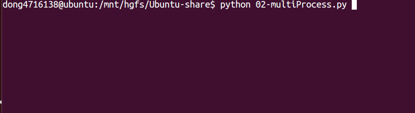

# 多任务开发

## 一、并发与并行

- `并发`：指的是任务数多余cpu核数，通过操作系统的各种任务调度算法，实现用多个任务“一起”执行（实际上总有一些任务不在执行，因为切换任务的速度相当快，看上去一起执行而已）
- `并行`：指的是任务数小于等于cpu核数，即任务真的是一起执行的

## 二、线程

### 1. 使用threading模块创建线程

- 查看线程数量`len(threading.enumerate())`

```python
#coding=utf-8
import threading
from time import sleep,ctime

def sing():
    for i in range(3):
        print("正在唱歌...%d"%i)
        sleep(1)

def dance():
    for i in range(3):
        print("正在跳舞...%d"%i)
        sleep(1)

if __name__ == '__main__':
    print('---开始---:%s'%ctime())

    t1 = threading.Thread(target=sing)
    t2 = threading.Thread(target=dance)

    t1.start()
    t2.start()

    while True:
        length = len(threading.enumerate())
        print('当前运行的线程数为：%d'%length)
        if length<=1:
            break

        sleep(0.5)
```


### 2. 线程执行代码的封装

通过上一小节，能够看出，通过使用threading模块能完成多任务的程序开发，为了让每个线程的封装性更完美，所以使用threading模块时，往往会定义一个新的子类class，只要继承`threading.Thread`就可以了，然后重写`run`方法

示例如下：

```python
#coding=utf-8
import threading
import time

class MyThread(threading.Thread):
    def run(self):
        for i in range(3):
            time.sleep(1)
            msg = "I'm "+self.name+' @ '+str(i) #name属性中保存的是当前线程的名字
            print(msg)


if __name__ == '__main__':
    t = MyThread()
    t.start()
```


##### 说明

- python的threading.Thread类有一个run方法，用于定义线程的功能函数，可以在自己的线程类中覆盖该方法。而创建自己的线程实例后，通过Thread类的start方法，可以启动该线程，交给python虚拟机进行调度，当该线程获得执行的机会时，就会调用run方法执行线程。

### 3. 线程的执行顺序

```python
#coding=utf-8
import threading
import time

class MyThread(threading.Thread):
    def run(self):
        for i in range(3):
            time.sleep(1)
            msg = "I'm "+self.name+' @ '+str(i)
            print(msg)
def test():
    for i in range(5):
        t = MyThread()
        t.start()
if __name__ == '__main__':
    test()
    
```

执行结果：(运行的结果可能不一样，但是大体是一致的)

```python
    I'm Thread-1 @ 0
    I'm Thread-2 @ 0
    I'm Thread-5 @ 0
    I'm Thread-3 @ 0
    I'm Thread-4 @ 0
    I'm Thread-3 @ 1
    I'm Thread-4 @ 1
    I'm Thread-5 @ 1
    I'm Thread-1 @ 1
    I'm Thread-2 @ 1
    I'm Thread-4 @ 2
    I'm Thread-5 @ 2
    I'm Thread-2 @ 2
    I'm Thread-1 @ 2
    I'm Thread-3 @ 2
```


##### 说明

从代码和执行结果我们可以看出，多线程程序的执行顺序是不确定的。当执行到sleep语句时，线程将被阻塞（Blocked），到sleep结束后，线程进入就绪（Runnable）状态，等待调度。而线程调度将自行选择一个线程执行。上面的代码中只能保证每个线程都运行完整个run函数，但是线程的启动顺序、run函数中每次循环的执行顺序都不能确定。

##### 总结

1. 每个线程默认有一个名字，尽管上面的例子中没有指定线程对象的name，但是python会自动为线程指定一个名字。
2. 当线程的run()方法结束时该线程完成。
3. 无法控制线程调度程序，但可以通过别的方式来影响线程调度的方式。

### 4. 共享全局变量-资源竞争

- 两个线程给全局变量`g_num`各加`1000000`次+1,理想中结果是`2000000`，可是结果却不是

```python
import threading
import time

g_num = 0

def work1(num):
    global g_num
    for i in range(num):
        g_num += 1
    print("----in work1, g_num is %d---"%g_num)


def work2(num):
    global g_num
    for i in range(num):
        g_num += 1
    print("----in work2, g_num is %d---"%g_num)


print("---线程创建之前g_num is %d---"%g_num)

t1 = threading.Thread(target=work1, args=(1000000,))
t1.start()

t2 = threading.Thread(target=work2, args=(1000000,))
t2.start()

while len(threading.enumerate()) != 1:
    time.sleep(1)
`
print("2个线程对同一个全局变量操作之后的最终结果是:%s" % g_num)
```

运行结果：

```python
---线程创建之前g_num is 0---
----in work1, g_num is 1088005---
----in work2, g_num is 1286202---
2个线程对同一个全局变量操作之后的最终结果是:1286202
```

##### 总结：

- 如果多个线程同时对同一个全局变量操作，会出现`资源竞争`问题，从而数据结果会不正确

### 5. 互斥锁

#### 5.1 同步的概念

同步就是协同步调，按预定的先后次序进行运行。如:你说完，我再说。

"同"字从字面上容易理解为一起动作

其实不是，"同"字应是指协同、协助、互相配合。

如进程、线程同步，可理解为进程或线程A和B一块配合，A执行到一定程度时要依靠B的某个结果，于是停下来，示意B运行;B执行，再将结果给A;A再继续操作。

#### 5.2 互斥锁

- 当多个线程几乎同时修改某一个共享数据的时候，需要进行`同步控制`
- 线程同步能够保证多个线程安全访问竞争资源，最简单的同步机制是引入`互斥锁`。

**互斥锁为资源引入一个状态：锁定/非锁定**

- 某个线程要更改共享数据时，先将其锁定，此时资源的状态为“锁定”，其他线程不能更改；
- 直到该线程释放资源，将资源的状态变成“非锁定”，其他的线程才能再次锁定该资源。
- 互斥锁保证了每次只有一个线程进行写入操作，从而保证了多线程情况下数据的正确性。

**threading模块中定义了Lock类，可以方便的处理锁定：**

```python
# 创建锁
mutex = threading.Lock()

# 锁定
mutex.acquire()

# 释放
mutex.release()
```

#### 注意：

- 如果这个锁之前是没有上锁的，那么acquire不会堵塞
- 如果在调用acquire对这个锁上锁之前 它已经被 其他线程上了锁，那么此时acquire会堵塞，直到这个锁被解锁为止

#### 使用互斥锁完成2个线程对同一个全局变量各加100万次的操作

```python
import threading
import time

g_num = 0

def test1(num):
    global g_num
    for i in range(num):
        mutex.acquire()  # 上锁
        g_num += 1
        mutex.release()  # 解锁

    print("---test1---g_num=%d"%g_num)

def test2(num):
    global g_num
    for i in range(num):
        mutex.acquire()  # 上锁
        g_num += 1
        mutex.release()  # 解锁

    print("---test2---g_num=%d"%g_num)

# 创建一个互斥锁
# 默认是未上锁的状态
mutex = threading.Lock()

# 创建2个线程，让他们各自对g_num加1000000次
p1 = threading.Thread(target=test1, args=(1000000,))
p1.start()

p2 = threading.Thread(target=test2, args=(1000000,))
p2.start()

# 等待计算完成
while len(threading.enumerate()) != 1:
    time.sleep(1)

print("2个线程对同一个全局变量操作之后的最终结果是:%s" % g_num)
```

运行结果：

```python
---test1---g_num=1909909
---test2---g_num=2000000
2个线程对同一个全局变量操作之后的最终结果是:2000000
```

#### 上锁解锁过程

当一个线程调用锁的acquire()方法获得锁时，锁就进入“locked”状态。

每次只有一个线程可以获得锁。如果此时另一个线程试图获得这个锁，该线程就会变为“blocked”状态，称为“阻塞”，直到拥有锁的线程调用锁的release()方法释放锁之后，锁进入“unlocked”状态。

线程调度程序从处于同步阻塞状态的线程中选择一个来获得锁，并使得该线程进入运行（running）状态。


#### 总结

锁的好处：

- 确保了某段关键代码只能由一个线程从头到尾完整地执行

锁的坏处：

- 阻止了多线程并发执行，包含锁的某段代码实际上只能以单线程模式执行，效率就大大地下降了
- 由于可以存在多个锁，不同的线程持有不同的锁，并试图获取对方持有的锁时，可能会造成死锁

### 6. 死锁

> 在线程间共享多个资源的时候，如果两个线程分别占有一部分资源并且同时等待对方的资源，就会造成死锁。

**死锁的例子**

```python
#coding=utf-8
import threading
import time

class MyThread1(threading.Thread):
    def run(self):
        # 对mutexA上锁
        mutexA.acquire()

        # mutexA上锁后，延时1秒，等待另外那个线程 把mutexB上锁
        print(self.name+'----do1---up----')
        time.sleep(1)

        # 此时会堵塞，因为这个mutexB已经被另外的线程抢先上锁了
        mutexB.acquire()
        print(self.name+'----do1---down----')
        mutexB.release()

        # 对mutexA解锁
        mutexA.release()

class MyThread2(threading.Thread):
    def run(self):
        # 对mutexB上锁
        mutexB.acquire()

        # mutexB上锁后，延时1秒，等待另外那个线程 把mutexA上锁
        print(self.name+'----do2---up----')
        time.sleep(1)

        # 此时会堵塞，因为这个mutexA已经被另外的线程抢先上锁了
        mutexA.acquire()
        print(self.name+'----do2---down----')
        mutexA.release()

        # 对mutexB解锁
        mutexB.release()

mutexA = threading.Lock()
mutexB = threading.Lock()

if __name__ == '__main__':
    t1 = MyThread1()
    t2 = MyThread2()
    t1.start()
    t2.start()
```

运行结果：


**避免死锁**

- 程序设计时要尽量避免（银行家算法）
- 添加超时时间等

### 案例：多任务版udp聊天器


#### 说明

> - 编写一个有2个线程的程序
> - 线程1用来接收数据然后显示
> - 线程2用来检测键盘数据然后通过udp发送数据

#### 要求

> 1. 实现上述要求
> 2. 总结多任务程序的特点

#### 参考代码:

```python
import socket
import threading


def send_msg(udp_socket):
    """获取键盘数据，并将其发送给对方"""
    while True:
        # 1. 从键盘输入数据
        msg = input("\n请输入要发送的数据:")
        # 2. 输入对方的ip地址
        dest_ip = input("\n请输入对方的ip地址:")
        # 3. 输入对方的port
        dest_port = int(input("\n请输入对方的port:"))
        # 4. 发送数据
        udp_socket.sendto(msg.encode("utf-8"), (dest_ip, dest_port))


def recv_msg(udp_socket):
    """接收数据并显示"""
    while True:
        # 1. 接收数据
        recv_msg = udp_socket.recvfrom(1024)
        # 2. 解码
        recv_ip = recv_msg[1]
        recv_msg = recv_msg[0].decode("utf-8")
        # 3. 显示接收到的数据
        print(">>>%s:%s" % (str(recv_ip), recv_msg))


def main():
    # 1. 创建套接字
    udp_socket = socket.socket(socket.AF_INET, socket.SOCK_DGRAM)
    # 2. 绑定本地信息
    udp_socket.bind(("", 7890))

    # 3. 创建一个子线程用来接收数据
    t = threading.Thread(target=recv_msg, args=(udp_socket,))
    t.start()
    # 4. 让主线程用来检测键盘数据并且发送
    send_msg(udp_socket)

if __name__ == "__main__":
    main()
```

## 三、 进程

### 1. 基本概念

- 进程：一个程序运行起来后，代码+用到的资源 称之为进程，它是操作系统分配资源的基本单元。
- 不仅可以通过线程完成多任务，进程也是可以的

**进程的状态**


- 就绪态：运行的条件都已经慢去，正在等在cpu执行
- 执行态：cpu正在执行其功能
- 等待态：等待某些条件满足，例如一个程序sleep了，此时就处于等待态

### 2. 进程的创建-multiprocessing

#### 2.1 Process语法结构如下：

- Process([group [, target [, name [, args [, kwargs]]]]])
  - target：如果传递了函数的引用，可以任务这个子进程就执行这里的代码
  - args：给target指定的函数传递的参数，以元组的方式传递
  - kwargs：给target指定的函数传递命名参数
  - name：给进程设定一个名字，可以不设定
  - group：指定进程组，大多数情况下用不到

- Process创建的实例对象的常用方法：
  - start()：启动子进程实例（创建子进程）
  - is_alive()：判断进程子进程是否还在活着
  - join([timeout])：是否等待子进程执行结束，或等待多少秒
  - terminate()：不管任务是否完成，立即终止子进程

- Process创建的实例对象的常用属性：
  - name：当前进程的别名，默认为Process-N，N为从1开始递增的整数
  - pid：当前进程的pid（进程号）

### 2.2 创建进程和使用


```python
# -*- coding:utf-8 -*-
from multiprocessing import Process
import os
from time import sleep


def run_proc(name, age, **kwargs):
    for i in range(10):
        print('子进程运行中，name= %s,age=%d ,pid=%d...' % (name, age, os.getpid()))
        print(kwargs)
        sleep(0.2)

if __name__=='__main__':
    p = Process(target=run_proc, args=('test',18), kwargs={"m":20})
    p.start()
    sleep(1)  # 1秒中之后，立即结束子进程
    p.terminate()
    p.join()
```

运行结果:

```python
子进程运行中，name= test,age=18 ,pid=45097...
{'m': 20}
子进程运行中，name= test,age=18 ,pid=45097...
{'m': 20}
子进程运行中，name= test,age=18 ,pid=45097...
{'m': 20}
子进程运行中，name= test,age=18 ,pid=45097...
{'m': 20}
子进程运行中，name= test,age=18 ,pid=45097...
{'m': 20}
```

### 2.3 进程间不同享全局变量

```python
# -*- coding:utf-8 -*-
from multiprocessing import Process
import os
import time

nums = [11, 22]

def work1():
    """子进程要执行的代码"""
    print("in process1 pid=%d ,nums=%s" % (os.getpid(), nums))
    for i in range(3):
        nums.append(i)
        time.sleep(1)
        print("in process1 pid=%d ,nums=%s" % (os.getpid(), nums))

def work2():
    """子进程要执行的代码"""
    print("in process2 pid=%d ,nums=%s" % (os.getpid(), nums))

if __name__ == '__main__':
    p1 = Process(target=work1)
    p1.start()
    p1.join()

    p2 = Process(target=work2)
    p2.start()
```

**运行结果:**

```python
in process1 pid=11349 ,nums=[11, 22]
in process1 pid=11349 ,nums=[11, 22, 0]
in process1 pid=11349 ,nums=[11, 22, 0, 1]
in process1 pid=11349 ,nums=[11, 22, 0, 1, 2]
in process2 pid=11350 ,nums=[11, 22]
```

### 2.4 进程间通信-Queue

Process之间有时需要通信，操作系统提供了很多机制来实现进程间的通信。

#### 2.4.1 Queue的使用

可以使用multiprocessing模块的Queue实现多进程之间的数据传递，Queue本身是一个消息列队程序，首先用一个小实例来演示一下Queue的工作原理：

```python
#coding=utf-8
from multiprocessing import Queue
q=Queue(3) #初始化一个Queue对象，最多可接收三条put消息
q.put("消息1") 
q.put("消息2")
print(q.full())  #False
q.put("消息3")
print(q.full()) #True

#因为消息列队已满下面的try都会抛出异常，第一个try会等待2秒后再抛出异常，第二个Try会立刻抛出异常
try:
    q.put("消息4",True,2)
except:
    print("消息列队已满，现有消息数量:%s"%q.qsize())

try:
    q.put_nowait("消息4")
except:
    print("消息列队已满，现有消息数量:%s"%q.qsize())

#推荐的方式，先判断消息列队是否已满，再写入
if not q.full():
    q.put_nowait("消息4")

#读取消息时，先判断消息列队是否为空，再读取
if not q.empty():
    for i in range(q.qsize()):
        print(q.get_nowait())
```

运行结果:

```python
False
True
消息列队已满，现有消息数量:3
消息列队已满，现有消息数量:3
消息1
消息2
消息3
```

##### 说明

- 初始化Queue()对象时（例如：q=Queue()），若括号中没有指定最大可接收的消息数量，或数量为负值，那么就代表可接受的消息数量没有上限（直到内存的尽头）；
- Queue.qsize()：返回当前队列包含的消息数量；

- Queue.empty()：如果队列为空，返回True，反之False ；

- Queue.full()：如果队列满了，返回True,反之False；

- Queue.get([block[, timeout]])：获取队列中的一条消息，然后将其从列队中移除，block默认值为True；

  1）如果block使用默认值，且没有设置timeout（单位秒），消息列队如果为空，此时程序将被阻塞（停在读取状态），直到从消息列队读到消息为止，如果设置了timeout，则会等待timeout秒，若还没读取到任何消息，则抛出"Queue.Empty"异常；

  2）如果block值为False，消息列队如果为空，则会立刻抛出"Queue.Empty"异常；

- Queue.get_nowait()：相当Queue.get(False)；

- Queue.put(item,[block[, timeout]])：将item消息写入队列，block默认值为True；

  1）如果block使用默认值，且没有设置timeout（单位秒），消息列队如果已经没有空间可写入，此时程序将被阻塞（停在写入状态），直到从消息列队腾出空间为止，如果设置了timeout，则会等待timeout秒，若还没空间，则抛出"Queue.Full"异常；

  2）如果block值为False，消息列队如果没有空间可写入，则会立刻抛出"Queue.Full"异常；

- Queue.put_nowait(item)：相当Queue.put(item, False)；

#### 2.4.2. Queue实例

我们以Queue为例，在父进程中创建两个子进程，一个往Queue里写数据，一个从Queue里读数据：

```python
from multiprocessing import Process, Queue
import os, time, random

# 写数据进程执行的代码:
def write(q):
    for value in ['A', 'B', 'C']:
        print('Put %s to queue...' % value)
        q.put(value)
        time.sleep(random.random())

# 读数据进程执行的代码:
def read(q):
    while True:
        if not q.empty():
            value = q.get(True)
            print('Get %s from queue.' % value)
            time.sleep(random.random())
        else:
            break

if __name__=='__main__':
    # 父进程创建Queue，并传给各个子进程：
    q = Queue()
    pw = Process(target=write, args=(q,))
    pr = Process(target=read, args=(q,))
    # 启动子进程pw，写入:
    pw.start()    
    # 等待pw结束:
    pw.join()
    # 启动子进程pr，读取:
    pr.start()
    pr.join()
    # pr进程里是死循环，无法等待其结束，只能强行终止:
    print('')
    print('所有数据都写入并且读完')
```

运行结果：



### 2.5 进程池Pool

当需要创建的子进程数量不多时，可以直接利用multiprocessing中的Process动态成生多个进程，但如果是上百甚至上千个目标，手动的去创建进程的工作量巨大，此时就可以用到multiprocessing模块提供的Pool方法。

初始化Pool时，可以指定一个最大进程数，当有新的请求提交到Pool中时，如果池还没有满，那么就会创建一个新的进程用来执行该请求；但如果池中的进程数已经达到指定的最大值，那么该请求就会等待，直到池中有进程结束，才会用之前的进程来执行新的任务，请看下面的实例：

```python
# -*- coding:utf-8 -*-
from multiprocessing import Pool
import os, time, random

def worker(msg):
    t_start = time.time()
    print("%s开始执行,进程号为%d" % (msg,os.getpid()))
    # random.random()随机生成0~1之间的浮点数
    time.sleep(random.random()*2) 
    t_stop = time.time()
    print(msg,"执行完毕，耗时%0.2f" % (t_stop-t_start))

po = Pool(3)  # 定义一个进程池，最大进程数3
for i in range(0,10):
    # Pool().apply_async(要调用的目标,(传递给目标的参数元祖,))
    # 每次循环将会用空闲出来的子进程去调用目标
    po.apply_async(worker,(i,))

print("----start----")
po.close()  # 关闭进程池，关闭后po不再接收新的请求
po.join()  # 等待po中所有子进程执行完成，必须放在close语句之后
print("-----end-----")
```

运行结果:

```python
----start----
0开始执行,进程号为21466
1开始执行,进程号为21468
2开始执行,进程号为21467
0 执行完毕，耗时1.01
3开始执行,进程号为21466
2 执行完毕，耗时1.24
4开始执行,进程号为21467
3 执行完毕，耗时0.56
5开始执行,进程号为21466
1 执行完毕，耗时1.68
6开始执行,进程号为21468
4 执行完毕，耗时0.67
7开始执行,进程号为21467
5 执行完毕，耗时0.83
8开始执行,进程号为21466
6 执行完毕，耗时0.75
9开始执行,进程号为21468
7 执行完毕，耗时1.03
8 执行完毕，耗时1.05
9 执行完毕，耗时1.69
-----end-----
```

multiprocessing.Pool常用函数解析：

- apply_async(func[, args[, kwds]]) ：使用非阻塞方式调用func（并行执行，堵塞方式必须等待上一个进程退出才能执行下一个进程），args为传递给func的参数列表，kwds为传递给func的关键字参数列表；
- close()：关闭Pool，使其不再接受新的任务；
- terminate()：不管任务是否完成，立即终止；
- join()：主进程阻塞，等待子进程的退出， 必须在close或terminate之后使用；

#### 进程池中的Queue

如果要使用Pool创建进程，就需要使用multiprocessing.Manager()中的Queue()，而不是multiprocessing.Queue()，否则会得到一条如下的错误信息：

RuntimeError: Queue objects should only be shared between processes through inheritance.

下面的实例演示了进程池中的进程如何通信：

```python
# -*- coding:utf-8 -*-

# 修改import中的Queue为Manager
from multiprocessing import Manager,Pool
import os,time,random

def reader(q):
    print("reader启动(%s),父进程为(%s)" % (os.getpid(), os.getppid()))
    for i in range(q.qsize()):
        print("reader从Queue获取到消息：%s" % q.get(True))

def writer(q):
    print("writer启动(%s),父进程为(%s)" % (os.getpid(), os.getppid()))
    for i in "itcast":
        q.put(i)

if __name__=="__main__":
    print("(%s) start" % os.getpid())
    q = Manager().Queue()  # 使用Manager中的Queue
    po = Pool()
    po.apply_async(writer, (q,))

    time.sleep(1)  # 先让上面的任务向Queue存入数据，然后再让下面的任务开始从中取数据

    po.apply_async(reader, (q,))
    po.close()
    po.join()
    print("(%s) End" % os.getpid())
```

运行结果:

```python
(11095) start
writer启动(11097),父进程为(11095)
reader启动(11098),父进程为(11095)
reader从Queue获取到消息：i
reader从Queue获取到消息：t
reader从Queue获取到消息：c
reader从Queue获取到消息：a
reader从Queue获取到消息：s
reader从Queue获取到消息：t
(11095) End
```

### 2.6 应用：文件夹copy器（多进程版）

```python
import multiprocessing
import os
import time
import random


def copy_file(queue, file_name,source_folder_name,  dest_folder_name):
    """copy文件到指定的路径"""
    f_read = open(source_folder_name + "/" + file_name, "rb")
    f_write = open(dest_folder_name + "/" + file_name, "wb")
    while True:
        time.sleep(random.random())
        content = f_read.read(1024)
        if content:
            f_write.write(content)
        else:
            break
    f_read.close()
    f_write.close()

    # 发送已经拷贝完毕的文件名字
    queue.put(file_name)


def main():
    # 获取要复制的文件夹
    source_folder_name = input("请输入要复制文件夹名字:")

    # 整理目标文件夹
    dest_folder_name = source_folder_name + "[副本]"

    # 创建目标文件夹
    try:
        os.mkdir(dest_folder_name)
    except:
        pass  # 如果文件夹已经存在，那么创建会失败

    # 获取这个文件夹中所有的普通文件名
    file_names = os.listdir(source_folder_name)

    # 创建Queue
    queue = multiprocessing.Manager().Queue()

    # 创建进程池
    pool = multiprocessing.Pool(3)

    for file_name in file_names:
        # 向进程池中添加任务
        pool.apply_async(copy_file, args=(queue, file_name, source_folder_name, dest_folder_name))

    # 主进程显示进度
    pool.close()

    all_file_num = len(file_names)
    while True:
        file_name = queue.get()
        if file_name in file_names:
            file_names.remove(file_name)

        copy_rate = (all_file_num-len(file_names))*100/all_file_num
        print("\r%.2f...(%s)" % (copy_rate, file_name) + " "*50, end="")
        if copy_rate >= 100:
            break
    print()


if __name__ == "__main__":
    main()
```

------


## 四、协程

### 1. yield实现协程

#### 1.1 协程是啥

`协程`，又称微线程，纤程。英文名Coroutine。

- 协程是python个中另外一种实现多任务的方式，只不过比线程更小占用更小执行单元（理解为需要的资源）。 

- 为啥说它是一个执行单元，因为它自带CPU上下文。这样只要在合适的时机， 我们可以把一个协程 切换到另一个协程。

- 只要这个过程中保存或恢复 CPU上下文那么程序还是可以运行的。

> 通俗的理解：在一个线程中的某个函数，可以在任何地方保存当前函数的一些临时变量等信息，
>
> 然后切换到另外一个函数中执行，注意不是通过调用函数的方式做到的，
>
> 并且切换的次数以及什么时候再切换到原来的函数都由开发者自己确定

#### 1.2 协程和线程差异

- 在实现多任务时, 线程切换从系统层面远不止保存和恢复 CPU上下文这么简单。

- 操作系统为了程序运行的高效性每个线程都有自己缓存Cache等等数据，操作系统还会帮你做这些数据的恢复操作。

- 所以线程的切换非常耗性能。

- 但是协程的切换只是单纯的操作CPU的上下文，所以一秒钟切换个上百万次系统都抗的住。

#### 1.3 简单实现协程

```python
import time

def work1():
    while True:
        print("----work1---")
        yield
        time.sleep(0.5)

def work2():
    while True:
        print("----work2---")
        yield
        time.sleep(0.5)

def main():
    w1 = work1()
    w2 = work2()
    while True:
        next(w1)
        next(w2)

if __name__ == "__main__":
    main()
```

运行结果：

```python
----work1---
----work2---
----work1---
----work2---
----work1---
----work2---
----work1---
----work2---
----work1---
----work2---
----work1---
----work2---
...省略...
```


### 2. greenlet实现协程

> 为了更好使用协程来完成多任务，python中的`greenlet`模块对其封装，从而使得切换任务变的更加简单

**安装**

使用如下命令安装greenlet模块:

```python
sudo pip3 install greenlet
#coding=utf-8

from greenlet import greenlet
import time

def test1():
    while True:
        print "---A--"
        gr2.switch()
        time.sleep(0.5)

def test2():
    while True:
        print "---B--"
        gr1.switch()
        time.sleep(0.5)

gr1 = greenlet(test1)
gr2 = greenlet(test2)

#切换到gr1中运行
gr1.switch()
```

**运行效果**

```python
---A--
---B--
---A--
---B--
---A--
---B--
---A--
---B--
...省略...
```


### 3. gevent实现协程

- greenlet已经实现了协程，但是这个还的人工切换，是不是觉得太麻烦了，
- python还有一个比greenlet更强大的并且能够自动切换任务的模块`gevent`

>  其原理是当一个greenlet遇到IO(指的是input output 输入输出，比如网络、文件操作等)操作时，比如访问网络，就自动切换到其他的greenlet，等到IO操作完成，再在适当的时候切换回来继续执行。

> 由于IO操作非常耗时，经常使程序处于等待状态，有了gevent为我们自动切换协程，就保证总有greenlet在运行，而不是等待IO

**安装**

```python
pip3 install gevent
```

#### 2.1 gevent的使用

```python
import gevent

def f(n):
    for i in range(n):
        print(gevent.getcurrent(), i)

g1 = gevent.spawn(f, 5)
g2 = gevent.spawn(f, 5)
g3 = gevent.spawn(f, 5)
g1.join()
g2.join()
g3.join()
```

运行结果

```python
<Greenlet at 0x10e49f550: f(5)> 0
<Greenlet at 0x10e49f550: f(5)> 1
<Greenlet at 0x10e49f550: f(5)> 2
<Greenlet at 0x10e49f550: f(5)> 3
<Greenlet at 0x10e49f550: f(5)> 4
<Greenlet at 0x10e49f910: f(5)> 0
<Greenlet at 0x10e49f910: f(5)> 1
<Greenlet at 0x10e49f910: f(5)> 2
<Greenlet at 0x10e49f910: f(5)> 3
<Greenlet at 0x10e49f910: f(5)> 4
<Greenlet at 0x10e49f4b0: f(5)> 0
<Greenlet at 0x10e49f4b0: f(5)> 1
<Greenlet at 0x10e49f4b0: f(5)> 2
<Greenlet at 0x10e49f4b0: f(5)> 3
<Greenlet at 0x10e49f4b0: f(5)> 4
```

可以看到，3个greenlet是依次运行而不是交替运行

#### 2.2 gevent切换执行

```python
import gevent

def f(n):
    for i in range(n):
        print(gevent.getcurrent(), i)
        #用来模拟一个耗时操作，注意不是time模块中的sleep
        gevent.sleep(1)

g1 = gevent.spawn(f, 5)
g2 = gevent.spawn(f, 5)
g3 = gevent.spawn(f, 5)
g1.join()
g2.join()
g3.join()
```

运行结果

```python
<Greenlet at 0x7fa70ffa1c30: f(5)> 0
<Greenlet at 0x7fa70ffa1870: f(5)> 0
<Greenlet at 0x7fa70ffa1eb0: f(5)> 0
<Greenlet at 0x7fa70ffa1c30: f(5)> 1
<Greenlet at 0x7fa70ffa1870: f(5)> 1
<Greenlet at 0x7fa70ffa1eb0: f(5)> 1
<Greenlet at 0x7fa70ffa1c30: f(5)> 2
<Greenlet at 0x7fa70ffa1870: f(5)> 2
<Greenlet at 0x7fa70ffa1eb0: f(5)> 2
<Greenlet at 0x7fa70ffa1c30: f(5)> 3
<Greenlet at 0x7fa70ffa1870: f(5)> 3
<Greenlet at 0x7fa70ffa1eb0: f(5)> 3
<Greenlet at 0x7fa70ffa1c30: f(5)> 4
<Greenlet at 0x7fa70ffa1870: f(5)> 4
<Greenlet at 0x7fa70ffa1eb0: f(5)> 4
```

#### 2.3 给程序打补丁

```python
from gevent import monkey
import gevent
import random
import time

def coroutine_work(coroutine_name):
    for i in range(10):
        print(coroutine_name, i)
        time.sleep(random.random())

gevent.joinall([
        gevent.spawn(coroutine_work, "work1"),
        gevent.spawn(coroutine_work, "work2")
])
```

运行结果

```python
work1 0
work1 1
work1 2
work1 3
work1 4
work1 5
work1 6
work1 7
work1 8
work1 9
work2 0
work2 1
work2 2
work2 3
work2 4
work2 5
work2 6
work2 7
work2 8
work2 9
from gevent import monkey
import gevent
import random
import time

# 有耗时操作时需要
monkey.patch_all()  # 将程序中用到的耗时操作的代码，换为gevent中自己实现的模块

def coroutine_work(coroutine_name):
    for i in range(10):
        print(coroutine_name, i)
        time.sleep(random.random())

gevent.joinall([
        gevent.spawn(coroutine_work, "work1"),
        gevent.spawn(coroutine_work, "work2")
])
```

运行结果

```python
work1 0
work2 0
work1 1
work1 2
work1 3
work2 1
work1 4
work2 2
work1 5
work2 3
work1 6
work1 7
work1 8
work2 4
work2 5
work1 9
work2 6
work2 7
work2 8
work2 9
```

