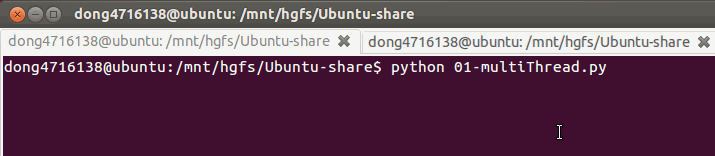

# 多任务开发

## 一、并发与并行

- `并发`：指的是任务数多余cpu核数，通过操作系统的各种任务调度算法，实现用多个任务“一起”执行（实际上总有一些任务不在执行，因为切换任务的速度相当快，看上去一起执行而已）
- `并行`：指的是任务数小于等于cpu核数，即任务真的是一起执行的

## 二、线程

### 1. 使用threading模块创建线程

- 查看线程数量`len(threading.enumerate())`

```python
#coding=utf-8
import threading
from time import sleep,ctime

def sing():
    for i in range(3):
        print("正在唱歌...%d"%i)
        sleep(1)

def dance():
    for i in range(3):
        print("正在跳舞...%d"%i)
        sleep(1)

if __name__ == '__main__':
    print('---开始---:%s'%ctime())

    t1 = threading.Thread(target=sing)
    t2 = threading.Thread(target=dance)

    t1.start()
    t2.start()

    while True:
        length = len(threading.enumerate())
        print('当前运行的线程数为：%d'%length)
        if length<=1:
            break

        sleep(0.5)
```


### 2. 线程执行代码的封装

通过上一小节，能够看出，通过使用threading模块能完成多任务的程序开发，为了让每个线程的封装性更完美，所以使用threading模块时，往往会定义一个新的子类class，只要继承`threading.Thread`就可以了，然后重写`run`方法

示例如下：

```python
#coding=utf-8
import threading
import time

class MyThread(threading.Thread):
    def run(self):
        for i in range(3):
            time.sleep(1)
            msg = "I'm "+self.name+' @ '+str(i) #name属性中保存的是当前线程的名字
            print(msg)


if __name__ == '__main__':
    t = MyThread()
    t.start()
```



##### 说明

- python的threading.Thread类有一个run方法，用于定义线程的功能函数，可以在自己的线程类中覆盖该方法。而创建自己的线程实例后，通过Thread类的start方法，可以启动该线程，交给python虚拟机进行调度，当该线程获得执行的机会时，就会调用run方法执行线程。

### 3. 线程的执行顺序

```python
#coding=utf-8
import threading
import time

class MyThread(threading.Thread):
    def run(self):
        for i in range(3):
            time.sleep(1)
            msg = "I'm "+self.name+' @ '+str(i)
            print(msg)
def test():
    for i in range(5):
        t = MyThread()
        t.start()
if __name__ == '__main__':
    test()
    
```

执行结果：(运行的结果可能不一样，但是大体是一致的)

```python
    I'm Thread-1 @ 0
    I'm Thread-2 @ 0
    I'm Thread-5 @ 0
    I'm Thread-3 @ 0
    I'm Thread-4 @ 0
    I'm Thread-3 @ 1
    I'm Thread-4 @ 1
    I'm Thread-5 @ 1
    I'm Thread-1 @ 1
    I'm Thread-2 @ 1
    I'm Thread-4 @ 2
    I'm Thread-5 @ 2
    I'm Thread-2 @ 2
    I'm Thread-1 @ 2
    I'm Thread-3 @ 2
```


##### 说明

从代码和执行结果我们可以看出，多线程程序的执行顺序是不确定的。当执行到sleep语句时，线程将被阻塞（Blocked），到sleep结束后，线程进入就绪（Runnable）状态，等待调度。而线程调度将自行选择一个线程执行。上面的代码中只能保证每个线程都运行完整个run函数，但是线程的启动顺序、run函数中每次循环的执行顺序都不能确定。

##### 总结

1. 每个线程默认有一个名字，尽管上面的例子中没有指定线程对象的name，但是python会自动为线程指定一个名字。
2. 当线程的run()方法结束时该线程完成。
3. 无法控制线程调度程序，但可以通过别的方式来影响线程调度的方式。

### 4. 共享全局变量-资源竞争

- 两个线程给全局变量`g_num`各加`1000000`次+1,理想中结果是`2000000`，可是结果却不是

```python
import threading
import time

g_num = 0

def work1(num):
    global g_num
    for i in range(num):
        g_num += 1
    print("----in work1, g_num is %d---"%g_num)


def work2(num):
    global g_num
    for i in range(num):
        g_num += 1
    print("----in work2, g_num is %d---"%g_num)


print("---线程创建之前g_num is %d---"%g_num)

t1 = threading.Thread(target=work1, args=(1000000,))
t1.start()

t2 = threading.Thread(target=work2, args=(1000000,))
t2.start()

while len(threading.enumerate()) != 1:
    time.sleep(1)
`
print("2个线程对同一个全局变量操作之后的最终结果是:%s" % g_num)
```

运行结果：

```python
---线程创建之前g_num is 0---
----in work1, g_num is 1088005---
----in work2, g_num is 1286202---
2个线程对同一个全局变量操作之后的最终结果是:1286202
```

##### 总结：

- 如果多个线程同时对同一个全局变量操作，会出现`资源竞争`问题，从而数据结果会不正确

### 5. 互斥锁

#### 5.1 同步的概念

同步就是协同步调，按预定的先后次序进行运行。如:你说完，我再说。

"同"字从字面上容易理解为一起动作

其实不是，"同"字应是指协同、协助、互相配合。

如进程、线程同步，可理解为进程或线程A和B一块配合，A执行到一定程度时要依靠B的某个结果，于是停下来，示意B运行;B执行，再将结果给A;A再继续操作。

#### 5.2 互斥锁

- 当多个线程几乎同时修改某一个共享数据的时候，需要进行`同步控制`
- 线程同步能够保证多个线程安全访问竞争资源，最简单的同步机制是引入`互斥锁`。

**互斥锁为资源引入一个状态：锁定/非锁定**

- 某个线程要更改共享数据时，先将其锁定，此时资源的状态为“锁定”，其他线程不能更改；
- 直到该线程释放资源，将资源的状态变成“非锁定”，其他的线程才能再次锁定该资源。
- 互斥锁保证了每次只有一个线程进行写入操作，从而保证了多线程情况下数据的正确性。

**threading模块中定义了Lock类，可以方便的处理锁定：**

```python
# 创建锁
mutex = threading.Lock()

# 锁定
mutex.acquire()

# 释放
mutex.release()
```

#### 注意：

- 如果这个锁之前是没有上锁的，那么acquire不会堵塞
- 如果在调用acquire对这个锁上锁之前 它已经被 其他线程上了锁，那么此时acquire会堵塞，直到这个锁被解锁为止

#### 使用互斥锁完成2个线程对同一个全局变量各加100万次的操作

```python
import threading
import time

g_num = 0

def test1(num):
    global g_num
    for i in range(num):
        mutex.acquire()  # 上锁
        g_num += 1
        mutex.release()  # 解锁

    print("---test1---g_num=%d"%g_num)

def test2(num):
    global g_num
    for i in range(num):
        mutex.acquire()  # 上锁
        g_num += 1
        mutex.release()  # 解锁

    print("---test2---g_num=%d"%g_num)

# 创建一个互斥锁
# 默认是未上锁的状态
mutex = threading.Lock()

# 创建2个线程，让他们各自对g_num加1000000次
p1 = threading.Thread(target=test1, args=(1000000,))
p1.start()

p2 = threading.Thread(target=test2, args=(1000000,))
p2.start()

# 等待计算完成
while len(threading.enumerate()) != 1:
    time.sleep(1)

print("2个线程对同一个全局变量操作之后的最终结果是:%s" % g_num)
```

运行结果：

```python
---test1---g_num=1909909
---test2---g_num=2000000
2个线程对同一个全局变量操作之后的最终结果是:2000000
```

#### 上锁解锁过程

当一个线程调用锁的acquire()方法获得锁时，锁就进入“locked”状态。

每次只有一个线程可以获得锁。如果此时另一个线程试图获得这个锁，该线程就会变为“blocked”状态，称为“阻塞”，直到拥有锁的线程调用锁的release()方法释放锁之后，锁进入“unlocked”状态。

线程调度程序从处于同步阻塞状态的线程中选择一个来获得锁，并使得该线程进入运行（running）状态。


#### 总结

锁的好处：

- 确保了某段关键代码只能由一个线程从头到尾完整地执行

锁的坏处：

- 阻止了多线程并发执行，包含锁的某段代码实际上只能以单线程模式执行，效率就大大地下降了
- 由于可以存在多个锁，不同的线程持有不同的锁，并试图获取对方持有的锁时，可能会造成死锁

### 6. 死锁

> 在线程间共享多个资源的时候，如果两个线程分别占有一部分资源并且同时等待对方的资源，就会造成死锁。

**死锁的例子**

```python
#coding=utf-8
import threading
import time

class MyThread1(threading.Thread):
    def run(self):
        # 对mutexA上锁
        mutexA.acquire()

        # mutexA上锁后，延时1秒，等待另外那个线程 把mutexB上锁
        print(self.name+'----do1---up----')
        time.sleep(1)

        # 此时会堵塞，因为这个mutexB已经被另外的线程抢先上锁了
        mutexB.acquire()
        print(self.name+'----do1---down----')
        mutexB.release()

        # 对mutexA解锁
        mutexA.release()

class MyThread2(threading.Thread):
    def run(self):
        # 对mutexB上锁
        mutexB.acquire()

        # mutexB上锁后，延时1秒，等待另外那个线程 把mutexA上锁
        print(self.name+'----do2---up----')
        time.sleep(1)

        # 此时会堵塞，因为这个mutexA已经被另外的线程抢先上锁了
        mutexA.acquire()
        print(self.name+'----do2---down----')
        mutexA.release()

        # 对mutexB解锁
        mutexB.release()

mutexA = threading.Lock()
mutexB = threading.Lock()

if __name__ == '__main__':
    t1 = MyThread1()
    t2 = MyThread2()
    t1.start()
    t2.start()
```

运行结果：


**避免死锁**

- 程序设计时要尽量避免（银行家算法）
- 添加超时时间等

### 案例：多任务版udp聊天器


#### 说明

> - 编写一个有2个线程的程序
> - 线程1用来接收数据然后显示
> - 线程2用来检测键盘数据然后通过udp发送数据

#### 要求

> 1. 实现上述要求
> 2. 总结多任务程序的特点

#### 参考代码:

```python
import socket
import threading


def send_msg(udp_socket):
    """获取键盘数据，并将其发送给对方"""
    while True:
        # 1. 从键盘输入数据
        msg = input("\n请输入要发送的数据:")
        # 2. 输入对方的ip地址
        dest_ip = input("\n请输入对方的ip地址:")
        # 3. 输入对方的port
        dest_port = int(input("\n请输入对方的port:"))
        # 4. 发送数据
        udp_socket.sendto(msg.encode("utf-8"), (dest_ip, dest_port))


def recv_msg(udp_socket):
    """接收数据并显示"""
    while True:
        # 1. 接收数据
        recv_msg = udp_socket.recvfrom(1024)
        # 2. 解码
        recv_ip = recv_msg[1]
        recv_msg = recv_msg[0].decode("utf-8")
        # 3. 显示接收到的数据
        print(">>>%s:%s" % (str(recv_ip), recv_msg))


def main():
    # 1. 创建套接字
    udp_socket = socket.socket(socket.AF_INET, socket.SOCK_DGRAM)
    # 2. 绑定本地信息
    udp_socket.bind(("", 7890))

    # 3. 创建一个子线程用来接收数据
    t = threading.Thread(target=recv_msg, args=(udp_socket,))
    t.start()
    # 4. 让主线程用来检测键盘数据并且发送
    send_msg(udp_socket)

if __name__ == "__main__":
    main()
```