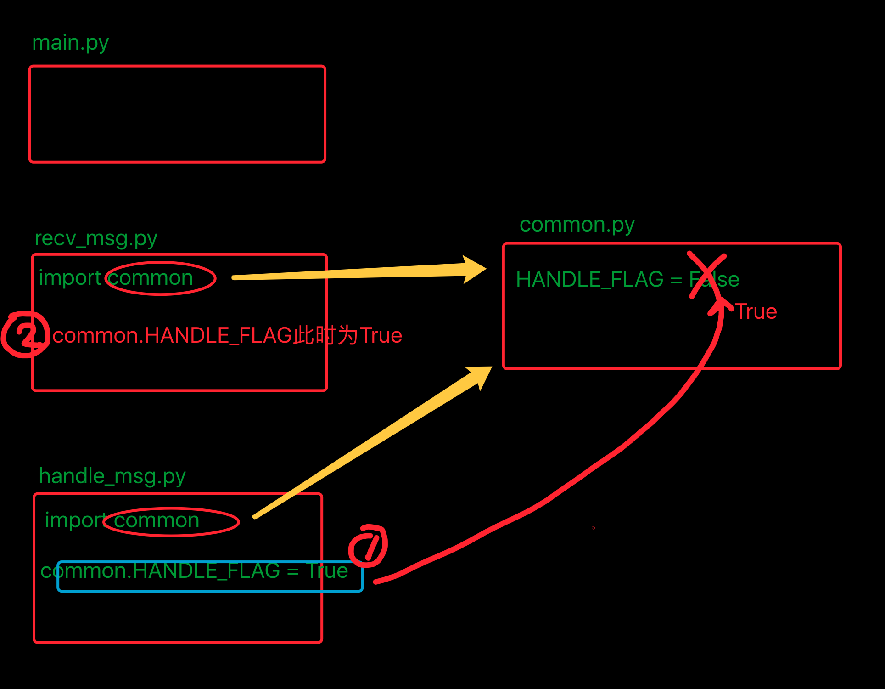

# 模块和包

## 目标

*   模块
*   包
*   发布模块

## 01. 模块

### 1.1 模块的概念

> **模块是 Python 程序架构的一个核心概念**

*   每一个以扩展名 `py` 结尾的 `Python` 源代码文件都是一个 **模块**
*   **模块名** 同样也是一个 **标识符**，需要符合标识符的命名规则
*   在模块中定义的 **全局变量** 、**函数**、**类** 都是提供给外界直接使用的 **工具**
*   **模块** 就好比是 **工具包**，要想使用这个工具包中的工具，就需要先 **导入** 这个模块

### 1.2 模块的两种导入方式

#### 1）import 导入

```python
import 模块名1, 模块名2 
```

*   **导入之后**

    通过 模块名. 使用 模块提供的工具 —— 全局变量、函数、类

##### 使用 `as` 指定模块的别名

> **如果模块的名字太长**，可以使用 `as` 指定模块的名称，以方便在代码中的使用
```python
import 模块名1 as 模块别名
```
> 注意：**模块别名** 应该符合 **大驼峰命名法**

#### 2）from...import 导入

*   如果希望 **从某一个模块** 中，导入 **部分** 工具，就可以使用 `from ... import` 的方式
*   `import 模块名` 是 **一次性** 把模块中 **所有工具全部导入**，并且通过 **模块名/别名** 访问
```python
# 从 模块 导入 某一个工具
from 模块名1 import 工具名
```


*   导入之后

    *   **不需要** 通过 `模块名.`
    *   可以直接使用 **模块提供的工具** —— **全局变量**、**函数**、**类**

    **注意**

    > 如果 **两个模块**，存在 **同名的函数**，那么 **后导入模块的函数**，会 **覆盖掉先导入的函数**

*   开发时 `import` 代码应该统一写在 **代码的顶部**，更容易及时发现冲突
*   一旦发现冲突，可以使用 `as` 关键字 **给其中一个工具起一个别名**

##### from...import *（知道）

```python
# 从 模块 导入 所有工具
from 模块名1 import *
```

**注意**

> 这种方式不推荐使用，因为函数重名并没有任何的提示，出现问题不好排查

### 1.3 模块的搜索顺序[扩展]

`Python` 的解释器在 **导入模块** 时，会：

1.  搜索 **当前目录** 指定模块名的文件，**如果有就直接导入**
2.  如果没有，再搜索 **系统目录**

> 在开发时，给文件起名，不要和 **系统的模块文件** **重名**

`Python` 中每一个模块都有一个内置属性 `__file__` 可以 **查看模块** 的 **完整路径**

**示例**

```python
import random
# 生成一个 0～10 的数字
rand = random.randint(0, 10)
print(rand)

```
> 注意：如果当前目录下，存在一个 `random.py` 的文件，程序就无法正常执行了！

*   这个时候，`Python` 的解释器会 **加载当前目录** 下的 `random.py` 而不会加载 **系统的** `random` 模块

### 1.4 原则 —— 每一个文件都应该是可以被导入的

*   一个 **独立的 `Python` 文件** 就是一个 **模块**
*   在导入文件时，文件中 **所有没有任何缩进的代码** 都会被执行一遍！

    **实际开发场景**

*   在实际开发中，每一个模块都是独立开发的，大多都有专人负责
*   **开发人员** 通常会在 **模块下方** **增加一些测试代码**

    - 仅在模块内使用，而被导入到其他文件中不需要执行

#### `__name__` 属性

> *   `__name__` 属性可以做到，测试模块的代码 **只在测试情况下被运行**，而在 **被导入时不会被执行**！

* `__name__` 是 `Python` 的一个内置属性，记录着一个 **字符串**

* 如果 **是被其他文件导入的**，`__name__` 就是 **模块名**

* 如果 **是当前执行的程序** `__name__` 是 **`__main__`**

  **在很多 `Python` 文件中都会看到以下格式的代码**：

  ```python
  # 导入模块
  # 定义全局变量
  # 定义类
  # 定义函数
  
  # 在代码的最下方
  def main():
      # ...
      pass
  
  # 根据 __name__ 判断是否执行下方代码
  if __name__ == "__main__":
      main()
  
  ```

## 02、import高级

### 1. import 搜索路径


**路径搜索 sys.path**

- 从上面列出的目录里依次查找要导入的模块文件
- '' 表示当前路径
- 列表中的路径的先后顺序代表了python解释器在搜索模块时的`先后顺序`

**程序执行时添加新的模块路径**

```python
sys.path.append('/home/itcast/xxx')
sys.path.insert(0, '/home/itcast/xxx')  # 可以确保先搜索这个路径
In [37]: sys.path.insert(0,"/home/python/xxxx")
In [38]: sys.path
Out[38]: 
['/home/python/xxxx',
 '',
 '/usr/bin',
 '/usr/lib/python35.zip',
 '/usr/lib/python3.5',
 '/usr/lib/python3.5/plat-x86_64-linux-gnu',
 '/usr/lib/python3.5/lib-dynload',
 '/usr/local/lib/python3.5/dist-packages',
 '/usr/lib/python3/dist-packages',
 '/usr/lib/python3/dist-packages/IPython/extensions',
 '/home/python/.ipython']
```

### 2. 重新导入模块

模块被导入后，`import module`不能重新导入模块，重新导入需用`reload`


### 3. 多模块开发时的注意点

```
recv_msg.py模块
from common import RECV_DATA_LIST
# from common import HANDLE_FLAG
import common


def recv_msg():
    """模拟接收到数据，然后添加到common模块中的列表中"""
    print("--->recv_msg")
    for i in range(5):
        RECV_DATA_LIST.append(i)


def test_recv_data():
    """测试接收到的数据"""
    print("--->test_recv_data")
    print(RECV_DATA_LIST)


def recv_msg_next():
    """已经处理完成后，再接收另外的其他数据"""
    print("--->recv_msg_next")
    # if HANDLE_FLAG:
    if common.HANDLE_FLAG:
        print("------发现之前的数据已经处理完成，这里进行接收其他的数据(模拟过程...)----")
    else:
        print("------发现之前的数据未处理完，等待中....------")
handle_msg.py模块
from common import RECV_DATA_LIST
# from common import HANDLE_FLAG
import common

def handle_data():
    """模拟处理recv_msg模块接收的数据"""
    print("--->handle_data")
    for i in RECV_DATA_LIST:
        print(i)

    # 既然处理完成了，那么将变量HANDLE_FLAG设置为True，意味着处理完成
    # global HANDLE_FLAG
    # HANDLE_FLAG = True
    common.HANDLE_FLAG = True

def test_handle_data():
    """测试处理是否完成，变量是否设置为True"""
    print("--->test_handle_data")
    # if HANDLE_FLAG:
    if common.HANDLE_FLAG:
        print("=====已经处理完成====")
    else:
        print("=====未处理完成====")
main.py模块
from recv_msg import *
from handle_msg import *


def main():
    # 1. 接收数据
    recv_msg()
    # 2. 测试是否接收完毕
    test_recv_data()
    # 3. 判断如果处理完成，则接收其它数据
    recv_msg_next()
    # 4. 处理数据
    handle_data()
    # 5. 测试是否处理完毕
    test_handle_data()
    # 6. 判断如果处理完成，则接收其它数据
    recv_msg_next()


if __name__ == "__main__":
    main()
```




## 03. 包（Package）

### 概念

* **包** 是一个 **包含多个模块** 的 **特殊目录**

* 目录下有一个 **特殊的文件** `__init__.py`

*   包名的 **命名方式** 和变量名一致，**小写字母** + `_`

    **好处**

*   使用 `import 包名` 可以一次性导入 **包** 中 **所有的模块**

    ### 案例演练

1.  新建一个 `hm_message` 的 **包**
2.  在目录下，新建两个文件 `send_message` 和 `receive_message`
3.  在 `send_message` 文件中定义一个 `send` 函数
4.  在 `receive_message` 文件中定义一个 `receive` 函数
5.  在外部直接导入 `hm_message` 的包

    ### `__init__.py`

* 要在外界使用 **包** 中的模块，需要在 `__init__.py` 中指定 **对外界提供的模块列表**

  ```python
  # 从 当前目录 导入 模块列表
  from . import send_message
  from . import receive_message
  ```

  


  ## 04. 发布模块（知道）

*   如果希望自己开发的模块，**分享** 给其他人，可以按照以下步骤操作

    ### 3.1 制作发布压缩包步骤

    #### 1) 创建 setup.py

* `setup.py` 的文件

```python
from distutils.core import setup

setup(name="hm_message",  # 包名
      version="1.0",  # 版本
      description="itheima's 发送和接收消息模块",  # 描述信息
      long_description="完整的发送和接收消息模块",  # 完整描述信息
      author="itheima",  # 作者
      author_email="itheima@itheima.com",  # 作者邮箱
      url="www.itheima.com",  # 主页
      py_modules=["hm_message.send_message",
                  "hm_message.receive_message"])
```


有关字典参数的详细信息，可以参阅官方网站：

[https://docs.python.org/2/distutils/apiref.html](https://docs.python.org/2/distutils/apiref.html)

#### 2) 构建模块

```python
$ python3 setup.py build
```


#### 3) 生成发布压缩包

```python
$ python3 setup.py sdist
```


> 注意：要制作哪个版本的模块，就使用哪个版本的解释器执行！

### 3.2 安装模块

```python
$ tar -zxvf hm_message-1.0.tar.gz 

$ sudo python3 setup.py install
```


**卸载模块**
    
直接从安装目录下，把安装模块的 **目录** 删除就可以

  ```python
$ cd /usr/local/lib/python3.5/dist-packages/
$ sudo rm -r hm_message*
  ```


### 3.3 `pip` 安装第三方模块

*   **第三方模块** 通常是指由 **知名的第三方团队** **开发的** 并且被 **程序员广泛使用** 的 `Python` 包 / 模块

    - 例如 `pygame` 就是一套非常成熟的 **游戏开发模块**
    
* `pip` 是一个现代的，通用的 `Python` 包管理工具

*   提供了对 `Python` 包的查找、下载、安装、卸载等功能

    安装和卸载命令如下：

    ```python
    # 将模块安装到 Python 2.x 环境
    $ sudo pip install pygame
$ sudo pip uninstall pygame
    
    # 将模块安装到 Python 3.x 环境
    $ sudo pip3 install pygame
    $ sudo pip3 uninstall pygame
    ```
```
    

    
    #### 在 `Mac` 下安装 `iPython`

    ```python
$ sudo pip install ipython
```


​    
​    
    #### 在 `Linux` 下安装 `iPython`
    
    ```python
    $ sudo apt install ipython
    $ sudo apt install ipython3
    ```


​    