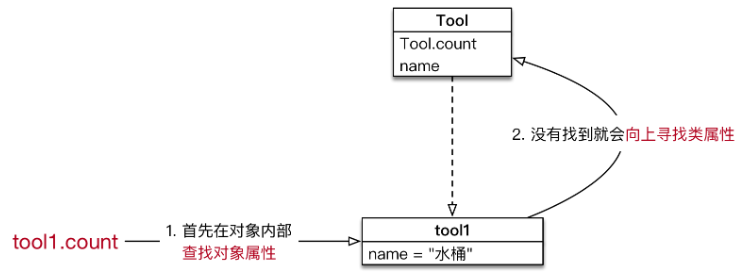

# 面向对象基础语法

## **面向对象三大特性**

1. **封装** 根据 **职责** 将 **属性** 和 **方法** **封装** 到一个抽象的 **类** 中
2. **继承** **实现代码的重用**，相同的代码不需要重复的编写
3. **多态** 不同的对象调用相同的方法，产生不同的执行结果，**增加代码的灵活度**


###  1. 技巧

- 利用好 `dir()` 函数，传入 **标识符** / **数据**，可以查看对象内的 **所有属性及方法**

- 使用 `print` 输出 **对象变量**，默认情况下，是能够输出这个变量 **引用的对象** 是 **由哪一个类创建的对象**，以及 **在内存中的地址**（**十六进制表示**）

### 2. 类内置方法

```python
class Foo(object):
    # 插槽 只允许该类只能有哪些属性
    __slots__ = ("__storage__", "__ident_func__")
    # 当调用__init__方法之前时，该方法会被调用
    def __new__(cls):
        print(cls)
        return super().__new__(cls)

    # 当对象初始化时，该方法会被调用
    def __init__(self):
        self.name = "haha"
        
        # 给当前类设定一个属性
        object.__setattr__(self, "__storage__", {})
        
  
    
    # 当对象加括号 foo() 时，该方法会被调用
    def __call__(self, *args, **kwargs):
        print("对象加()执行我")

    # 当对象设置属性或者方法时，该方法会被调用
    def __setattr__(self, key, value):
        pass

    # 当对象设置元素时时，该方法会被调用
    def __setitem__(self, key, value):
        pass

    # 当调用的属性或者方法不存在时，该方法会被调用
    def __getattr__(self, item):
        print("没有这个属性")

    # 当print(foo)时，该方法会被调用
    def __str__(self):
        return "fooooooo"
    
	# 对象在内存中销毁前，会被自动调用
    def __del__(self):
        pass


if __name__ == '__main__':
    foo = Foo()  # 执行__int__()

    foo()  # 执行 foo.__call__()

    foo.age = 1  # 执行foo.__setattr__方法

    foo["sex"] = "male"  # 执行foo.__setitem__方法

    a = foo.x  # 调用foo.__getattr__方法
    
    foo.__dict__() # 查看对象内部所有属性名和属性值组成的字典
    
    foo.__class__() # 查看由哪个类实例化而来
   
    print(foo)

    
```

#### 2.1 `__new__` 方法

- 使用 **类名()** 创建对象时，`Python` 的解释器 **首先** 会 调用 `__new__` 方法为对象 **分配空间**
- `__new__` 是一个 由 `object` 基类提供的 **内置的静态方法**，主要作用有两个：
  - 1) 在内存中为对象 **分配空间**
  - 2) **返回** 对象的引用

- `Python` 的解释器获得对象的 **引用** 后，将引用作为 **第一个参数**，传递给 `__init__` 方法

> *重写* `__new__` *方法 的代码非常固定！*

- 重写 `__new__` 方法 **一定要** `return super().__new__(cls)`
- 否则 Python 的解释器 **得不到** 分配了空间的 **对象引用**，**就不会调用对象的初始化方法**
- 注意：`__new__` 是一个静态方法，在调用时需要 **主动传递** `cls` 参数

### 3. 方法中的 `self` 参数

> *由* **哪一个对象** *调用的方法，方法内的* `self` *就是* **哪一个对象的引用**

- 在类封装的方法内部，`self` 就表示 **当前调用方法的对象自己**
- **调用方法时**，程序员不需要传递 `self` 参数
- 在方法内部
  - 可以通过 `self.` **访问对象的属性**
  - 也可以通过 `self.` **调用其他的对象方法**

### **4. 增加属性**

> 不推荐在类的外部给对象增加属性，应该 **封装在类的内部**

#### 4.1 初始化方法添加属性

> `__init__` *方法是* **专门** *用来定义一个类* **具有哪些属性的方法**

```python
class Cat:

    def __init__(self, name):
        print("初始化方法 %s" % name)
        self.name = name
    ...
    
tom = Cat("Tom")
...

lazy_cat = Cat("大懒猫")
...
```


### **5. 类的生命周期**

- 一个对象从调用 `类名()` 创建，生命周期开始
- 一个对象的 `__del__` 方法一旦被调用，生命周期结束
- 在对象的生命周期内，可以访问对象属性，或者让对象调用方法

### 6. 身份运算符

> 身份运算符用于 **比较** 两个对象的 **内存地址** 是否一致 —— **是否是对同一个对象的引用**

- 在 `Python` 中针对 `None` 比较时，建议使用 `is` 判断

| 运算符 | 描述                                      | 实例                            |
| :----- | :---------------------------------------- | :------------------------------ |
| is     | is 是判断两个标识符是不是引用同一个对象   | x is y，类似 id(x) == id(y)     |
| is not | is not 是判断两个标识符是不是引用不同对象 | x is not y，类似 id(a) != id(b) |

#### is 与 == 区别：

`is` 用于判断 **两个变量 引用对象是否为同一个** 
`==` 用于判断 **引用变量的值** 是否相等

```python
>>> a = [1, 2, 3]
>>> b = [1, 2, 3]
>>> b is a 
False
>>> b == a
True
```

### 7. 私有属性和私有方法

- 在 **定义属性或方法时**，在 **属性名或者方法名前** 增加 **两个下划线**，定义的就是 **私有** 属性或方法

```python
class Women:

    def __init__(self, name):

        self.name = name
        # 不要问女生的年龄
        self.__age = 18

    def __secret(self):
        print("我的年龄是 %d" % self.__age)


xiaofang = Women("小芳")
# 私有属性，外部不能直接访问
# print(xiaofang.__age)

# 私有方法，外部不能直接调用
# xiaofang.__secret()

```

- **访问对象的 私有属性 或 私有方法**(不推荐)

```python
# 私有属性，外部不能直接访问到
print(xiaofang._Women__age)

# 私有方法，外部不能直接调用
xiaofang._Women__secret()

```

### 8. 继承

#### 8.1 单继承

1. ##### 继承的传递性

- `C` 类从 `B` 类继承，`B` 类又从 `A` 类继承
- 那么 `C` 类就具有 `B` 类和 `A` 类的所有属性和方法

2. ##### 方法的重写

   1) 覆盖父类的方法

   - *具体的实现方式，就相当于在* **子类中** *定义了一个* **和父类同名的方法并且实现**

   - 重写之后，在运行时，**只会调用** 子类中重写的方法，而不再会调用 **父类封装的方法**

     

3. ##### 对父类方法进行 **扩展**

- 如果在开发中，子类的方法实现中包含父类的方法实现
  - **父类原本封装的方法实现** 是 **子类方法的一部分**
- 就可以使用扩展的方式
  1. **在子类中** **重写** 父类的方法
  2. 在需要的位置使用 `super().父类方法` 来调用父类方法的执行
  3. 代码其他的位置针对子类的需求，编写 **子类特有的代码实现**

4. ##### 父类的 私有属性 和 私有方法

   1. **子类对象** **不能** 在自己的方法内部，**直接** 访问 父类的 **私有属性** 或 **私有方法**
   2. **子类对象** 可以通过 **父类** 的 **公有方法** **间接** 访问到 **私有属性** 或 **私有方法**

   > - **私有属性、方法** 是对象的隐私，不对外公开，**外界** 以及 **子类** 都不能直接访问
   > - **私有属性、方法** 通常用于做一些内部的事情


#### 8.2 多继承

##### 1 多继承的使用注意事项

- 如果 **不同的父类** 中存在 **同名的方法**，**子类对象** 在调用方法时，会调用 **哪一个父类中**的方法呢？

  > *提示：***开发时，应该尽量避免这种容易产生混淆的情况！** *—— 如果* **父类之间** *存在* **同名的属性或者方法***，应该* **尽量避免** *使用多继承*

###### Python 中的 MRO —— 方法搜索顺序（知道）

- `Python` 中针对 **类** 提供了一个 **内置属性** `__mro__` 可以查看 **方法** 搜索顺序
- MRO 是 `method resolution order`，主要用于 **在多继承时判断 方法、属性 的调用 路径**

```python
print(C.__mro__)
```

###### **输出结果**

```python
(<class '__main__.C'>, <class '__main__.A'>, <class '__main__.B'>, <class 'object'>)
```

- 在搜索方法时，是按照 `__mro__` 的输出结果 **从左至右** 的顺序查找的
- 如果在当前类中 **找到方法，就直接执行，不再搜索**
- 如果 **没有找到，就查找下一个类** 中是否有对应的方法，**如果找到，就直接执行，不再搜索**
- 如果找到最后一个类，还没有找到方法，程序报错

### 9 新式类与旧式（经典）类

> `object` 是 `Python` 为所有对象提供的 **基类**，提供有一些内置的属性和方法，可以使用 `dir` 函数查看

- **新式类**：以 `object` 为基类的类，**推荐使用**
- **经典类**：不以 `object` 为基类的类，**不推荐使用**
- 在 `Python 3.x` 中定义类时，如果没有指定父类，会 **默认使用** `object` 作为该类的 **基类** —— `Python 3.x` 中定义的类都是 **新式类**
- 在 `Python 2.x` 中定义类时，如果没有指定父类，则不会以 `object` 作为 **基类**

> **新式类** 和 **经典类** 在多继承时 —— **会影响到方法的搜索顺序**

为了保证编写的代码能够同时在 `Python 2.x` 和 `Python 3.x` 运行！
今后在定义类时，**如果没有父类，建议统一继承自 `object`**

```python
class 类名(object):
    pass
```

#### 10 多态

- `Person` 类中只需要让 **狗对象** 调用 `game` 方法，而不关心具体是 **什么狗**
- 在程序执行时，传入不同的 **狗对象** 实参，就会产生不同的执行效果

> **多态** *更容易编写出出通用的代码，做出通用的编程，以适应需求的不断变化！*

```python
class Dog(object):

    def __init__(self, name):
        self.name = name

    def game(self):
        print("%s 蹦蹦跳跳的玩耍..." % self.name)


class XiaoTianDog(Dog):

    def game(self):
        print("%s 飞到天上去玩耍..." % self.name)


class Person(object):

    def __init__(self, name):
        self.name = name

    def game_with_dog(self, dog):

        print("%s 和 %s 快乐的玩耍..." % (self.name, dog.name))

        # 让狗玩耍
        dog.game()


# 1. 创建一个狗对象
# wangcai = Dog("旺财")
wangcai = XiaoTianDog("飞天旺财")

# 2. 创建一个小明对象
xiaoming = Person("小明")

# 3. 让小明调用和狗玩的方法
xiaoming.game_with_dog(wangcai)
        
```


### 11 类属性和类方法

##### 1. 类是一个特殊的对象

>  `Python` 中 **一切皆对象**：
>
> - `class AAA:` 定义的类属于 **类对象**
> - `obj1 = AAA()` 属于 **实例对象**

- 在程序运行时，**类** 同样 **会被加载到内存**

- 在 `Python` 中，**类** 是一个特殊的对象 —— **类对象**

- 在程序运行时，**类对象** 在内存中 **只有一份**，使用 **一个类** 可以创建出 **很多个对象实例**

- 除了封装 **实例** 的 **属性** 和 **方法**外，**类对象** 还可以拥有自己的 **属性** 和 **方法**
- 通过 **类名.** 的方式可以 **访问类的属性** 或者 **调用类的方法**


##### 2. 类属性和实例属性

```python
class Tool(object):

    # 使用赋值语句，定义 类属性 ，记录创建工具对象的总数
    count = 0

    def __init__(self, name):
        self.name = name

        # 针对类属性做一个计数+1
        Tool.count += 1


# 创建工具对象
tool1 = Tool("斧头")
tool2 = Tool("榔头")
tool3 = Tool("铁锹")

# 知道使用 Tool 类到底创建了多少个对象?
print("现在创建了 %d 个工具" % Tool.count)

```

##### 3. 属性的获取机制（科普）

- 在 `Python` 中 **属性的获取** 存在一个 **向上查找机制**



因此，要访问类属性有两种方式：

1. **类名.类属性**
2. **对象.类属性** （不推荐）

**注意**

- 如果使用 `对象.类属性 = 值` 赋值语句，只会 **给对象添加一个属性**，而不会影响到 **类属性的值**

##### 

##### 4. 类方法

- **类方法** 就是针对 **类对象** 定义的方法
  - 在 **类方法** 内部可以直接访问 **类属性** 或者调用其他的 **类方法**

**语法如下**

```python
@classmethod
def 类方法名(cls):
    pass
```

- 类方法需要用 **修饰器** `@classmethod` 来标识，**告诉解释器这是一个类方法**
- 类方法的 **第一个参数** 应该是 `cls`
  - 由 **哪一个类** 调用的方法，方法内的 `cls` 就是 **哪一个类的引用**
  - 这个参数和 **实例方法** 的第一个参数是 `self` 类似
  - **提示** 使用其他名称也可以，不过习惯使用 `cls`

- 通过 **类名.** 调用 **类方法**，**调用方法时**，不需要传递 `cls` 参数
- **在方法内部**
  - 可以通过 `cls.` **访问类的属性**
  - 也可以通过 `cls.` **调用其他的类方法**

```python
@classmethod
def show_tool_count(cls):
    """显示工具对象的总数"""
    print("工具对象的总数 %d" % cls.count)
```

> *在类方法内部，可以直接使用* `cls` *访问* **类属性** *或者* **调用类方法**

##### 5. 静态方法

```python
@staticmethod
def 静态方法名():
    pass
```

- **静态方法** 需要用 **修饰器** `@staticmethod` 来标识，**告诉解释器这是一个静态方法**
- 通过 **类名.** 调用 **静态方法**

```python
class Dog(object):
    
    # 狗对象计数
    dog_count = 0
    
    @staticmethod
    def run():
        
        # 不需要访问实例属性也不需要访问类属性的方法
        print("狗在跑...")

    def __init__(self, name):
        self.name = name
        
```

##### 6. 方法综合案例

**需求**

1. 设计一个 `Game` 类
2. 属性：
   - 定义一个 **类属性** `top_score` 记录游戏的 **历史最高分**
   - 定义一个 **实例属性** `player_name` 记录 **当前游戏的玩家姓名**
3. 方法：
   - **静态方法** `show_help` 显示游戏帮助信息
   - **类方法** `show_top_score` 显示历史最高分
   - **实例方法** `start_game` 开始当前玩家的游戏
4. 主程序步骤
   - 1) 查看帮助信息
   - 2) 查看历史最高分
   - 3) 创建游戏对象，开始游戏


#### 案例小结

1. 实例方法—— 方法内部需要访问实例属性
   - **实例方法** 内部可以使用 **类名.** 访问类属性
2. **类方法** —— 方法内部 **只** 需要访问 **类属性**
3. **静态方法** —— 方法内部，不需要访问 **实例属性** 和 **类属性**

**提问**

如果方法内部 即需要访问 **实例属性**，又需要访问 **类属性**，应该定义成什么方法？

**答案**

- 应该定义 **实例方法**
- 因为，**类只有一个**，在 **实例方法** 内部可以使用 **类名.** 访问类属性

```python
class Game(object):

    # 游戏最高分，类属性
    top_score = 0

    @staticmethod
    def show_help():
        print("帮助信息：让僵尸走进房间")
        
    @classmethod
    def show_top_score(cls):
        print("游戏最高分是 %d" % cls.top_score)

    def __init__(self, player_name):
        self.player_name = player_name

    def start_game(self):
        print("[%s] 开始游戏..." % self.player_name)
        
        # 使用类名.修改历史最高分
        Game.top_score = 999

# 1. 查看游戏帮助
Game.show_help()

# 2. 查看游戏最高分
Game.show_top_score()

# 3. 创建游戏对象，开始游戏
game = Game("小明")

game.start_game()

# 4. 游戏结束，查看游戏最高分
Game.show_top_score()
```


### 12 关于 `super`

- 在 `Python` 中 `super` 是一个 **特殊的类**
- `super()` 就是使用 `super` 类创建出来的对象
- **最常** 使用的场景就是在 **重写父类方法时**，调用 **在父类中封装的方法实现**

### 13 单例模式

**单例** —— 让 **类** 创建的对象，在系统中 **只有** **唯一的一个实例**

1. 定义一个 **类属性**，初始值是 `None`，用于记录 **单例对象的引用**
2. 重写 `__new__` 方法
3. 如果 **类属性** `is None`，调用父类方法分配空间，并在类属性中记录结果
4. 返回 **类属性** 中记录的 **对象引用**

```python
class MusicPlayer(object):

    # 定义类属性记录单例对象引用
    instance = None

    def __new__(cls, *args, **kwargs):

        # 1. 判断类属性是否已经被赋值
        if cls.instance is None:
            cls.instance = super().__new__(cls)

        # 2. 返回类属性的单例引用
        return cls.instance

```

### 只执行一次初始化工作

- 在每次使用 `类名()` 创建对象时，`Python` 的解释器都会自动调用两个方法：
  - `__new__` 分配空间
  - `__init__` 对象初始化
- 在上一小节对 `__new__` 方法改造之后，每次都会得到 **第一次被创建对象的引用**
- 但是：**初始化方法还会被再次调用**

**需求**

- 让 **初始化动作** 只被 **执行一次**

**解决办法**

1. 定义一个类属性 `init_flag` 标记是否 **执行过初始化动作**，初始值为 `False`
2. 在 `__init__` 方法中，判断 `init_flag`，如果为 `False` 就执行初始化动作
3. 然后将 `init_flag` 设置为 `True`
4. 这样，再次 **自动** 调用 `__init__` 方法时，**初始化动作就不会被再次执行** 了

```python
class MusicPlayer(object):

    # 记录第一个被创建对象的引用
    instance = None
    # 记录是否执行过初始化动作
    init_flag = False

    def __new__(cls, *args, **kwargs):

        # 1. 判断类属性是否是空对象
        if cls.instance is None:
            # 2. 调用父类的方法，为第一个对象分配空间
            cls.instance = super().__new__(cls)

        # 3. 返回类属性保存的对象引用
        return cls.instance

    def __init__(self):

        if not MusicPlayer.init_flag:
            print("初始化音乐播放器")

            MusicPlayer.init_flag = True


# 创建多个对象
player1 = MusicPlayer()
print(player1)

player2 = MusicPlayer()
print(player2)
```

