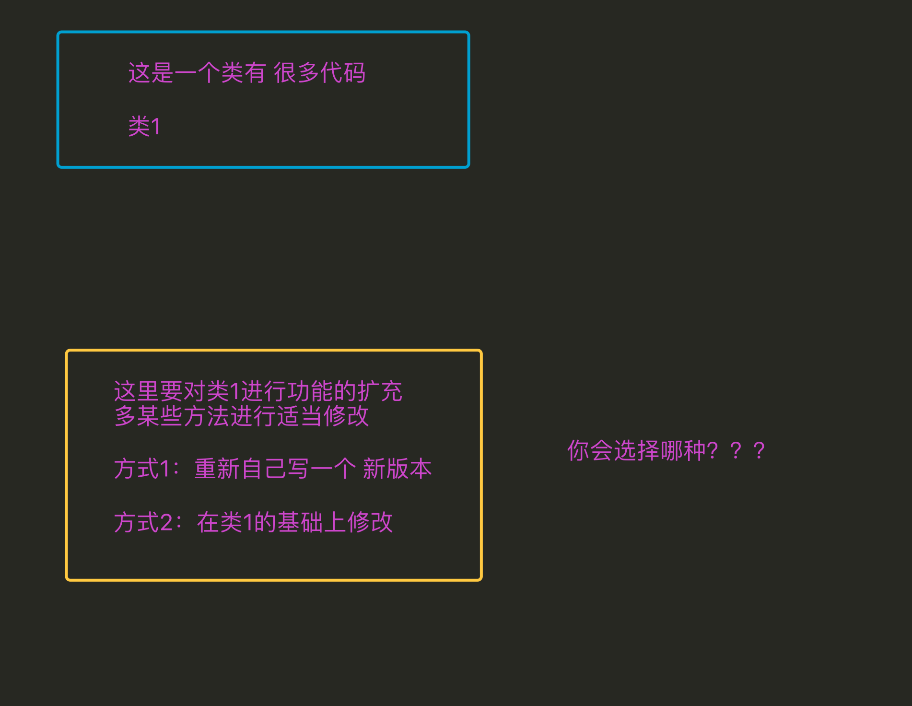

# 一、再议 封装、继承、多态

封装、继承、多态 是面向对象的3大特性

## 1. 为啥要封装


#### 好处

> 1. 在使用面向过程编程时，当需要对数据处理时，需要考虑用哪个模板中哪个函数来进行操作，但是当用面向对象编程时，因为已经将数据存储到了这个独立的空间中，这个独立的空间（即对象）中通过一个特殊的变量（__class__）能够获取到类（模板），而且这个类中的方法是有一定数量的，与此类无关的将不会出现在本类中，因此需要对数据处理时，可以很快速的定位到需要的方法是谁 这样更方便
> 2. 全局变量是只能有1份的，多很多个函数需要多个备份时，往往需要利用其它的变量来进行储存；而通过封装 会将用来存储数据的这个变量 变为了对象中的一个“全局”变量，只要对象不一样那么这个变量就可以再有1份，所以这样更方便
> 3. 代码划分更清晰

面向过程

```python
全局变量1
全局变量2
全局变量3
...

def 函数1():
    pass


def 函数2():
    pass


def 函数3():
    pass


def 函数4():
    pass


def 函数5():
    pass
```

面向对象

```python
class 类(object):
    属性1
    属性2

    def 方法1(self):
        pass

    def 方法2(self):
        pass

class 类2(object):
    属性3
    def 方法3(self):
        pass

    def 方法4(self):
        pass

    def 方法5(self):
        pass
```

## 2. 为啥要继承



#### 说明

> 1. 能够提升代码的重用率，即开发一个类，可以在多个子功能中直接使用
> 2. 继承能够有效的进行代码的管理，当某个类有问题只要修改这个类就行，而其继承这个类的子类往往不需要就修改

## 3. 怎样理解多态

```python
class MiniOS(object):
    """MiniOS 操作系统类 """
    def __init__(self, name):
        self.name = name
        self.apps = []  # 安装的应用程序名称列表

    def __str__(self):
        return "%s 安装的软件列表为 %s" % (self.name, str(self.apps))

    def install_app(self, app):
        # 判断是否已经安装了软件
        if app.name in self.apps:
            print("已经安装了 %s，无需再次安装" % app.name)
        else:
            app.install()
            self.apps.append(app.name)


class App(object):
    def __init__(self, name, version, desc):
        self.name = name
        self.version = version
        self.desc = desc

    def __str__(self):
        return "%s 的当前版本是 %s - %s" % (self.name, self.version, self.desc)

    def install(self):
        print("将 %s [%s] 的执行程序复制到程序目录..." % (self.name, self.version))


class PyCharm(App):
    pass


class Chrome(App):
    def install(self):
        print("正在解压缩安装程序...")
        super().install()


linux = MiniOS("Linux")
print(linux)

pycharm = PyCharm("PyCharm", "1.0", "python 开发的 IDE 环境")
chrome = Chrome("Chrome", "2.0", "谷歌浏览器")

linux.install_app(pycharm)
linux.install_app(chrome)
linux.install_app(chrome)

print(linux)
```

运行结果

```python
Linux 安装的软件列表为 []
将 PyCharm [1.0] 的执行程序复制到程序目录...
正在解压缩安装程序...
将 Chrome [2.0] 的执行程序复制到程序目录...
已经安装了 Chrome，无需再次安装
Linux 安装的软件列表为 ['PyCharm', 'Chrome']
```


# 多继承以及MRO顺序

## 1. 单独调用父类的方法

```python
# coding=utf-8

print("******多继承使用类名.__init__ 发生的状态******")
class Parent(object):
    def __init__(self, name):
        print('parent的init开始被调用')
        self.name = name
        print('parent的init结束被调用')

class Son1(Parent):
    def __init__(self, name, age):
        print('Son1的init开始被调用')
        self.age = age
        Parent.__init__(self, name)
        print('Son1的init结束被调用')

class Son2(Parent):
    def __init__(self, name, gender):
        print('Son2的init开始被调用')
        self.gender = gender
        Parent.__init__(self, name)
        print('Son2的init结束被调用')

class Grandson(Son1, Son2):
    def __init__(self, name, age, gender):
        print('Grandson的init开始被调用')
        Son1.__init__(self, name, age)  # 单独调用父类的初始化方法
        Son2.__init__(self, name, gender)
        print('Grandson的init结束被调用')

gs = Grandson('grandson', 12, '男')
print('姓名：', gs.name)
print('年龄：', gs.age)
print('性别：', gs.gender)

print("******多继承使用类名.__init__ 发生的状态******\n\n")
```

**运行结果:**

```
******多继承使用类名.__init__ 发生的状态******
Grandson的init开始被调用
Son1的init开始被调用
parent的init开始被调用
parent的init结束被调用
Son1的init结束被调用
Son2的init开始被调用
parent的init开始被调用
parent的init结束被调用
Son2的init结束被调用
Grandson的init结束被调用
姓名： grandson
年龄： 12
性别： 男
******多继承使用类名.__init__ 发生的状态******
```

**问题：**

- 父类`__init__()`被调用多次，浪费资源，不推荐用`Parent.__init__()`这种方式，调用父类init方法


## 2. 多继承中 super 调用有所父类的被重写的方法

```python
print("******多继承使用super().__init__ 发生的状态******")
class Parent(object):
    def __init__(self, name, *args, **kwargs):  # 为避免多继承报错，使用不定长参数，接受参数
        print('parent的init开始被调用')
        self.name = name
        print('parent的init结束被调用')

class Son1(Parent):
    def __init__(self, name, age, *args, **kwargs):  # 为避免多继承报错，使用不定长参数，接受参数
        print('Son1的init开始被调用')
        self.age = age
        super().__init__(name, *args, **kwargs)  # 为避免多继承报错，使用不定长参数，接受参数
        print('Son1的init结束被调用')

class Son2(Parent):
    def __init__(self, name, gender, *args, **kwargs):  # 为避免多继承报错，使用不定长参数，接受参数
        print('Son2的init开始被调用')
        self.gender = gender
        super().__init__(name, *args, **kwargs)  # 为避免多继承报错，使用不定长参数，接受参数
        print('Son2的init结束被调用')

class Grandson(Son1, Son2):
    def __init__(self, name, age, gender):
        print('Grandson的init开始被调用')
        # 多继承时，相对于使用类名.__init__方法，要把每个父类全部写一遍
        # 而super只用一句话，执行了全部父类的方法，这也是为何多继承需要全部传参的一个原因
        # super(Grandson, self).__init__(name, age, gender)
        super().__init__(name, age, gender)
        print('Grandson的init结束被调用')

print(Grandson.__mro__)

gs = Grandson('grandson', 12, '男')
print('姓名：', gs.name)
print('年龄：', gs.age)
print('性别：', gs.gender)
print("******多继承使用super().__init__ 发生的状态******\n\n")
```

运行结果：

```
******多继承使用super().__init__ 发生的状态******
(<class '__main__.Grandson'>, <class '__main__.Son1'>, <class '__main__.Son2'>, <class '__main__.Parent'>, <class 'object'>)
Grandson的init开始被调用
Son1的init开始被调用
Son2的init开始被调用
parent的init开始被调用
parent的init结束被调用
Son2的init结束被调用
Son1的init结束被调用
Grandson的init结束被调用
姓名： grandson
年龄： 12
性别： 男
******多继承使用super().__init__ 发生的状态******
```

**注意：**

> 1. 以上2个代码执行的结果不同
> 2. 如果2个子类中都继承了父类，当在子类中通过父类名调用时，parent被执行了2次
> 3. 如果2个子类中都继承了父类，当在子类中通过super调用时，parent被执行了1次

### 2.1 方法搜索顺序——Python 中的 MRO

- `Python` 中针对 **类** 提供了一个 **内置属性** `__mro__` 可以查看 **方法** 搜索顺序
- MRO 是 `method resolution order`，主要用于 **在多继承时判断 方法、属性 的调用 路径**
- `self.属性`，`selft.函数`
  - 会先去创建实例的类中寻找，没有的话就下一个类寻找。
  - 如果找到，直接执行，不再继续搜索。
  - 如果找到最后一个类还没没有，就会报错。

```python
print(Grandson.__mro__)
```

**输出结果**

```python
(<class '__main__.Grandson'>, <class '__main__.Son1'>, <class '__main__.Son2'>, <class '__main__.Parent'>, <class 'object'>)
```

- 在搜索方法时，是按照 `__mro__` 的输出结果 **从左至右** 的顺序查找的
- 如果在当前类中 **找到方法，就直接执行，不再搜索**
- 如果 **没有找到，就查找下一个类** 中是否有对应的方法，**如果找到，就直接执行，不再搜索**
- 如果找到最后一个类，还没有找到方法，程序报错

1) 多继承中的`self.函数()`搜索顺序

#### 1）多继承中的super() 搜索顺序

**情况一：子类 super()中不加任何参数**

```python
class Grandson(Son1, Son2):
    def __init__(self, name, age, gender):
        print('Grandson的init开始被调用')
        
        """
        super().__init__(name, age, gender) 等价于 super(Grandson, self).__init__(name, age, gender)
        会从__mro__顺序中，找到当前类后面的类(Son1)中的__init__方法执行
        
        """
        
        super().__init__(name, age, gender)
        print('Grandson的init结束被调用')
        
```

**情况二：子类 super()中添加参数**

- 可以指定到底调用哪个父类的方法

```python
class Grandson(Son1, Son2):
    def __init__(self, name, age, gender):
        print('Grandson的init开始被调用')
       
    	"""
    	如果参数是Son2,就会从__mro__顺序中找到Son2后面的类（Parent）的__init__()方法执行
    	"""
        super(Son2, self).__init__(name, age, gender)
       
        print('Grandson的init结束被调用')
```


## 3. 单继承中super

```python
print("******单继承使用super().__init__ 发生的状态******")
class Parent(object):
    def __init__(self, name):
        print('parent的init开始被调用')
        self.name = name
        print('parent的init结束被调用')

class Son1(Parent):
    def __init__(self, name, age):
        print('Son1的init开始被调用')
        self.age = age
        super().__init__(name)  # 单继承不能提供全部参数
        print('Son1的init结束被调用')

class Grandson(Son1):
    def __init__(self, name, age, gender):
        print('Grandson的init开始被调用')
        super().__init__(name, age)  # 单继承不能提供全部参数
        print('Grandson的init结束被调用')

gs = Grandson('grandson', 12, '男')
print('姓名：', gs.name)
print('年龄：', gs.age)
#print('性别：', gs.gender)
print("******单继承使用super().__init__ 发生的状态******\n\n")
```

## 总结

1. `super().__init__`相对于`类名.__init__`，在单继承上用法基本无差
2. 但在多继承上有区别，super方法能保证每个父类的方法只会执行一次，而使用类名的方法会导致方法被执行多次，具体看前面的输出结果
3. 多继承时，使用super方法，对父类的传参数，应该是由于python中super的算法导致的原因，必须把参数全部传递，否则会报错
4. 单继承时，使用super方法，则不能全部传递，只能传父类方法所需的参数，否则会报错
5. 多继承时，相对于使用类名.__init__方法，要把每个父类全部写一遍, 而使用super方法，只需写一句话便执行了全部父类的方法，这也是为何多继承需要全部传参的一个原因

## 小试牛刀(以下为面试题)

> 以下的代码的输出将是什么? 说出你的答案并解释。

```python
class Parent(object):
    x = 1

class Child1(Parent):
    pass

class Child2(Parent):
    pass

print(Parent.x, Child1.x, Child2.x)
Child1.x = 2
print(Parent.x, Child1.x, Child2.x)
Parent.x = 3
print(Parent.x, Child1.x, Child2.x)
```

答案, 以上代码的输出是：

```
1 1 1
1 2 1
3 2 3
```

使你困惑或是惊奇的是关于最后一行的输出是 3 2 3 而不是 3 2 1。为什么改变了 Parent.x 的值还会改变 Child2.x 的值，但是同时 Child1.x 值却没有改变？

这个答案的关键是，在 Python 中，类变量在内部是作为字典处理的。如果一个变量的名字没有在当前类的字典中发现，将搜索祖先类（比如父类）直到被引用的变量名被找到（如果这个被引用的变量名既没有在自己所在的类又没有在祖先类中找到，会引发一个 AttributeError 异常 ）。

因此，在父类中设置 x = 1 会使得类变量 x 在引用该类和其任何子类中的值为 1。这就是因为第一个 print 语句的输出是 1 1 1。

随后，如果任何它的子类重写了该值（例如，我们执行语句 Child1.x = 2），然后，该值仅仅在子类中被改变。这就是为什么第二个 print 语句的输出是 1 2 1。

最后，如果该值在父类中被改变（例如，我们执行语句 Parent.x = 3），这个改变会影响到任何未重写该值的子类当中的值（在这个示例中被影响的子类是 Child2）。这就是为什么第三个 print 输出是 3 2 3。