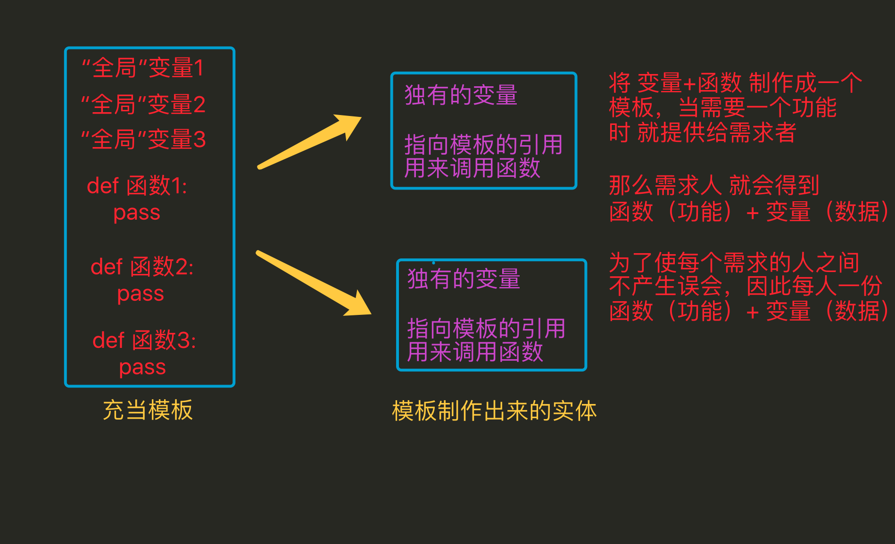
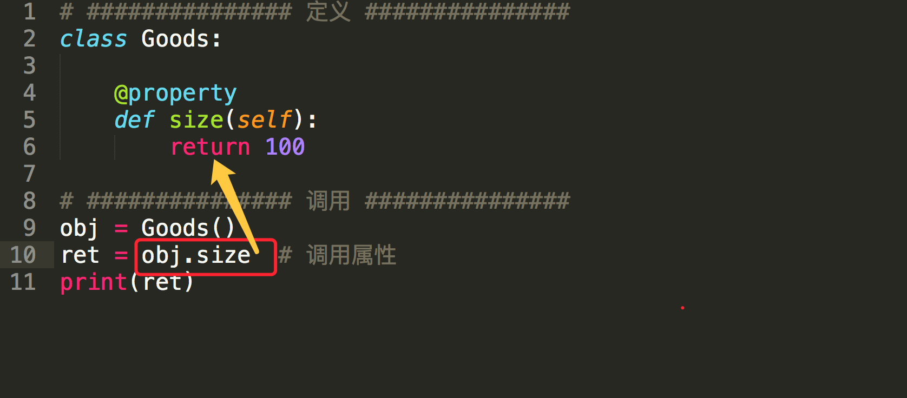

# 一、再议 封装、继承、多态

封装、继承、多态 是面向对象的3大特性

## 1. 为啥要封装




#### 好处

> 1. 在使用面向过程编程时，当需要对数据处理时，需要考虑用哪个模板中哪个函数来进行操作，但是当用面向对象编程时，因为已经将数据存储到了这个独立的空间中，这个独立的空间（即对象）中通过一个特殊的变量（__class__）能够获取到类（模板），而且这个类中的方法是有一定数量的，与此类无关的将不会出现在本类中，因此需要对数据处理时，可以很快速的定位到需要的方法是谁 这样更方便
> 2. 全局变量是只能有1份的，多很多个函数需要多个备份时，往往需要利用其它的变量来进行储存；而通过封装 会将用来存储数据的这个变量 变为了对象中的一个“全局”变量，只要对象不一样那么这个变量就可以再有1份，所以这样更方便
> 3. 代码划分更清晰

面向过程

```python
全局变量1
全局变量2
全局变量3
...

def 函数1():
    pass


def 函数2():
    pass


def 函数3():
    pass


def 函数4():
    pass


def 函数5():
    pass
```

面向对象

```python
class 类(object):
    属性1
    属性2

    def 方法1(self):
        pass

    def 方法2(self):
        pass

class 类2(object):
    属性3
    def 方法3(self):
        pass

    def 方法4(self):
        pass

    def 方法5(self):
        pass
```

## 2. 为啥要继承


#### 说明

> 1. 能够提升代码的重用率，即开发一个类，可以在多个子功能中直接使用
> 2. 继承能够有效的进行代码的管理，当某个类有问题只要修改这个类就行，而其继承这个类的子类往往不需要就修改

## 3. 怎样理解多态

```python
class MiniOS(object):
    """MiniOS 操作系统类 """
    def __init__(self, name):
        self.name = name
        self.apps = []  # 安装的应用程序名称列表

    def __str__(self):
        return "%s 安装的软件列表为 %s" % (self.name, str(self.apps))

    def install_app(self, app):
        # 判断是否已经安装了软件
        if app.name in self.apps:
            print("已经安装了 %s，无需再次安装" % app.name)
        else:
            app.install()
            self.apps.append(app.name)


class App(object):
    def __init__(self, name, version, desc):
        self.name = name
        self.version = version
        self.desc = desc

    def __str__(self):
        return "%s 的当前版本是 %s - %s" % (self.name, self.version, self.desc)

    def install(self):
        print("将 %s [%s] 的执行程序复制到程序目录..." % (self.name, self.version))


class PyCharm(App):
    pass


class Chrome(App):
    def install(self):
        print("正在解压缩安装程序...")
        super().install()


linux = MiniOS("Linux")
print(linux)

pycharm = PyCharm("PyCharm", "1.0", "python 开发的 IDE 环境")
chrome = Chrome("Chrome", "2.0", "谷歌浏览器")

linux.install_app(pycharm)
linux.install_app(chrome)
linux.install_app(chrome)

print(linux)
```

运行结果

```python
Linux 安装的软件列表为 []
将 PyCharm [1.0] 的执行程序复制到程序目录...
正在解压缩安装程序...
将 Chrome [2.0] 的执行程序复制到程序目录...
已经安装了 Chrome，无需再次安装
Linux 安装的软件列表为 ['PyCharm', 'Chrome']
```


# 二、多继承以及MRO顺序

## 1. 单独调用父类的方法

```python
# coding=utf-8

print("******多继承使用类名.__init__ 发生的状态******")
class Parent(object):
    def __init__(self, name):
        print('parent的init开始被调用')
        self.name = name
        print('parent的init结束被调用')

class Son1(Parent):
    def __init__(self, name, age):
        print('Son1的init开始被调用')
        self.age = age
        Parent.__init__(self, name)
        print('Son1的init结束被调用')

class Son2(Parent):
    def __init__(self, name, gender):
        print('Son2的init开始被调用')
        self.gender = gender
        Parent.__init__(self, name)
        print('Son2的init结束被调用')

class Grandson(Son1, Son2):
    def __init__(self, name, age, gender):
        print('Grandson的init开始被调用')
        Son1.__init__(self, name, age)  # 单独调用父类的初始化方法
        Son2.__init__(self, name, gender)
        print('Grandson的init结束被调用')

gs = Grandson('grandson', 12, '男')
print('姓名：', gs.name)
print('年龄：', gs.age)
print('性别：', gs.gender)

print("******多继承使用类名.__init__ 发生的状态******\n\n")
```

**运行结果:**

```
******多继承使用类名.__init__ 发生的状态******
Grandson的init开始被调用
Son1的init开始被调用
parent的init开始被调用
parent的init结束被调用
Son1的init结束被调用
Son2的init开始被调用
parent的init开始被调用
parent的init结束被调用
Son2的init结束被调用
Grandson的init结束被调用
姓名： grandson
年龄： 12
性别： 男
******多继承使用类名.__init__ 发生的状态******
```

**问题：**

- 父类`__init__()`被调用多次，浪费资源，不推荐用`Parent.__init__()`这种方式，调用父类init方法


## 2. 多继承中 super 调用有所父类的被重写的方法

```python
print("******多继承使用super().__init__ 发生的状态******")
class Parent(object):
    def __init__(self, name, *args, **kwargs):  # 为避免多继承报错，使用不定长参数，接受参数
        print('parent的init开始被调用')
        self.name = name
        print('parent的init结束被调用')

class Son1(Parent):
    def __init__(self, name, age, *args, **kwargs):  # 为避免多继承报错，使用不定长参数，接受参数
        print('Son1的init开始被调用')
        self.age = age
        super().__init__(name, *args, **kwargs)  # 为避免多继承报错，使用不定长参数，接受参数
        print('Son1的init结束被调用')

class Son2(Parent):
    def __init__(self, name, gender, *args, **kwargs):  # 为避免多继承报错，使用不定长参数，接受参数
        print('Son2的init开始被调用')
        self.gender = gender
        super().__init__(name, *args, **kwargs)  # 为避免多继承报错，使用不定长参数，接受参数
        print('Son2的init结束被调用')

class Grandson(Son1, Son2):
    def __init__(self, name, age, gender):
        print('Grandson的init开始被调用')
        # 多继承时，相对于使用类名.__init__方法，要把每个父类全部写一遍
        # 而super只用一句话，执行了全部父类的方法，这也是为何多继承需要全部传参的一个原因
        # super(Grandson, self).__init__(name, age, gender)
        super().__init__(name, age, gender)
        print('Grandson的init结束被调用')

print(Grandson.__mro__)

gs = Grandson('grandson', 12, '男')
print('姓名：', gs.name)
print('年龄：', gs.age)
print('性别：', gs.gender)
print("******多继承使用super().__init__ 发生的状态******\n\n")
```

运行结果：

```
******多继承使用super().__init__ 发生的状态******
(<class '__main__.Grandson'>, <class '__main__.Son1'>, <class '__main__.Son2'>, <class '__main__.Parent'>, <class 'object'>)
Grandson的init开始被调用
Son1的init开始被调用
Son2的init开始被调用
parent的init开始被调用
parent的init结束被调用
Son2的init结束被调用
Son1的init结束被调用
Grandson的init结束被调用
姓名： grandson
年龄： 12
性别： 男
******多继承使用super().__init__ 发生的状态******
```

**注意：**

> 1. 以上2个代码执行的结果不同
> 2. 如果2个子类中都继承了父类，当在子类中通过父类名调用时，parent被执行了2次
> 3. 如果2个子类中都继承了父类，当在子类中通过super调用时，parent被执行了1次

### 2.1 方法搜索顺序——Python 中的 MRO

- `Python` 中针对 **类** 提供了一个 **内置属性** `__mro__` 可以查看 **方法** 搜索顺序
- MRO 是 `method resolution order`，主要用于 **在多继承时判断 方法、属性 的调用 路径**
- `self.属性`，`selft.函数`
  - 会先去创建实例的类中寻找，没有的话就下一个类寻找。
  - 如果找到，直接执行，不再继续搜索。
  - 如果找到最后一个类还没没有，就会报错。

```python
print(Grandson.__mro__)
```

**输出结果**

```python
(<class '__main__.Grandson'>, <class '__main__.Son1'>, <class '__main__.Son2'>, <class '__main__.Parent'>, <class 'object'>)
```

- 在搜索方法时，是按照 `__mro__` 的输出结果 **从左至右** 的顺序查找的
- 如果在当前类中 **找到方法，就直接执行，不再搜索**
- 如果 **没有找到，就查找下一个类** 中是否有对应的方法，**如果找到，就直接执行，不再搜索**
- 如果找到最后一个类，还没有找到方法，程序报错

1) 多继承中的`self.函数()`搜索顺序

#### 1）多继承中的super() 搜索顺序

**情况一：子类 super()中不加任何参数**

```python
class Grandson(Son1, Son2):
    def __init__(self, name, age, gender):
        print('Grandson的init开始被调用')
        
        """
        super().__init__(name, age, gender) 等价于 super(Grandson, self).__init__(name, age, gender)
        会从__mro__顺序中，找到当前类后面的类(Son1)中的__init__方法执行
        
        """
        
        super().__init__(name, age, gender)
        print('Grandson的init结束被调用')
        
```

**情况二：子类 super()中添加参数**

- 可以指定到底调用哪个父类的方法

```python
class Grandson(Son1, Son2):
    def __init__(self, name, age, gender):
        print('Grandson的init开始被调用')
       
    	"""
    	如果参数是Son2,就会从__mro__顺序中找到Son2后面的类（Parent）的__init__()方法执行
    	"""
        super(Son2, self).__init__(name, age, gender)
       
        print('Grandson的init结束被调用')
```


## 3. 单继承中super

```python
print("******单继承使用super().__init__ 发生的状态******")
class Parent(object):
    def __init__(self, name):
        print('parent的init开始被调用')
        self.name = name
        print('parent的init结束被调用')

class Son1(Parent):
    def __init__(self, name, age):
        print('Son1的init开始被调用')
        self.age = age
        super().__init__(name)  # 单继承不能提供全部参数
        print('Son1的init结束被调用')

class Grandson(Son1):
    def __init__(self, name, age, gender):
        print('Grandson的init开始被调用')
        super().__init__(name, age)  # 单继承不能提供全部参数
        print('Grandson的init结束被调用')

gs = Grandson('grandson', 12, '男')
print('姓名：', gs.name)
print('年龄：', gs.age)
#print('性别：', gs.gender)
print("******单继承使用super().__init__ 发生的状态******\n\n")
```

## 总结

1. `super().__init__`相对于`类名.__init__`，在单继承上用法基本无差
2. 但在多继承上有区别，super方法能保证每个父类的方法只会执行一次，而使用类名的方法会导致方法被执行多次，具体看前面的输出结果
3. 多继承时，使用super方法，对父类的传参数，应该是由于python中super的算法导致的原因，必须把参数全部传递，否则会报错
4. 单继承时，使用super方法，则不能全部传递，只能传父类方法所需的参数，否则会报错
5. 多继承时，相对于使用类名.__init__方法，要把每个父类全部写一遍, 而使用super方法，只需写一句话便执行了全部父类的方法，这也是为何多继承需要全部传参的一个原因

## 小试牛刀(以下为面试题)

> 以下的代码的输出将是什么? 说出你的答案并解释。

```python
class Parent(object):
    x = 1

class Child1(Parent):
    pass

class Child2(Parent):
    pass

# Child1、Child2没有类属性x，就会到Parent找

print(Parent.x, Child1.x, Child2.x) # 1 1 1

Child1.x = 2 # 相当于给Child1添加一个类属性x=2
print(Parent.x, Child1.x, Child2.x) # 1 2 1

Parent.x = 3 # Child1中有x类属性并且值是2，这句话只把Parent中的类属性x=3，所以Child1中X的值没有变，Child2.x得去Parent中找

print(Parent.x, Child1.x, Child2.x) # 3 2 3
```

答案, 以上代码的输出是：

```
1 1 1
1 2 1
3 2 3
```

使你困惑或是惊奇的是关于最后一行的输出是 3 2 3 而不是 3 2 1。为什么改变了 Parent.x 的值还会改变 Child2.x 的值，但是同时 Child1.x 值却没有改变？

这个答案的关键是，在 Python 中，类变量在内部是作为字典处理的。如果一个变量的名字没有在当前类的字典中发现，将搜索祖先类（比如父类）直到被引用的变量名被找到（如果这个被引用的变量名既没有在自己所在的类又没有在祖先类中找到，会引发一个 AttributeError 异常 ）。

因此，在父类中设置 x = 1 会使得类变量 x 在引用该类和其任何子类中的值为 1。这就是因为第一个 print 语句的输出是 1 1 1。

随后，如果任何它的子类重写了该值（例如，我们执行语句 Child1.x = 2），然后，该值仅仅在子类中被改变。这就是为什么第二个 print 语句的输出是 1 2 1。

最后，如果该值在父类中被改变（例如，我们执行语句 Parent.x = 3），这个改变会影响到任何未重写该值的子类当中的值（在这个示例中被影响的子类是 Child2）。这就是为什么第三个 print 输出是 3 2 3。

**总结**：

- 继承不是复制，子类不是从父类copy一份


# 三、再论静态方法和类方法

### 1. 类属性、实例属性

它们在定义和使用中有所区别，而最本质的区别是内存中保存的位置不同，

- 实例属性属于对象
- 类属性属于类

```python
class Province(object):
    # 类属性
    country = '中国'

    def __init__(self, name):
        # 实例属性
        self.name = name


# 创建一个实例对象
obj = Province('山东省')
# 直接访问实例属性
print(obj.name)
# 直接访问类属性
Province.country
```

由上述代码可以看出【实例属性需要通过对象来访问】【类属性通过类访问】，在使用上可以看出实例属性和类属性的归属是不同的。

其在内容的存储方式类似如下图：


由上图看出：

- 类属性在内存中只保存一份
- 实例属性在每个对象中都要保存一份

#### 应用场景：

- 通过类创建实例对象时，如果每个对象需要具有相同名字的属性，那么就使用类属性，用一份既可

### 2. 实例方法、静态方法和类方法

方法包括：实例方法、静态方法和类方法，三种方法在内存中都归属于类，区别在于调用方式不同。

- 实例方法：由对象调用；至少一个self参数；执行实例方法时，自动将调用该方法的对象赋值给self；
- 类方法：由类调用； 至少一个cls参数；执行类方法时，自动将调用该方法的类赋值给cls；
- 静态方法：由类调用；无默认参数；

```python
"""
类本身也是对象，叫类对象
"""
class Foo(object):
    def __init__(self, name):
        self.name = name

    def ord_func(self):
        """ 定义实例方法，至少有一个self参数 """
        # print(self.name)
        print('实例方法')

    @classmethod
    def class_func(cls):
        """ 定义类方法，至少有一个cls参数 """
        print('类方法')

    @staticmethod
    def static_func():
        """ 定义静态方法 ，无默认参数"""
        print('静态方法')


"""
f是实例对象
"""
f = Foo("中国")

# 实例对象调用实例方法
f.ord_func()

# 实例对象调用类方法
f.__class__.class_func()

# 实例对象调用类静态方法
f.__class__.static_func()

# 类对象调用类方法
Foo.class_func()

# 类对象调用静态方法
Foo.static_func()
```


#### 对比

- 相同点：对于所有的方法而言，均属于类，所以 在内存中也只保存一份
- 不同点：方法调用者不同、调用方法时自动传入的参数不同。

总结：

- 实例对象可以调实例方法、类方法和静态方法
  - 实例对象调用类方法：`obj.__class__.class_func()`
  - 实例对象调用类静态方法：`obj.__class__.static_func()`

- 类对象可以调用类方法和静态方法
  - 类对象调用类方法：`Foo.class_func()`
  - 类对象调用静态方法：`Foo.static_func()`

------

# 四、类与方法的私有化

### 1. _，__单下划线，双下划线的用法

- xx: `公有变量`
- _x: `保护变量`，单前置下划线,from somemodule import *`禁止导入`,**类对象和子类可以访问**，类似`C#` 中关键字`protected`
- __xx：`私有成员`，双前置下划线,避免与子类中的属性命名冲突，`无法在外部直接访问`(名字重整所以访问不到)，类似`C#` 中关键字`private`
- __xx__:双前后下划线,用户名字空间的魔法对象或属性。例如:`__init__` , __ 不要自己发明这样的名字，不推荐使用
- xx_:单后置下划线,用于避免与Python关键词的冲突，不推荐使用

通过name mangling（名字重整(目的就是以防子类意外重写基类的方法或者属性)如：_Class__object）机制就可以访问private了。

```python
#coding=utf-8

class Person(object):
    def __init__(self, name, age, taste):
        self.name = name
        self._age = age 
        self.__taste = taste

    def showperson(self):
        print(self.name)
        print(self._age)
        print(self.__taste)

    def dowork(self):
        self._work()
        self.__away()


    def _work(self):
        print('my _work')

    def __away(self):
        print('my __away')

class Student(Person):
    def construction(self, name, age, taste):
        self.name = name
        self._age = age 
        self.__taste = taste

    def showstudent(self):
        print(self.name)
        print(self._age)
        print(self.__taste)

    @staticmethod
    def testbug():
        _Bug.showbug()

# 模块内可以访问，当from  cur_module import *时，不导入
class _Bug(object):
    @staticmethod
    def showbug():
        print("showbug")

s1 = Student('jack', 25, 'football')
s1.showperson()
print('*'*20)

# 无法访问__taste,导致报错
# s1.showstudent() 
s1.construction('rose', 30, 'basketball')
s1.showperson()
print('*'*20)

s1.showstudent()
print('*'*20)

Student.testbug()
```


**总结**

- 父类中属性名为`__名字`的，子类不继承，子类不能访问
- 如果在子类中向`__名字`赋值，那么会在子类中定义的一个与父类相同名字的属性
- `_名`的变量、函数、类在使用`from xxx import *`时都不会被导入


### 2. 修改、查看私有属性

#### 2.1 名字重整

```python
class Test(object):
    def __init__(self, name):
        self.__name = name  # 私有属性

a = Test("laowang")
a.__name # 直接访问私有属性会报错

a.__dict__
# 通过__dict__方法查看，输出{'_Test__name':'laowang'}
# python中所谓的私有属性，解释器把私有属性变量名改成 ：_name --> _Test.__name
a._Test__name # 通过调用重整后变量名的可以访问私有属性

a.__name = “xxxx” # 这并不是定义私有属性，而是定义了一个属性
a.__dict__ # {'_Test__name':'laowang','__name':'xxxxx'}
```

------


# 五、property属性

### 1. 什么是property属性

一种用起来像是使用的实例属性一样的特殊属性，可以对应于某个方法

```python
# ############### 定义 ###############
class Foo:
    def func(self):
        pass

    # 定义property属性
    @property
    def prop(self):
        pass

# ############### 调用 ###############
foo_obj = Foo()
foo_obj.func()  # 调用实例方法
foo_obj.prop  # 调用property属性
```



##### property属性的定义和调用要注意一下几点：

- 定义时，在实例方法的基础上添加 @property 装饰器；并且仅有一个self参数

- 调用时，无需括号

  ```python
    方法：foo_obj.func()
    property属性：foo_obj.prop
  ```

### 2. 简单的实例

> 对于京东商城中显示电脑主机的列表页面，每次请求不可能把数据库中的所有内容都显示到页面上，而是通过分页的功能局部显示，所以在向数据库中请求数据时就要显示的指定获取从第m条到第n条的所有数据 这个分页的功能包括：
>
> - 根据用户请求的当前页和总数据条数计算出 m 和 n
> - 根据m 和 n 去数据库中请求数据

```python
# ############### 定义 ###############
class Pager:
    def __init__(self, current_page):
        # 用户当前请求的页码（第一页、第二页...）
        self.current_page = current_page
        # 每页默认显示10条数据
        self.per_items = 10 

    @property
    def start(self):
        val = (self.current_page - 1) * self.per_items
        return val

    @property
    def end(self):
        val = self.current_page * self.per_items
        return val

# ############### 调用 ###############
p = Pager(1)
p.start  # 就是起始值，即：m
p.end  # 就是结束值，即：n
```

#### 从上述可见

- Python的property属性的功能是：property属性内部进行一系列的逻辑计算，最终将计算结果返回。

### 3. property属性的有两种方式

- 装饰器 即：在方法上应用装饰器
- 类属性 即：在类中定义值为property对象的类属性

#### 3.1 装饰器方式

在类的实例方法上应用@property装饰器

Python中的类有`经典类`和`新式类`，`新式类`的属性比`经典类`的属性丰富。（ 如果类继object，那么该类是新式类 ）

#### 经典类，具有一种@property装饰器

```python
# ############### 定义 ###############    
class Goods:
    @property
    def price(self):
        return "laowang"
# ############### 调用 ###############
obj = Goods()
result = obj.price  # 自动执行 @property 修饰的 price 方法，并获取方法的返回值
print(result)
```

#### 新式类，具有三种@property装饰器

```python
#coding=utf-8
# ############### 定义 ###############
class Goods:
    """python3中默认继承object类
        以python2、3执行此程序的结果不同，因为只有在python3中才有@xxx.setter  @xxx.deleter
    """
    @property
    def price(self):
        print('@property')

    @price.setter
    def price(self, value):
        print('@price.setter')

    @price.deleter
    def price(self):
        print('@price.deleter')

# ############### 调用 ###############
obj = Goods()
obj.price          # 自动执行 @property 修饰的 price 方法，并获取方法的返回值
obj.price = 123    # 自动执行 @price.setter 修饰的 price 方法，并将  123 赋值给方法的参数
del obj.price      # 自动执行 @price.deleter 修饰的 price 方法
```

#### 注意

- 经典类中的属性只有一种访问方式，其对应被 @property 修饰的方法
- 新式类中的属性有三种访问方式，并分别对应了三个被@property、@方法名.setter、@方法名.deleter修饰的方法

由于新式类中具有三种访问方式，我们可以根据它们几个属性的访问特点，分别将三个方法定义为对同一个属性：获取、修改、删除

```python
class Goods(object):

    def __init__(self):
        # 原价
        self.original_price = 100
        # 折扣
        self.discount = 0.8

    @property
    def price(self):
        # 实际价格 = 原价 * 折扣
        new_price = self.original_price * self.discount
        return new_price

    @price.setter
    def price(self, value):
        self.original_price = value

    @price.deleter
    def price(self):
        del self.original_price

obj = Goods()
obj.price         # 获取商品价格
obj.price = 200   # 修改商品原价
del obj.price     # 删除商品原价
```

#### 3.2 类属性方式，创建值为property对象的类属性

- 当使用类属性的方式创建property属性时，`经典类`和`新式类`无区别

```python
class Foo:
    def get_bar(self):
        return 'laowang'

    BAR = property(get_bar)

obj = Foo()
reuslt = obj.BAR  # 自动调用get_bar方法，并获取方法的返回值
print(reuslt)
```

property方法中有个四个参数

- 第一个参数是方法名，调用 对象.属性 时自动触发执行方法
- 第二个参数是方法名，调用 对象.属性 ＝ XXX 时自动触发执行方法
- 第三个参数是方法名，调用 del 对象.属性 时自动触发执行方法
- 第四个参数是字符串，调用 对象.属性.__doc__ ，此参数是该属性的描述信息

```python
#coding=utf-8
class Foo(object):
    def get_bar(self):
        print("getter...")
        return 'laowang'

    def set_bar(self, value): 
        """必须两个参数"""
        print("setter...")
        return 'set value' + value

    def del_bar(self):
        print("deleter...")
        return 'laowang'

    BAR = property(get_bar, set_bar, del_bar, "description...")

obj = Foo()

obj.BAR  # 自动调用第一个参数中定义的方法：get_bar
obj.BAR = "alex"  # 自动调用第二个参数中定义的方法：set_bar方法，并将“alex”当作参数传入
desc = Foo.BAR.__doc__  # 自动获取第四个参数中设置的值：description...
print(desc)
del obj.BAR  # 自动调用第三个参数中定义的方法：del_bar方法
```

由于`类属性方式`创建property属性具有3种访问方式，我们可以根据它们几个属性的访问特点，分别将三个方法定义为对同一个属性：获取、修改、删除

```python
class Goods(object):

    def __init__(self):
        # 原价
        self.original_price = 100
        # 折扣
        self.discount = 0.8

    def get_price(self):
        # 实际价格 = 原价 * 折扣
        new_price = self.original_price * self.discount
        return new_price

    def set_price(self, value):
        self.original_price = value

    def del_price(self):
        del self.original_price

    PRICE = property(get_price, set_price, del_price, '价格属性描述...')

obj = Goods()
obj.PRICE         # 获取商品价格
obj.PRICE = 200   # 修改商品原价
del obj.PRICE     # 删除商品原价
```

### 4. Django框架中应用了property属性（了解）

WEB框架 Django 的视图中 request.POST 就是使用的类属性的方式创建的属性

```python
class WSGIRequest(http.HttpRequest):
    def __init__(self, environ):
        script_name = get_script_name(environ)
        path_info = get_path_info(environ)
        if not path_info:
            # Sometimes PATH_INFO exists, but is empty (e.g. accessing
            # the SCRIPT_NAME URL without a trailing slash). We really need to
            # operate as if they'd requested '/'. Not amazingly nice to force
            # the path like this, but should be harmless.
            path_info = '/'
        self.environ = environ
        self.path_info = path_info
        self.path = '%s/%s' % (script_name.rstrip('/'), path_info.lstrip('/'))
        self.META = environ
        self.META['PATH_INFO'] = path_info
        self.META['SCRIPT_NAME'] = script_name
        self.method = environ['REQUEST_METHOD'].upper()
        _, content_params = cgi.parse_header(environ.get('CONTENT_TYPE', ''))
        if 'charset' in content_params:
            try:
                codecs.lookup(content_params['charset'])
            except LookupError:
                pass
            else:
                self.encoding = content_params['charset']
        self._post_parse_error = False
        try:
            content_length = int(environ.get('CONTENT_LENGTH'))
        except (ValueError, TypeError):
            content_length = 0
        self._stream = LimitedStream(self.environ['wsgi.input'], content_length)
        self._read_started = False
        self.resolver_match = None

    def _get_scheme(self):
        return self.environ.get('wsgi.url_scheme')

    def _get_request(self):
        warnings.warn('`request.REQUEST` is deprecated, use `request.GET` or '
                      '`request.POST` instead.', RemovedInDjango19Warning, 2)
        if not hasattr(self, '_request'):
            self._request = datastructures.MergeDict(self.POST, self.GET)
        return self._request

    @cached_property
    def GET(self):
        # The WSGI spec says 'QUERY_STRING' may be absent.
        raw_query_string = get_bytes_from_wsgi(self.environ, 'QUERY_STRING', '')
        return http.QueryDict(raw_query_string, encoding=self._encoding)

    # ############### 看这里看这里  ###############
    def _get_post(self):
        if not hasattr(self, '_post'):
            self._load_post_and_files()
        return self._post

    # ############### 看这里看这里  ###############
    def _set_post(self, post):
        self._post = post

    @cached_property
    def COOKIES(self):
        raw_cookie = get_str_from_wsgi(self.environ, 'HTTP_COOKIE', '')
        return http.parse_cookie(raw_cookie)

    def _get_files(self):
        if not hasattr(self, '_files'):
            self._load_post_and_files()
        return self._files

    # ############### 看这里看这里  ###############
    POST = property(_get_post, _set_post)

    FILES = property(_get_files)
    REQUEST = property(_get_request)
```

#### 综上所述:

- 定义property属性共有两种方式，分别是【装饰器】和【类属性】，而【装饰器】方式针对经典类和新式类又有所不同。
- 通过使用property属性，能够简化调用者在获取数据的流程

### 5. property属性-应用

#### 1. 私有属性添加getter和setter方法

```python
class Money(object):
    def __init__(self):
        self.__money = 0

    def getMoney(self):
        return self.__money

    def setMoney(self, value):
        if isinstance(value, int):
            self.__money = value
        else:
            print("error:不是整型数字")
```

#### 2. 使用property升级getter和setter方法

```python
class Money(object):
    def __init__(self):
        self.__money = 0

    def getMoney(self):
        return self.__money

    def setMoney(self, value):
        if isinstance(value, int):
            self.__money = value
        else:
            print("error:不是整型数字")

    # 定义一个属性，当对这个money设置值时调用setMoney,当获取值时调用getMoney
    money = property(getMoney, setMoney)  

a = Money()
a.money = 100  # 调用setMoney方法
print(a.money)  # 调用getMoney方法
#100
```

#### 3. 使用property取代getter和setter方法

- 重新实现一个属性的设置和读取方法,可做边界判定

```python
class Money(object):
    def __init__(self):
        self.__money = 0

    # 使用装饰器对money进行装饰，那么会自动添加一个叫money的属性，当调用获取money的值时，调用装饰的方法
    @property
    def money(self):
        return self.__money

    # 使用装饰器对money进行装饰，当对money设置值时，调用装饰的方法
    @money.setter
    def money(self, value):
        if isinstance(value, int):
            self.__money = value
        else:
            print("error:不是整型数字")

a = Money()
a.money = 100
print(a.money)
```

# 六、魔法属性

无论人或事物往往都有不按套路出牌的情况，Python的类属性也是如此，存在着一些具有特殊含义的属性，详情如下：

### 1. \_\_doc__

- 表示类的描述信息

```python
class Foo:
    """ 描述类信息，这是用于看片的神奇 """
    def func(self):
        pass

print(Foo.__doc__)
#输出：类的描述信息
```

### 2. \_\_module\__ 和 \__class__

- \_\_module\__ 表示当前操作的对象在那个模块
- \_\_class\__ 表示当前操作的对象的类是什么

```
test.py
# -*- coding:utf-8 -*-

class Person(object):
    def __init__(self):
        self.name = 'laowang'
main.py
from test import Person

obj = Person()
print(obj.__module__)  # 输出 test 即：输出模块
print(obj.__class__)  # 输出 test.Person 即：输出类
```

### 3. \_\_init\__

- 初始化方法，通过类创建对象时，自动触发执行

```python
class Person:
    def __init__(self, name):
        self.name = name
        self.age = 18


obj = Person('laowang')  # 自动执行类中的 __init__ 方法
```

### 4. \_\_del\__

- 当对象在内存中被释放时，自动触发执行。

注：此方法一般无须定义，因为Python是一门高级语言，程序员在使用时无需关心内存的分配和释放，因为此工作都是交给Python解释器来执行，所以，__del__的调用是由解释器在进行垃圾回收时自动触发执行的。

```python
class Foo:
    def __del__(self):
        pass
```

### 5. \_\_call\__

- 对象后面加括号，触发执行。

注：__init__方法的执行是由创建对象触发的，即：`对象 = 类名()` ；而对于 __call__ 方法的执行是由对象后加括号触发的，即：`对象()` 或者 `类()()`

```python
class Foo:
    def __init__(self):
        pass

    def __call__(self, *args, **kwargs):
        print('__call__')


obj = Foo()  # 执行 __init__
obj()  # 执行 __call__
```

### 6. \_\_dict\__

- 类或对象中的所有属性

类的实例属性属于对象；类中的类属性和方法等属于类，即：

```python
class Province(object):
    country = 'China'

    def __init__(self, name, count):
        self.name = name
        self.count = count

    def func(self, *args, **kwargs):
        print('func')

# 获取类的属性，即：类属性、方法、
print(Province.__dict__)
# 输出：{'__dict__': <attribute '__dict__' of 'Province' objects>, '__module__': '__main__', 'country': 'China', '__doc__': None, '__weakref__': <attribute '__weakref__' of 'Province' objects>, 'func': <function Province.func at 0x101897950>, '__init__': <function Province.__init__ at 0x1018978c8>}

obj1 = Province('山东', 10000)
print(obj1.__dict__)
# 获取 对象obj1 的属性
# 输出：{'count': 10000, 'name': '山东'}

obj2 = Province('山西', 20000)
print(obj2.__dict__)
# 获取 对象obj1 的属性
# 输出：{'count': 20000, 'name': '山西'}
```

### 7. \_\_str\__

- 如果一个类中定义了__str__方法，那么在打印 对象 时，默认输出该方法的返回值。

```python
class Foo:
    def __str__(self):
        return 'laowang'


obj = Foo()
print(obj)
# 输出：laowang
```

### 8、\_\_getitem\_\_、\_\_setitem\_\_、\_\_delitem\_\_

- 用于索引操作，如`字典`。以上分别表示获取、设置、删除数据

```python
# -*- coding:utf-8 -*-

class Foo(object):

    def __getitem__(self, key):
        print('__getitem__', key)

    def __setitem__(self, key, value):
        print('__setitem__', key, value)

    def __delitem__(self, key):
        print('__delitem__', key)


obj = Foo()

result = obj['k1']      # 自动触发执行 __getitem__
obj['k2'] = 'laowang'   # 自动触发执行 __setitem__
del obj['k1']           # 自动触发执行 __delitem__
```

### 9、\_\_getslice\_\_、\_\_setslice\_\_、\_\_delslice\_\_

- 该三个方法用于分片操作，如：`列表`

```python
# -*- coding:utf-8 -*-

class Foo(object):

    def __getslice__(self, i, j):
        print('__getslice__', i, j)

    def __setslice__(self, i, j, sequence):
        print('__setslice__', i, j)

    def __delslice__(self, i, j):
        print('__delslice__', i, j)

obj = Foo()

obj[-1:1]                   # 自动触发执行 __getslice__
obj[0:1] = [11,22,33,44]    # 自动触发执行 __setslice__
del obj[0:2]                # 自动触发执行 __delslice__
```

### 10、\_\_name\_\_

**表示当前的模块名字**

- 在demo.py中 

```python
print(“demo.py模块的名字：”, __name__)
```

在demo.py中直接启动代码，结果打印：

```python
demo.py模块的名字：__main__
```


- 如果在app.py中import demo模块，

```python
# app.py
import demo
```

把app.py作为启动文件，在import demo 时，在demo.py中会执行print(“模块的名字：”, \_\_name\_\_)

会打印出demo.py的文件名

```python
demo.py模块的名字：demo
```


应用：

```python
def main():
    pass

if __name__ == "__main__": #  如果从此文件启动就会执行main函数
    main()
```


------


# 七、面向对象设计

- 继承 - 是基于Python中的属性查找(如X.name)
- 多态 - 在X.method方法中，method的意义取决于X的类型
- 封装 - 方法和运算符实现行为，数据隐藏默认是一种惯例

### 参考实例

腾讯即时通信模块,初级封装

```python
#! /usr/bin/env python
# coding: utf-8

import random
import time


class Message(object):

    def __init__(self, msgarr=[], toacc=''):
        self.msgbody = msgarr # 此处为MsgDict对象实例的列表或者空列表
        self.toacc = toacc # toacc为字符串(单发)或者列表(批量发)
        self.msgrandom = random.randint(1, 1000000000)
        self.msgrequest = {
            'To_Account': toacc, # 消息接收方账号
            'MsgRandom': self.msgrandom, # 消息随机数，由随机函数产生
            'MsgBody': [t.msg for t in msgarr]
        }

    def del_option(self, option):
        if option in (set(self.msgrequest)-set(['To_Account', 'MsgRandom', 'MsgBody'])):
            self.__dict__.pop(option)
            self.msgrequest.pop(option)

    def append_msg(self, msg):
        self.msgbody.append(msg)
        self.msgrequest['MsgBody'].append(msg.msg)

    def insert_msg(self, index, msg):
        self.msgbody.insert(index, msg)
        self.msgrequest['MsgBody'].insert(msg.msg)

    def del_msg(self, index):
        if index in range(len(self.msgbody)):
            del self.msgbody[index]
            del sel.msgrequest['MsgBody'][index]

    def set_from(self, fromacc):
        # 指定消息的发送方，默认为服务器发送
        self.fromacc = fromacc
        self.msgrequest['From_Account'] = fromacc

    def set_to(self, toacc):
        # 指定消息的接收方，可以为String(单发),可以为List(批量发送)
        self.toacc = toacc
        self.msgrequest['To_Account'] = toacc

    def refresh_random(self):
        self.msgrandom = random.randint(1, 1000000000)
        self.msgrequest['MsgRandom'] = self.msgrandom, # 消息随机数，由随机函数产生

    def set_sync(self, sync):
        # 同步选项：1, 把消息同步到From_Account在线终端和漫游上
        #           2, 消息不同步至From_Account
        #           若不填写，默认情况下会将消息同步
        #           仅在单发单聊消息中可调用
        self.sync = sync
        self.msgrequest['SyncOtherMachine'] = sync

    def set_timestamp(self):
        # 设置消息时间戳，unix时间, 仅在单发单聊消息中可以调用
        self.timestamp = int(time.time())
        self.msgrequest['MsgTimeStamp'] = self.timestamp

    def set_offlinepush(self, pushflag=0, desc='', ext='', sound=''):
        # 仅适用于APNa推送，不适用于安卓厂商推送
        self.msgrequest['OfflinePushInfo'] = {
            'PushFlag': pushflag,
            'Desc': desc,
            'Ext': ext,
            'Sound': sound
        }


class MsgDict(object):

    def __init__(self, msgtype='', msgcontent={}):
        self.msgtype = msgtype
        self.msgcontent = msgcontent

    @property
    def msg(self):
        return {
            'MsgType': self.msgtype,
            'MsgContent': self.msgcontent
        } 

    def set_content(self, content):
        self.msgcontent = content


class TextMsg(MsgDict):

    def __init__(self, text='', msgtype='TIMTextElem'): 
        self.text = text
        content = {'Text': text}
        super(TextMsg, self).__init__(msgtype=msgtype, msgcontent=content)

    def set_text(self, text):
        self.text = text
        self.msgcontent['Text'] = text


class LocationMsg(MsgDict):

    def __init__(self, desc='', latitude=0, longitude=0, msgtype='TIMLocationElem'): 
        self.desc = desc
        self.latitude = latitude
        self.longitude = longitude
        content = {
            'Desc': desc,  # 地理位置描述信息, String
            'Latitude': latitude, # 纬度, Number
            'Longitude': longitude # 经度, Number
        }
        super(LocationMsg, self).__init__(msgtype=msgtype, msgcontent=content)

    def set_desc(self, desc):
        self.desc = desc
        self.msgcontent['Desc'] = desc

    def set_location(self, latitude, longitude):
        self.latitude = latitude
        self.longitude = longitude
        self.msgcontent['Latitude'] = latitude
        self.msgcontent['Longitude'] = longitude

    def set_latitude(self, latitude):
        self.latitude = latitude
        self.msgcontent['Latitude'] = latitude

    def set_longitude(self, longitude):
        self.longitude = longitude
        self.msgcontent['Longitude'] = longitude


class FaceMsg(MsgDict):

    def __init__(self, index=1, data='', msgtype='TIMFaceElem'): 
        self.index = index 
        self.data = data
        content = {
            'Index': index, # 表情索引，用户自定义, Number
            'Data': data # 额外数据, String
        }
        super(TextMsg, self).__init__(msgtype=msgtype, msgcontent=content)

    def set_index(self, index):
        self.index = index
        self.msgcontent['Index'] = index

    def set_data(self, data):
        self.data = data
        self.msgcontent['Data'] = data


class CustomMsg(MsgDict):

    def __init__(self, data='', desc='', ext='', sound='', msgtype='TIMCustomElem'): 
        self.data = data
        self.desc = desc
        self.ext = ext
        self.sound = sound
        content = {
            'Data': data, # 自定义消息数据。不作为APNS的payload中字段下发，故从payload中无法获取Data字段, String
            'Desc': desc, # 自定义消息描述，当接收方为iphone后台在线时，做ios离线Push时文本展示
            'Ext': ext, # 扩展字段，当接收方为ios系统且应用处在后台时，此字段作为APNS请求包Payloads中的ext键值下发，Ext的协议格式由业务方确定，APNS只做透传
            'Sound': sound # 自定义APNS推送铃声
        }
        super(CustomMsg, self).__init__(msgtype=msgtype, msgcontent=content)

    def set_data(self, data):
        self.data = data
        self.msgcontent['Data'] = data

    def set_desc(self, desc):
        self.desc = desc
        self.msgcontent['Desc'] = desc

    def set_ext(self, ext):
        self.ext = ext
        self.msgcontent['Ext'] = ext

    def set_sound(self, sound):
        self.sound = sound
        self.msgcontent['Sound'] = sound


class SoundMsg(MsgDict):

    def __init__(self, uuid='', size=0, second=0, msgtype='TIMSoundElem'): 
        self.uuid = uuid 
        self.size = size 
        self.second = second
        content = {
            'UUID': uuid, # 语音序列号，后台用于索引语音的键值，String
            'Size': size, # 语音数据大小, Number 
            'Second': second # 语音时长，单位秒 Number 
        }
        super(SoundMsg, self).__init__(msgtype=msgtype, msgcontent=content)

    def set_uuid(self, uuid):
        self.uuid = uuid
        self.msgcontent['UUID'] = uuid

    def set_size(self, size):
        self.size = size
        self.msgcontent['Size'] = size

    def set_second(self, second):
        self.second = second
        self.msgcontent['Second'] = second


class ImageMsg(MsgDict):

    def __init__(self, uuid='', imgformat=0, imginfo=[], msgtype='TIMImageElem'): 
        self.uuid = uuid 
        self.imgformat = imgformat 
        self.imginfo = imginfo 
        content = {
            'UUID': uuid, # 图片序列号，后台用于索引语音的键值，String
            'ImageFormat': imgformat, # 图片格式， BMP=1, JPG=2, GIF=3, 其他=0, Number 
            'ImageInfoArray': [t.info for t in imginfo] # 原图，缩略图或者大图下载信息, Array
        }
        super(ImageMsg, self).__init__(msgtype=msgtype, msgcontent=content)

    def set_uuid(self, uuid):
        self.uuid = uuid
        self.msgcontent['UUID'] = uuid

    def set_format(self, imgformat):
        self.imgformat = imgformat
        self.msgcontent['ImageFormat'] = imgformat

    def append_info(self, info):
        # info 为ImageInfo对象实例
        self.imginfo.append(info)
        self.msgcontnet['ImageInfoArray'].append(info.info)

    def insert_info(self, index, info):
        self.imginfo.insert(index, info)
        self.msgcontent['ImageInfoArray'].insert(index, info.info)

    def del_info(self, index):
        del self.imginfo[index]
        del self.msgcontent['ImageInfoArray'][index]


class FileMsg(MsgDict):

    def __init__(self, uuid='', size=0, name='', msgtype='TIMFileElem'): 
        self.uuid = uuid 
        self.size = size 
        self.name = name
        content = {
            'UUID': uuid, # 文件序列号，后台用于索引语音的键值，String
            'FileSize': size, # 文件数据大小, Number 
            'FileName': name # 文件名称/路径， String
        }
        super(FileMsg, self).__init__(msgtype=msgtype, msgcontent=content)

    def set_uuid(self, uuid):
        self.uuid = uuid
        self.msgcontent['UUID'] = UUID

    def set_size(self, size):
        self.size = size
        self.msgcontent['FileSize'] = size

    def set_name(self, name):
        self.name = name
        self.msgcontent['FileName'] = name


class ImageInfo(object):

    def __init__(self, itype=1, size=0, width=0, height=0, url=''):
        #图片类型， 1-原图， 2-大图， 3-缩略图, 0-其他
        self.itype = itype 
        # 图片数据大小,Number
        self.size = size
        # 图片宽度,Number
        self.width = width
        # 图片高度, Number
        self.height = height
        # 图片下载地址,String
        self.url = url

    @property
    def info(self):
        return {
            'Type': self.itype, 
            'Size': self.size,  
            'Width': self.width,  
            'Height': self.height, 
            'URL': self.url 
        }

    def set_type(self, itype):
        self.itype = itype

    def set_size(self, size):
        self.size = size

    def set_width(self, width):
        self.width = width

    def set_height(self, height):
        self.height = height

    def set_url(self, url):
        self.url = url
```

#### 微信开发包，python实现, wechat_sdk开发

```
http://wechat-python-sdk.com/
```

截取部分代码，学习类的设计

```python
from __future__ import unicode_literals

import time

from wechat_sdk.lib.crypto import BasicCrypto
from wechat_sdk.lib.request import WechatRequest
from wechat_sdk.exceptions import NeedParamError
from wechat_sdk.utils import disable_urllib3_warning


class WechatConf(object):
    """ WechatConf 配置类

    该类将会存储所有和微信开发相关的配置信息, 同时也会维护配置信息的有效性.
    """

    def __init__(self, **kwargs):
        """
        :param kwargs: 配置信息字典, 可用字典 key 值及对应解释如下:
                       'token': 微信 Token

                       'appid': App ID
                       'appsecret': App Secret

                       'encrypt_mode': 加解密模式 ('normal': 明文模式, 'compatible': 兼容模式, 'safe': 安全模式(默认))
                       'encoding_aes_key': EncodingAESKey 值 (传入此值必须保证同时传入 token, appid, 否则抛出异常)

                       'access_token_getfunc': access token 获取函数 (用于单机及分布式环境下, 具体格式参见文档)
                       'access_token_setfunc': access token 写入函数 (用于单机及分布式环境下, 具体格式参见文档)
                       'access_token_refreshfunc': access token 刷新函数 (用于单机及分布式环境下, 具体格式参见文档)
                       'access_token': 直接导入的 access token 值, 该值需要在上一次该类实例化之后手动进行缓存并在此处传入, 如果不
                                       传入, 将会在需要时自动重新获取 (传入 access_token_getfunc 和 access_token_setfunc 函数
                                       后将会自动忽略此处的传入值)
                       'access_token_expires_at': 直接导入的 access token 的过期日期, 该值需要在上一次该类实例化之后手动进行缓存
                                                  并在此处传入, 如果不传入, 将会在需要时自动重新获取 (传入 access_token_getfunc
                                                  和 access_token_setfunc 函数后将会自动忽略此处的传入值)

                       'jsapi_ticket_getfunc': jsapi ticket 获取函数 (用于单机及分布式环境下, 具体格式参见文档)
                       'jsapi_ticket_setfunc': jsapi ticket 写入函数 (用于单机及分布式环境下, 具体格式参见文档)
                       'jsapi_ticket_refreshfunc': jsapi ticket 刷新函数 (用于单机及分布式环境下, 具体格式参见文档)
                       'jsapi_ticket': 直接导入的 jsapi ticket 值, 该值需要在上一次该类实例化之后手动进行缓存并在此处传入, 如果不
                                       传入, 将会在需要时自动重新获取 (传入 jsapi_ticket_getfunc 和 jsapi_ticket_setfunc 函数
                                       后将会自动忽略此处的传入值)
                       'jsapi_ticket_expires_at': 直接导入的 jsapi ticket 的过期日期, 该值需要在上一次该类实例化之后手动进行缓存
                                                  并在此处传入, 如果不传入, 将会在需要时自动重新获取 (传入 jsapi_ticket_getfunc
                                                  和 jsapi_ticket_setfunc 函数后将会自动忽略此处的传入值)

                       'partnerid': 财付通商户身份标识, 支付权限专用
                       'partnerkey': 财付通商户权限密钥 Key, 支付权限专用
                       'paysignkey': 商户签名密钥 Key, 支付权限专用

                       'checkssl': 是否检查 SSL, 默认不检查 (False), 可避免 urllib3 的 InsecurePlatformWarning 警告
        :return:
        """

        self.__request = WechatRequest()

        if kwargs.get('checkssl') is not True:
            disable_urllib3_warning()  # 可解决 InsecurePlatformWarning 警告

        self.__token = kwargs.get('token')

        self.__appid = kwargs.get('appid')
        self.__appsecret = kwargs.get('appsecret')

        self.__encrypt_mode = kwargs.get('encrypt_mode', 'safe')
        self.__encoding_aes_key = kwargs.get('encoding_aes_key')
        self.__crypto = None
        self._update_crypto()

        self.__access_token_getfunc = kwargs.get('access_token_getfunc')
        self.__access_token_setfunc = kwargs.get('access_token_setfunc')
        self.__access_token_refreshfunc = kwargs.get('access_token_refreshfunc')
        self.__access_token = kwargs.get('access_token')
        self.__access_token_expires_at = kwargs.get('access_token_expires_at')

        self.__jsapi_ticket_getfunc = kwargs.get('jsapi_ticket_getfunc')
        self.__jsapi_ticket_setfunc = kwargs.get('jsapi_ticket_setfunc')
        self.__jsapi_ticket_refreshfunc = kwargs.get('jsapi_ticket_refreshfunc')
        self.__jsapi_ticket = kwargs.get('jsapi_ticket')
        self.__jsapi_ticket_expires_at = kwargs.get('jsapi_ticket_expires_at')

        self.__partnerid = kwargs.get('partnerid')
        self.__partnerkey = kwargs.get('partnerkey')
        self.__paysignkey = kwargs.get('paysignkey')

    @property
    def token(self):
        """ 获取当前 Token """
        self._check_token()
        return self.__token

    @token.setter
    def token(self, token):
        """ 设置当前 Token """
        self.__token = token
        self._update_crypto()  # 改动 Token 需要重新更新 Crypto

    @property
    def appid(self):
        """ 获取当前 App ID """
        return self.__appid

    @property
    def appsecret(self):
        """ 获取当前 App Secret """
        return self.__appsecret

    def set_appid_appsecret(self, appid, appsecret):
        """ 设置当前 App ID 及 App Secret"""
        self.__appid = appid
        self.__appsecret = appsecret
        self._update_crypto()  # 改动 App ID 后需要重新更新 Crypto

    @property
    def encoding_aes_key(self):
        """ 获取当前 EncodingAESKey """
        return self.__encoding_aes_key

    @encoding_aes_key.setter
    def encoding_aes_key(self, encoding_aes_key):
        """ 设置当前 EncodingAESKey """
        self.__encoding_aes_key = encoding_aes_key
        self._update_crypto()  # 改动 EncodingAESKey 需要重新更新 Crypto

    @property
    def encrypt_mode(self):
        return self.__encrypt_mode

    @encrypt_mode.setter
    def encrypt_mode(self, encrypt_mode):
        """ 设置当前加密模式 """
        self.__encrypt_mode = encrypt_mode
        self._update_crypto()

    @property
    def crypto(self):
        """ 获取当前 Crypto 实例 """
        return self.__crypto

    @property
    def access_token(self):
        """ 获取当前 access token 值, 本方法会自行维护 access token 有效性 """
        self._check_appid_appsecret()

        if callable(self.__access_token_getfunc):
            self.__access_token, self.__access_token_expires_at = self.__access_token_getfunc()

        if self.__access_token:
            now = time.time()
            if self.__access_token_expires_at - now > 60:
                return self.__access_token

        self.grant_access_token()  # 从腾讯服务器获取 access token 并更新
        return self.__access_token

    @property
    def jsapi_ticket(self):
        """ 获取当前 jsapi ticket 值, 本方法会自行维护 jsapi ticket 有效性 """
        self._check_appid_appsecret()

        if callable(self.__jsapi_ticket_getfunc):
            self.__jsapi_ticket, self.__jsapi_ticket_expires_at = self.__jsapi_ticket_getfunc()

        if self.__jsapi_ticket:
            now = time.time()
            if self.__jsapi_ticket_expires_at - now > 60:
                return self.__jsapi_ticket

        self.grant_jsapi_ticket()  # 从腾讯服务器获取 jsapi ticket 并更新
        return self.__jsapi_ticket

    @property
    def partnerid(self):
        """ 获取当前财付通商户身份标识 """
        return self.__partnerid

    @property
    def partnerkey(self):
        """ 获取当前财付通商户权限密钥 Key """
        return self.__partnerkey

    @property
    def paysignkey(self):
        """ 获取商户签名密钥 Key """
        return self.__paysignkey

    def grant_access_token(self):
        """
        获取 access token 并更新当前配置
        :return: 返回的 JSON 数据包 (传入 access_token_refreshfunc 参数后返回 None)
        """
        self._check_appid_appsecret()

        if callable(self.__access_token_refreshfunc):
            self.__access_token, self.__access_token_expires_at = self.__access_token_refreshfunc()
            return

        response_json = self.__request.get(
            url="https://api.weixin.qq.com/cgi-bin/token",
            params={
                "grant_type": "client_credential",
                "appid": self.__appid,
                "secret": self.__appsecret,
            },
            access_token=self.__access_token
        )
        self.__access_token = response_json['access_token']
        self.__access_token_expires_at = int(time.time()) + response_json['expires_in']

        if callable(self.__access_token_setfunc):
            self.__access_token_setfunc(self.__access_token, self.__access_token_expires_at)

        return response_json

    def grant_jsapi_ticket(self):
        """
        获取 jsapi ticket 并更新当前配置
        :return: 返回的 JSON 数据包 (传入 jsapi_ticket_refreshfunc 参数后返回 None)
        """
        self._check_appid_appsecret()

        if callable(self.__jsapi_ticket_refreshfunc):
            self.__jsapi_ticket, self.__jsapi_ticket_expires_at = self.__jsapi_ticket_refreshfunc()
            return

        response_json = self.__request.get(
            url="https://api.weixin.qq.com/cgi-bin/ticket/getticket",
            params={
                "type": "jsapi",
            },
            access_token=self.access_token,
        )
        self.__jsapi_ticket = response_json['ticket']
        self.__jsapi_ticket_expires_at = int(time.time()) + response_json['expires_in']

        if callable(self.__jsapi_ticket_setfunc):
            self.__jsapi_ticket_setfunc(self.__jsapi_ticket, self.__jsapi_ticket_expires_at)

        return response_json

    def get_access_token(self):
        """
        获取 Access Token 及 Access Token 过期日期, 仅供缓存使用, 如果希望得到原生的 Access Token 请求数据请使用 :func:`grant_token`
        **仅为兼容 v0.6.0 以前版本使用, 自行维护 access_token 请使用 access_token_setfunc 和 access_token_getfunc 进行操作**
        :return: dict 对象, key 包括 `access_token` 及 `access_token_expires_at`
        """
        self._check_appid_appsecret()

        return {
            'access_token': self.access_token,
            'access_token_expires_at': self.__access_token_expires_at,
        }

    def get_jsapi_ticket(self):
        """
        获取 Jsapi Ticket 及 Jsapi Ticket 过期日期, 仅供缓存使用, 如果希望得到原生的 Jsapi Ticket 请求数据请使用 :func:`grant_jsapi_ticket`
        **仅为兼容 v0.6.0 以前版本使用, 自行维护 jsapi_ticket 请使用 jsapi_ticket_setfunc 和 jsapi_ticket_getfunc 进行操作**
        :return: dict 对象, key 包括 `jsapi_ticket` 及 `jsapi_ticket_expires_at`
        """
        self._check_appid_appsecret()

        return {
            'jsapi_ticket': self.jsapi_ticket,
            'jsapi_ticket_expires_at': self.__jsapi_ticket_expires_at,
        }

    def _check_token(self):
        """
        检查 Token 是否存在
        :raises NeedParamError: Token 参数没有在初始化的时候提供
        """
        if not self.__token:
            raise NeedParamError('Please provide Token parameter in the construction of class.')

    def _check_appid_appsecret(self):
        """
        检查 AppID 和 AppSecret 是否存在
        :raises NeedParamError: AppID 或 AppSecret 参数没有在初始化的时候完整提供
        """
        if not self.__appid or not self.__appsecret:
            raise NeedParamError('Please provide app_id and app_secret parameters in the construction of class.')

    def _update_crypto(self):
        """
        根据当前配置内容更新 Crypto 类
        """
        if self.__encrypt_mode in ['compatible', 'safe'] and self.__encoding_aes_key is not None:
            if self.__token is None or self.__appid is None:
                raise NeedParamError('Please provide token and appid parameters in the construction of class.')
            self.__crypto = BasicCrypto(self.__token, self.__encoding_aes_key, self.__appid)
        else:
            self.__crypto = None
```

#### 思维锻炼

1. 设计讲师和学生类，讲师有上课，备课等方法，学生有听课，做练习等方法，均有姓名、性别、年龄等基本属性
2. 设计聊天Message类

# 八、元类及应用

## 1）元类

### 1. 类也是对象

在大多数编程语言中，类就是一组用来描述如何生成一个对象的代码段。在Python中这一点仍然成立：

```python
>>> class ObjectCreator(object):
…       pass
…
>>> my_object = ObjectCreator()
>>> print(my_object)
<__main__.ObjectCreator object at 0x8974f2c>
```

但是，Python中的类还远不止如此。类同样也是一种对象。是的，没错，就是对象。只要你使用关键字class，Python解释器在执行的时候就会创建一个对象。

下面的代码段：

```python
>>> class ObjectCreator(object):
…       pass
…
```

将在内存中创建一个对象，名字就是ObjectCreator。这个对象（类对象ObjectCreator）拥有创建对象（实例对象）的能力。但是，它的本质仍然是一个对象，于是乎你可以对它做如下的操作：

1. 你可以将它赋值给一个变量
2. 你可以拷贝它
3. 你可以为它增加属性
4. 你可以将它作为函数参数进行传递

下面是示例：

```python
>>> print(ObjectCreator)  # 你可以打印一个类，因为它其实也是一个对象
<class '__main__.ObjectCreator'>
>>> def echo(o):
…       print(o)
…
>>> echo(ObjectCreator)  # 你可以将类做为参数传给函数
<class '__main__.ObjectCreator'>
>>> print(hasattr(ObjectCreator, 'new_attribute'))
Fasle
>>> ObjectCreator.new_attribute = 'foo'  # 你可以为类增加属性
>>> print(hasattr(ObjectCreator, 'new_attribute'))
True
>>> print(ObjectCreator.new_attribute)
foo
>>> ObjectCreatorMirror = ObjectCreator  # 你可以将类赋值给一个变量
>>> print(ObjectCreatorMirror())
<__main__.ObjectCreator object at 0x8997b4c>
```

### 2. 动态地创建类

因为类也是对象，你可以在运行时动态的创建它们，就像其他任何对象一样。首先，你可以在函数中创建类，使用class关键字即可。

```python
>>> def choose_class(name):
…       if name == 'foo':
…           class Foo(object):
…               pass
…           return Foo     # 返回的是类，不是类的实例
…       else:
…           class Bar(object):
…               pass
…           return Bar
…
>>> MyClass = choose_class('foo')
>>> print(MyClass)  # 函数返回的是类，不是类的实例
<class '__main__'.Foo>
>>> print(MyClass())  # 你可以通过这个类创建类实例，也就是对象
<__main__.Foo object at 0x89c6d4c>
```

但这还不够动态，因为你仍然需要自己编写整个类的代码。由于类也是对象，所以它们必须是通过什么东西来生成的才对。

当你使用class关键字时，Python解释器自动创建这个对象。但就和Python中的大多数事情一样，Python仍然提供给你手动处理的方法。

还记得内建函数type吗？这个古老但强大的函数能够让你知道一个对象的类型是什么，就像这样：

```python
>>> print(type(1))  # 数值的类型
<type 'int'>
>>> print(type("1"))  # 字符串的类型
<type 'str'>
>>> print(type(ObjectCreator()))  # 实例对象的类型
<class '__main__.ObjectCreator'>
>>> print(type(ObjectCreator))  # 类的类型
<type 'type'>
```

仔细观察上面的运行结果，发现使用type对ObjectCreator查看类型是，答案为type， 是不是有些惊讶。。。看下面

### 3. 使用type创建类

type还有一种完全不同的功能，动态的创建类。

type可以接受一个类的描述作为参数，然后返回一个类。（要知道，根据传入参数的不同，同一个函数拥有两种完全不同的用法是一件很傻的事情，但这在Python中是为了保持向后兼容性）

type可以像这样工作：

type(类名, 由父类名称组成的元组（针对继承的情况，可以为空），包含属性的字典（名称和值）)

比如下面的代码：

```python
In [2]: class Test: #定义了一个Test类
   ...:     pass
   ...:
In [3]: Test() # 创建了一个Test类的实例对象
Out[3]: <__main__.Test at 0x10d3f8438>
```

可以手动像这样创建：

```python
Test2 = type("Test2", (), {}) # 定了一个Test2类
In [5]: Test2() # 创建了一个Test2类的实例对象
Out[5]: <__main__.Test2 at 0x10d406b38>
```

我们使用"Test2"作为类名，并且也可以把它当做一个变量来作为类的引用。类和变量是不同的，这里没有任何理由把事情弄的复杂。即type函数中第1个实参，也可以叫做其他的名字，这个名字表示类的名字

```python
In [23]: MyDogClass = type('MyDog', (), {})

In [24]: print(MyDogClass)
<class '__main__.MyDog'>
```

使用help来测试这2个类

```python
In [10]: help(Test) # 用help查看Test类

Help on class Test in module __main__:

class Test(builtins.object)
 |  Data descriptors defined here:
 |
 |  __dict__
 |      dictionary for instance variables (if defined)
 |
 |  __weakref__
 |      list of weak references to the object (if defined)
In [8]: help(Test2) #用help查看Test2类

Help on class Test2 in module __main__:

class Test2(builtins.object)
 |  Data descriptors defined here:
 |
 |  __dict__
 |      dictionary for instance variables (if defined)
 |
 |  __weakref__
 |      list of weak references to the object (if defined)
```

### 4. 使用type创建带有属性的类

type 接受一个字典来为类定义属性，因此

```python
>>> Foo = type('Foo', (), {'bar': True})
```

可以翻译为：

```python
>>> class Foo(object):
…       bar = True
```

并且可以将Foo当成一个普通的类一样使用：

```python
>>> print(Foo)
<class '__main__.Foo'>
>>> print(Foo.bar)
True
>>> f = Foo()
>>> print(f)
<__main__.Foo object at 0x8a9b84c>
>>> print(f.bar)
True
```

当然，你可以继承这个类，代码如下：

```python
>>> class FooChild(Foo):
…       pass
```

就可以写成：

```python
>>> FooChild = type('FooChild', (Foo,), {})
>>> print(FooChild)
<class '__main__.FooChild'>
>>> print(FooChild.bar)  # bar属性是由Foo继承而来
True
```

#### 注意：

- type的第2个参数，元组中是父类的名字，而不是字符串
- 添加的属性是类属性，并不是实例属性

### 5. 使用type创建带有方法的类

最终你会希望为你的类增加方法。只需要定义一个有着恰当签名的函数并将其作为属性赋值就可以了。

##### 添加实例方法

```python
In [46]: def echo_bar(self):  # 定义了一个普通的函数
    ...:     print(self.bar)
    ...:

In [47]: FooChild = type('FooChild', (Foo,), {'echo_bar': echo_bar})  # 让FooChild类中的echo_bar属性，指向了上面定义的函数

In [48]: hasattr(Foo, 'echo_bar')  # 判断Foo类中 是否有echo_bar这个属性
Out[48]: False

In [49]:

In [49]: hasattr(FooChild, 'echo_bar')  # 判断FooChild类中 是否有echo_bar这个属性
Out[49]: True

In [50]: my_foo = FooChild()

In [51]: my_foo.echo_bar()
True
```

##### 添加静态方法

```python
In [36]: @staticmethod
    ...: def test_static():
    ...:     print("static method ....")
    ...:

In [37]: Foochild = type('Foochild', (Foo,), {"echo_bar": echo_bar, "test_static": test_static})

In [38]: fooclid = Foochild()

In [39]: fooclid.test_static
Out[39]: <function __main__.test_static>

In [40]: fooclid.test_static()
static method ....

In [41]: fooclid.echo_bar()
True
```

##### 添加类方法

```python
In [42]: @classmethod
    ...: def test_class(cls):
    ...:     print(cls.bar)
    ...:

In [43]:

In [43]: Foochild = type('Foochild', (Foo,), {"echo_bar":echo_bar, "test_static": test_static, "test_class": test_class})

In [44]:

In [44]: fooclid = Foochild()

In [45]: fooclid.test_class()
True
```

你可以看到，在Python中，类也是对象，你可以动态的创建类。这就是当你使用关键字class时Python在幕后做的事情，而这就是通过元类来实现的。

较为完整的使用type创建类的方式:

```python
class A(object):
    num = 100

def print_b(self):
    print(self.num)

@staticmethod
def print_static():
    print("----haha-----")

@classmethod
def print_class(cls):
    print(cls.num)

B = type("B", (A,), {"print_b": print_b, "print_static": print_static, "print_class": print_class})
b = B()
b.print_b()
b.print_static()
b.print_class()
# 结果
# 100
# ----haha-----
# 100
```

### 6. 到底什么是元类（终于到主题了）

元类就是用来创建类的“东西”。你创建类就是为了创建类的实例对象，不是吗？但是我们已经学习到了Python中的类也是对象。

元类就是用来创建这些类（对象）的，元类就是类的类，你可以这样理解为：

```python
MyClass = MetaClass() # 使用元类创建出一个对象，这个对象称为“类”
my_object = MyClass() # 使用“类”来创建出实例对象
```

你已经看到了type可以让你像这样做：

```python
MyClass = type('MyClass', (), {})
```

这是因为函数type实际上是一个元类。type就是Python在背后用来创建所有类的元类。现在你想知道那为什么type会全部采用小写形式而不是Type呢？好吧，我猜这是为了和str保持一致性，str是用来创建字符串对象的类，而int是用来创建整数对象的类。type就是创建类对象的类。你可以通过检查__class__属性来看到这一点。Python中所有的东西，注意，我是指所有的东西——都是对象。这包括整数、字符串、函数以及类。它们全部都是对象，而且它们都是从一个类创建而来，这个类就是type。

```python
>>> age = 35
>>> age.__class__
<type 'int'>
>>>
>>> name = 'bob'
>>> name.__class__
<type 'str'>
>>>
>>> def foo(): pass
>>>foo.__class__
<type 'function'>
>>>
>>> class Bar(object): pass
>>> b = Bar()
>>> b.__class__
<class '__main__.Bar'>
>>>
```

现在，对于任何一个__class__的__class__属性又是什么呢？

```python
>>> a.__class__.__class__
<type 'type'>
>>> age.__class__.__class__
<type 'type'>
>>> foo.__class__.__class__
<type 'type'>
>>> b.__class__.__class__
<type 'type'>
```

因此，元类就是创建类这种对象的东西。type就是Python的内建元类，当然了，你也可以创建自己的元类。

### 7. __metaclass__属性

你可以在定义一个类的时候为其添加__metaclass__属性。

```python
class Foo(object):
    __metaclass__ = something…
    ...省略...
```

如果你这么做了，Python就会用元类来创建类Foo。小心点，这里面有些技巧。你首先写下class Foo(object)，但是类Foo还没有在内存中创建。Python会在类的定义中寻找__metaclass__属性，如果找到了，Python就会用它来创建类Foo，如果没有找到，就会用内建的type来创建这个类。把下面这段话反复读几次。当你写如下代码时 :

```python
class Foo(Bar):
    pass
```

Python做了如下的操作：

1. Foo中有__metaclass__这个属性吗？如果是，Python会通过__metaclass__创建一个名字为Foo的类(对象)
2. 如果Python没有找到__metaclass__，它会继续在Bar（父类）中寻找__metaclass__属性，并尝试做和前面同样的操作。
3. 如果Python在任何父类中都找不到__metaclass__，它就会在模块层次中去寻找__metaclass__，并尝试做同样的操作。
4. 如果还是找不到__metaclass__,Python就会用内置的type来创建这个类对象。

现在的问题就是，你可以在__metaclass__中放置些什么代码呢？答案就是：可以创建一个类的东西。那么什么可以用来创建一个类呢？type，或者任何使用到type或者子类化type的东东都可以。

### 8. 自定义元类

元类的主要目的就是为了当创建类时能够自动地改变类。

假想一个很傻的例子，你决定在你的模块里所有的类的属性都应该是大写形式。有好几种方法可以办到，但其中一种就是通过在模块级别设定__metaclass__。采用这种方法，这个模块中的所有类都会通过这个元类来创建，我们只需要告诉元类把所有的属性都改成大写形式就万事大吉了。

幸运的是，__metaclass__实际上可以被任意调用，它并不需要是一个正式的类。所以，我们这里就先以一个简单的函数作为例子开始。

##### python2中

```python
#-*- coding:utf-8 -*-
def upper_attr(class_name, class_parents, class_attr):

    # class_name 会保存类的名字 Foo
    # class_parents 会保存类的父类 object
    # class_attr 会以字典的方式保存所有的类属性

    # 遍历属性字典，把不是__开头的属性名字变为大写
    new_attr = {}
    for name, value in class_attr.items():
        if not name.startswith("__"):
            new_attr[name.upper()] = value

    # 调用type来创建一个类
    return type(class_name, class_parents, new_attr)

class Foo(object):
    __metaclass__ = upper_attr # 设置Foo类的元类为upper_attr
    bar = 'bip'

print(hasattr(Foo, 'bar'))
print(hasattr(Foo, 'BAR'))

f = Foo()
print(f.BAR)
```

##### python3中

```python
#-*- coding:utf-8 -*-
def upper_attr(class_name, class_parents, class_attr):

    #遍历属性字典，把不是__开头的属性名字变为大写
    new_attr = {}
    for name,value in class_attr.items():
        if not name.startswith("__"):
            new_attr[name.upper()] = value

    #调用type来创建一个类
    return type(class_name, class_parents, new_attr)

class Foo(object, metaclass=upper_attr):
    bar = 'bip'

print(hasattr(Foo, 'bar'))
print(hasattr(Foo, 'BAR'))

f = Foo()
print(f.BAR)
```

现在让我们再做一次，这一次用一个真正的class来当做元类。

```python
#coding=utf-8

class UpperAttrMetaClass(type):
    # __new__ 是在__init__之前被调用的特殊方法
    # __new__是用来创建对象并返回之的方法
    # 而__init__只是用来将传入的参数初始化给对象
    # 你很少用到__new__，除非你希望能够控制对象的创建
    # 这里，创建的对象是类，我们希望能够自定义它，所以我们这里改写__new__
    # 如果你希望的话，你也可以在__init__中做些事情
    # 还有一些高级的用法会涉及到改写__call__特殊方法，但是我们这里不用
    def __new__(cls, class_name, class_parents, class_attr):
        # 遍历属性字典，把不是__开头的属性名字变为大写
        new_attr = {}
        for name, value in class_attr.items():
            if not name.startswith("__"):
                new_attr[name.upper()] = value

        # 方法1：通过'type'来做类对象的创建
        return type(class_name, class_parents, new_attr)

        # 方法2：复用type.__new__方法
        # 这就是基本的OOP编程，没什么魔法
        # return type.__new__(cls, class_name, class_parents, new_attr)

# python3的用法
class Foo(object, metaclass=UpperAttrMetaClass):
    bar = 'bip'

# python2的用法
# class Foo(object):
#     __metaclass__ = UpperAttrMetaClass
#     bar = 'bip'


print(hasattr(Foo, 'bar'))
# 输出: False
print(hasattr(Foo, 'BAR'))
# 输出:True

f = Foo()
print(f.BAR)
# 输出:'bip'
```

就是这样，除此之外，关于元类真的没有别的可说的了。但就元类本身而言，它们其实是很简单的：

1. 拦截类的创建
2. 修改类
3. 返回修改之后的类

##### 究竟为什么要使用元类？

现在回到我们的大主题上来，究竟是为什么你会去使用这样一种容易出错且晦涩的特性？好吧，一般来说，你根本就用不上它：

“元类就是深度的魔法，99%的用户应该根本不必为此操心。如果你想搞清楚究竟是否需要用到元类，那么你就不需要它。那些实际用到元类的人都非常清楚地知道他们需要做什么，而且根本不需要解释为什么要用元类。” —— Python界的领袖 Tim Peters


## 2）元类实现ORM

### 1. ORM是什么

ORM 是 python编程语言后端web框架 Django的核心思想，“Object Relational Mapping”，即对象-关系映射，简称ORM。

一个句话理解就是：创建一个实例对象，用创建它的类名当做数据表名，用创建它的类属性对应数据表的字段，当对这个实例对象操作时，能够对应MySQL语句


demo:

```python
class User(父类省略):
    uid = ('uid', "int unsigned")
    name = ('username', "varchar(30)")
    email = ('email', "varchar(30)")
    password = ('password', "varchar(30)")
    ...省略...


u = User(uid=12345, name='Michael', email='test@orm.org', password='my-pwd')
u.save()
# 对应如下sql语句
# insert into User (username,email,password,uid)
# values ('Michael','test@orm.org','my-pwd',12345)
```

#### 说明

1. 所谓的ORM就是让开发者在操作数据库的时候，能够像操作对象时通过`xxxx.属性=yyyy`一样简单，这是开发ORM的初衷
2. 只不过ORM的实现较为复杂，Django中已经实现了 很复杂的操作，本节知识 主要通过完成一个 insert相类似的ORM，理解其中的道理就就可以了

### 2. 通过元类简单实现ORM中的insert功能

```python
class ModelMetaclass(type):
    def __new__(cls, name, bases, attrs):
        mappings = dict()
        # 判断是否需要保存
        for k, v in attrs.items():
            # 判断是否是指定的StringField或者IntegerField的实例对象
            if isinstance(v, tuple):
                print('Found mapping: %s ==> %s' % (k, v))
                mappings[k] = v

        # 删除这些已经在字典中存储的属性
        for k in mappings.keys():
            attrs.pop(k)

        # 将之前的uid/name/email/password以及对应的对象引用、类名字
        attrs['__mappings__'] = mappings  # 保存属性和列的映射关系
        attrs['__table__'] = name  # 假设表名和类名一致
        return type.__new__(cls, name, bases, attrs)


class User(metaclass=ModelMetaclass):
    uid = ('uid', "int unsigned")
    name = ('username', "varchar(30)")
    email = ('email', "varchar(30)")
    password = ('password', "varchar(30)")
    # 当指定元类之后，以上的类属性将不在类中，而是在__mappings__属性指定的字典中存储
    # 以上User类中有 
    # __mappings__ = {
    #     "uid": ('uid', "int unsigned")
    #     "name": ('username', "varchar(30)")
    #     "email": ('email', "varchar(30)")
    #     "password": ('password', "varchar(30)")
    # }
    # __table__ = "User"
    def __init__(self, **kwargs):
        for name, value in kwargs.items():
            setattr(self, name, value)

    def save(self):
        fields = []
        args = []
        for k, v in self.__mappings__.items():
            fields.append(v[0])
            args.append(getattr(self, k, None))

        sql = 'insert into %s (%s) values (%s)' % (self.__table__, ','.join(fields), ','.join([str(i) for i in args]))
        print('SQL: %s' % sql)


u = User(uid=12345, name='Michael', email='test@orm.org', password='my-pwd')
# print(u.__dict__)
u.save()
```

执行的效果:

```python
Found mapping: password ==> ('password', 'varchar(30)')
Found mapping: email ==> ('email', 'varchar(30)')
Found mapping: uid ==> ('uid', 'int unsigned')
Found mapping: name ==> ('username', 'varchar(30)')
SQL: insert into User (uid,password,username,email) values (12345,my-pwd,Michael,test@orm.org)
```

### 3. 完善对数据类型的检测

```python
class ModelMetaclass(type):
    def __new__(cls, name, bases, attrs):
        mappings = dict()
        # 判断是否需要保存
        for k, v in attrs.items():
            # 判断是否是指定的StringField或者IntegerField的实例对象
            if isinstance(v, tuple):
                print('Found mapping: %s ==> %s' % (k, v))
                mappings[k] = v

        # 删除这些已经在字典中存储的属性
        for k in mappings.keys():
            attrs.pop(k)

        # 将之前的uid/name/email/password以及对应的对象引用、类名字
        attrs['__mappings__'] = mappings  # 保存属性和列的映射关系
        attrs['__table__'] = name  # 假设表名和类名一致
        return type.__new__(cls, name, bases, attrs)


class User(metaclass=ModelMetaclass):
    uid = ('uid', "int unsigned")
    name = ('username', "varchar(30)")
    email = ('email', "varchar(30)")
    password = ('password', "varchar(30)")
    # 当指定元类之后，以上的类属性将不在类中，而是在__mappings__属性指定的字典中存储
    # 以上User类中有 
    # __mappings__ = {
    #     "uid": ('uid', "int unsigned")
    #     "name": ('username', "varchar(30)")
    #     "email": ('email', "varchar(30)")
    #     "password": ('password', "varchar(30)")
    # }
    # __table__ = "User"
    def __init__(self, **kwargs):
        for name, value in kwargs.items():
            setattr(self, name, value)

    def save(self):
        fields = []
        args = []
        for k, v in self.__mappings__.items():
            fields.append(v[0])
            args.append(getattr(self, k, None))

        args_temp = list()
        for temp in args:
            # 判断入如果是数字类型
            if isinstance(temp, int):
                args_temp.append(str(temp))
            elif isinstance(temp, str):
                args_temp.append("""'%s'""" % temp)
        sql = 'insert into %s (%s) values (%s)' % (self.__table__, ','.join(fields), ','.join(args_temp))
        print('SQL: %s' % sql)


u = User(uid=12345, name='Michael', email='test@orm.org', password='my-pwd')
# print(u.__dict__)
u.save()
```

运行效果如下:

```python
Found mapping: uid ==> ('uid', 'int unsigned')
Found mapping: password ==> ('password', 'varchar(30)')
Found mapping: name ==> ('username', 'varchar(30)')
Found mapping: email ==> ('email', 'varchar(30)')
SQL: insert into User (email,uid,password,username) values ('test@orm.org',12345,'my-pwd','Michael')
```

### 4. 抽取到基类中

```python
class ModelMetaclass(type):
    def __new__(cls, name, bases, attrs):
        mappings = dict()
        # 判断是否需要保存
        for k, v in attrs.items():
            # 判断是否是指定的StringField或者IntegerField的实例对象
            if isinstance(v, tuple):
                print('Found mapping: %s ==> %s' % (k, v))
                mappings[k] = v

        # 删除这些已经在字典中存储的属性
        for k in mappings.keys():
            attrs.pop(k)

        # 将之前的uid/name/email/password以及对应的对象引用、类名字
        attrs['__mappings__'] = mappings  # 保存属性和列的映射关系
        attrs['__table__'] = name  # 假设表名和类名一致
        return type.__new__(cls, name, bases, attrs)


class Model(object, metaclass=ModelMetaclass):
    def __init__(self, **kwargs):
        for name, value in kwargs.items():
            setattr(self, name, value)

    def save(self):
        fields = []
        args = []
        for k, v in self.__mappings__.items():
            fields.append(v[0])
            args.append(getattr(self, k, None))

        args_temp = list()
        for temp in args:
            # 判断入如果是数字类型
            if isinstance(temp, int):
                args_temp.append(str(temp))
            elif isinstance(temp, str):
                args_temp.append("""'%s'""" % temp)
        sql = 'insert into %s (%s) values (%s)' % (self.__table__, ','.join(fields), ','.join(args_temp))
        print('SQL: %s' % sql)


class User(Model):
    uid = ('uid', "int unsigned")
    name = ('username', "varchar(30)")
    email = ('email', "varchar(30)")
    password = ('password', "varchar(30)")


u = User(uid=12345, name='Michael', email='test@orm.org', password='my-pwd')
# print(u.__dict__)
u.save()
```