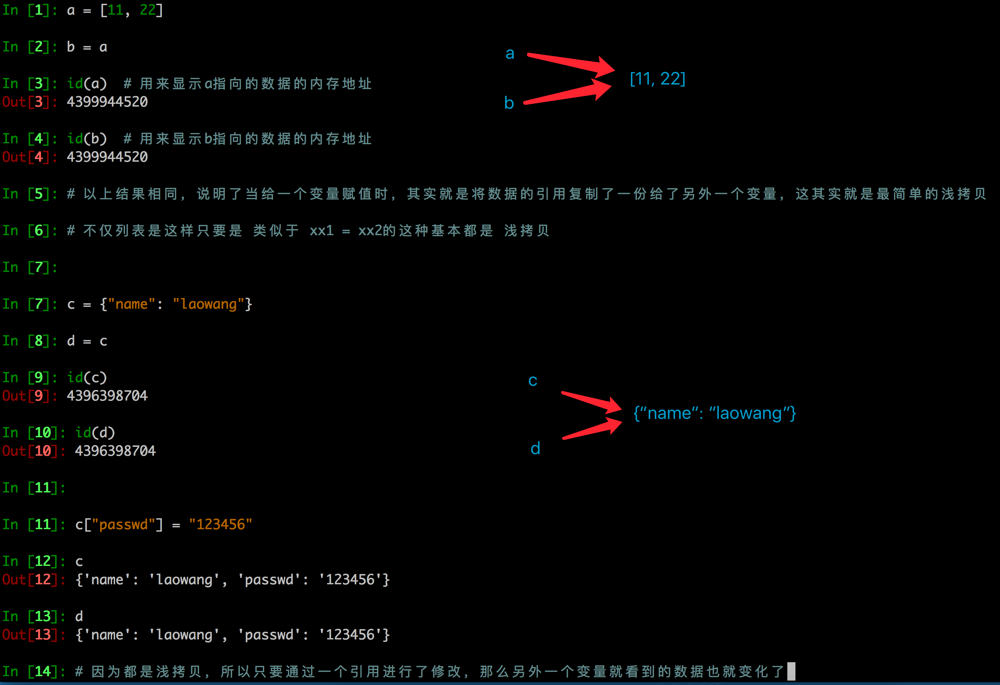
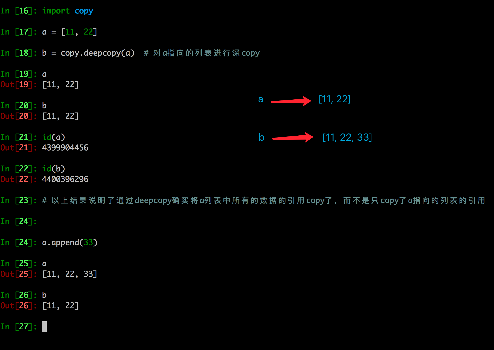
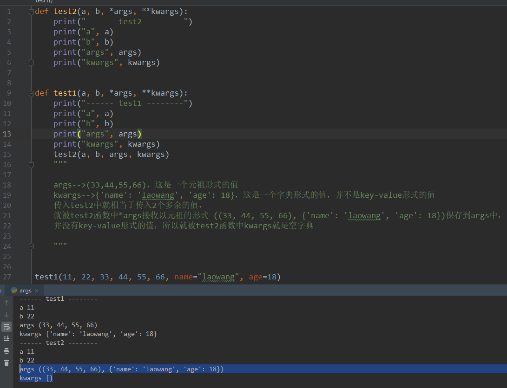

# 一、GIL（全局解释器锁）

#### GIL面试题

> 描述Python GIL的概念， 以及它对python多线程的影响？编写一个多线程抓取网页的程序，并阐明多线程抓取程序是否可比单线程性能有提升，并解释原因。

Guido的声明：http://www.artima.com/forums/flat.jsp?forum=106&thread=214235

he language doesn't require the GIL -- it's only the CPython virtual machine that has historically been unable to shed it.

**参考答案**:

> 1. **Python语言和GIL没有半毛钱关系**。仅仅是由于历史原因在`Cpython虚拟机`(解释器)，难以移除GIL。
> 2. GIL：全局解释器锁。每个线程在执行的过程都需要先获取GIL，保证同一时刻只有一个线程可以执行代码。
> 3. 线程释放GIL锁的情况： 在IO操作等可能会引起阻塞的system call之前,可以暂时释放GIL,但在执行完毕后,必须重新获取GIL Python 3.x使用计时器（执行时间达到阈值后，当前线程释放GIL）或Python 2.x，tickets计数达到100
> 4. Python使用多进程是可以利用多核的CPU资源的。
> 5. 多线程爬取比单线程性能有提升，因为遇到IO阻塞会自动释放GIL锁
> 6. 换解释器
> 7. 换其他语言，如c语言

**总结**

- **计算密集型：进程**

- **IO密集型：线程、协程**

# 二、深、浅拷贝

### 1. 浅拷贝

- 浅拷贝是对于一个对象的顶层拷贝

通俗的理解是：拷贝了引用，并没有拷贝内容




### 2. 深拷贝

- 深拷贝是对于一个对象所有层次的拷贝(递归)

- 

- ##### 进一步理解深拷贝


### 3. 拷贝的其他方式

- 分片表达式可以赋值一个序列


- 字典的copy方法可以拷贝一个字典


### 4. 注意点

#### 浅拷贝对不可变类型和可变类型的copy不同

1. copy.copy对于可变类型，会进行浅拷贝
2. copy.copy对于不可变类型，不会拷贝，仅仅是指向

```python
In [88]: a = [11,22,33]
In [89]: b = copy.copy(a)
In [90]: id(a)
Out[90]: 59275144
In [91]: id(b)
Out[91]: 59525600
In [92]: a.append(44)
In [93]: a
Out[93]: [11, 22, 33, 44]
In [94]: b
Out[94]: [11, 22, 33]


In [95]: a = (11,22,33)
In [96]: b = copy.copy(a)
In [97]: id(a)
Out[97]: 58890680
In [98]: id(b)
Out[98]: 58890680
```


#### copy.copy和copy.deepcopy的区别

> copy.copy


> copy.deepcopy


# 三、详解函数中可变参数 (*args,**kwargs)

### 1. 基本用法

- \*args,\*\*kwargs:  args，kwargs是变量名,\*,  \*\*是python解释器特殊功能

- *：把多余的参数（值）以`元祖`的形式保存到`args`中
- ** ：把多余的 `key-value`形式的参数以字典的形式保存到`kwargs`中


### 2、深入




**可变参数原封不动传递**：


# 四、with与“上下文管理器”

如果你有阅读源码的习惯，可能会看到一些优秀的代码经常出现带有 “with” 关键字的语句，它通常用在什么场景呢？今

对于系统资源如文件、数据库连接、socket 而言，应用程序打开这些资源并执行完业务逻辑之后，必须做的一件事就是要关闭（断开）该资源。

比如 Python 程序打开一个文件，往文件中写内容，写完之后，就要关闭该文件，否则会出现什么情况呢？极端情况下会出现 "Too many open files" 的错误，因为系统允许你打开的最大文件数量是有限的。

同样，对于数据库，如果连接数过多而没有及时关闭的话，就可能会出现 "Can not connect to MySQL server Too many connections"，因为数据库连接是一种非常昂贵的资源，不可能无限制的被创建。

来看看如何正确关闭一个文件。

### 普通版：

```python
def m1():
    f = open("output.txt", "w")
    f.write("python之禅")
    f.close()
```

这样写有一个潜在的问题，如果在调用 write 的过程中，出现了异常进而导致后续代码无法继续执行，close 方法无法被正常调用，因此资源就会一直被该程序占用者释放。那么该如何改进代码呢？

### 进阶版：

```python
def m2():
    f = open("output.txt", "w")
    try:
        f.write("python之禅")
    except IOError:
        print("oops error")
    finally:
        f.close()
```

改良版本的程序是对可能发生异常的代码处进行 try 捕获，使用 try/finally 语句，该语句表示如果在 try 代码块中程序出现了异常，后续代码就不再执行，而直接跳转到 except 代码块。而无论如何，finally 块的代码最终都会被执行。因此，只要把 close 放在 finally 代码中，文件就一定会关闭。

### 高级版：

```python
def m3():
    with open("output.txt", "r") as f:
        f.write("Python之禅")
```

一种更加简洁、优雅的方式就是用 with 关键字。open 方法的返回值赋值给变量 f，当离开 with 代码块的时候，系统会自动调用 f.close() 方法， with 的作用和使用 try/finally 语句是一样的。那么它的实现原理是什么？在讲 with 的原理前要涉及到另外一个概念，就是上下文管理器（Context Manager）。

### 什么是上下文(context)

> 上下文在不同的地方表示不同的含义，要感性理解。context其实说白了，和文章的上下文是一个意思，在通俗一点，我觉得叫环境更好。....
>
> 林冲大叫一声“啊也！”....
>
> 问:这句话林冲的“啊也”表达了林冲怎样的心里？
>
> 答:啊你妈个头啊！
>
> 看，一篇文章，给你摘录一段，没前没后，你读不懂，因为有语境，就是语言环境存在，一段话说了什么，要通过上下文(文章的上下文)来推断。
>
> app点击一个按钮进入一个新的界面，也要保存你是在哪个屏幕跳过来的等等信息，以便你点击返回的时候能正确跳回，如果不存肯定就无法正确跳回了。
>
> 看这些都是上下文的典型例子，理解成环境就可以，(而且上下文虽然叫上下文，但是程序里面一般都只有上文而已，只是叫的好听叫上下文。。进程中断在操作系统中是有上有下的，不过不这个高深的问题就不要深究了。。。)

### 上下文管理器

任何实现了 __enter__() 和 __exit__() 方法的对象都可称之为上下文管理器，上下文管理器对象可以使用 with 关键字。显然，文件（file）对象也实现了上下文管理器。

那么文件对象是如何实现这两个方法的呢？我们可以模拟实现一个自己的文件类，让该类实现 __enter__() 和 __exit__() 方法。

```python
class File():

    def __init__(self, filename, mode):
        self.filename = filename
        self.mode = mode

    def __enter__(self):
        print("entering")
        self.f = open(self.filename, self.mode)
        return self.f

    def __exit__(self, *args):
        print("will exit")
        self.f.close()
```

__enter__() 方法返回资源对象，这里就是你将要打开的那个文件对象，__exit__() 方法处理一些清除工作。

因为 File 类实现了上下文管理器，现在就可以使用 with 语句了。

```python
with File('out.txt', 'w') as f: # with 关键字 在File初始化后会调用__enter__方法，返回 self.f as f
    print("writing")
    f.write('hello, python')
```

这样，你就无需显示地调用 close 方法了，由系统自动去调用，哪怕中间遇到异常 close 方法也会被调用。

### 实现上下文管理器的另外方式

Python 还提供了一个 contextmanager 的装饰器，更进一步简化了上下文管理器的实现方式。通过 yield 将函数分割成两部分，yield 之前的语句在 __enter__ 方法中执行，yield 之后的语句在 __exit__ 方法中执行。紧跟在 yield 后面的值是函数的返回值。

```python
from contextlib import contextmanager

@contextmanager
def my_open(path, mode):
    f = open(path, mode)
    yield f
    f.close()
```

调用

```
with my_open('out.txt', 'w') as f:
    f.write("hello , the simplest context manager")
```

### 总结

Python 提供了 with 语法用于简化资源操作的后续清除操作，是 try/finally 的替代方法，实现原理建立在上下文管理器之上。此外，Python 还提供了一个 contextmanager 装饰器，更进一步简化上下管理器的实现方式。

