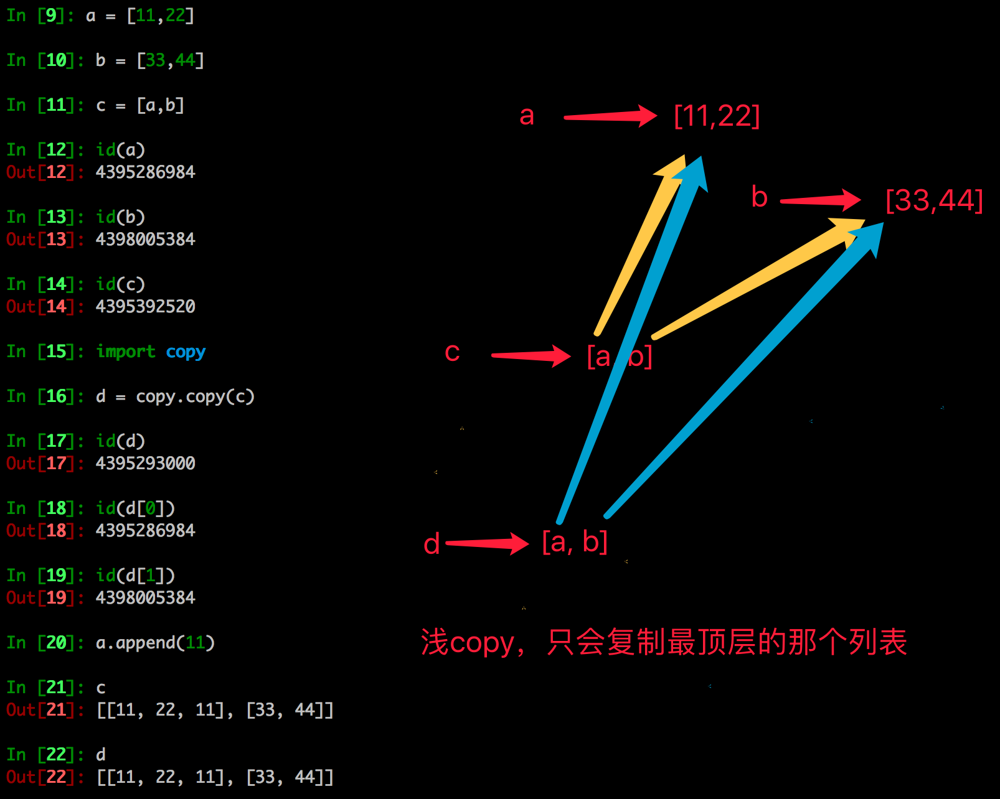
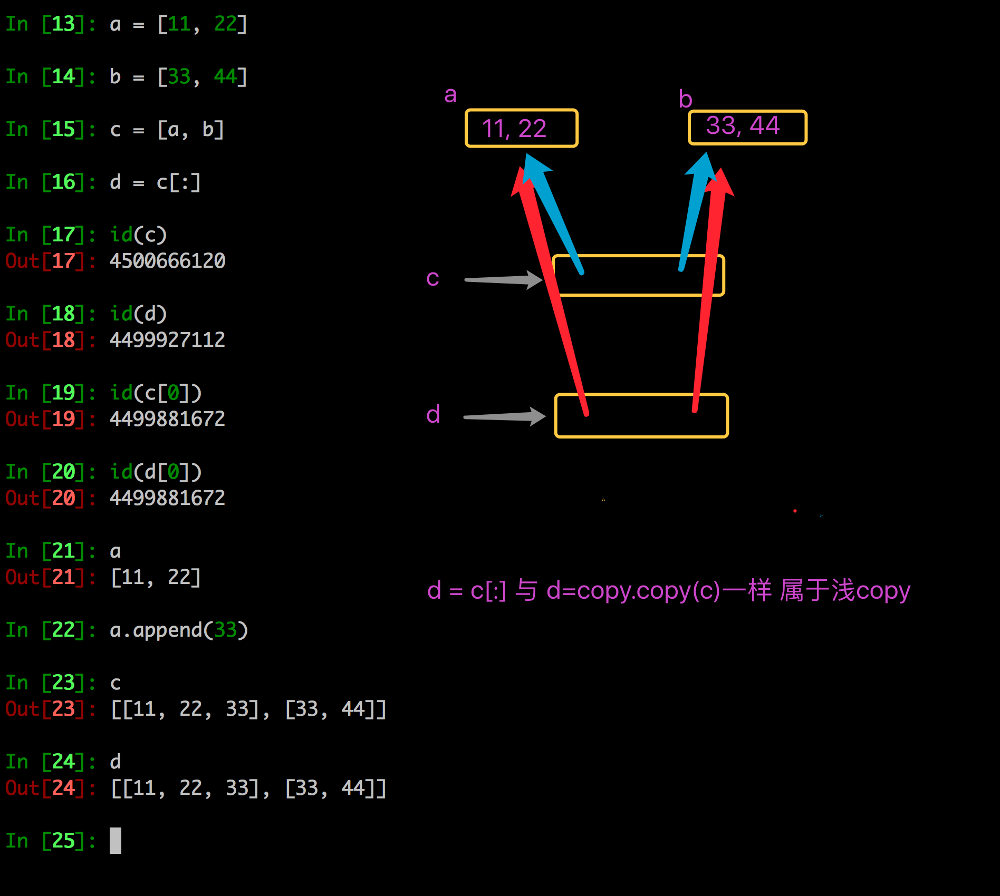
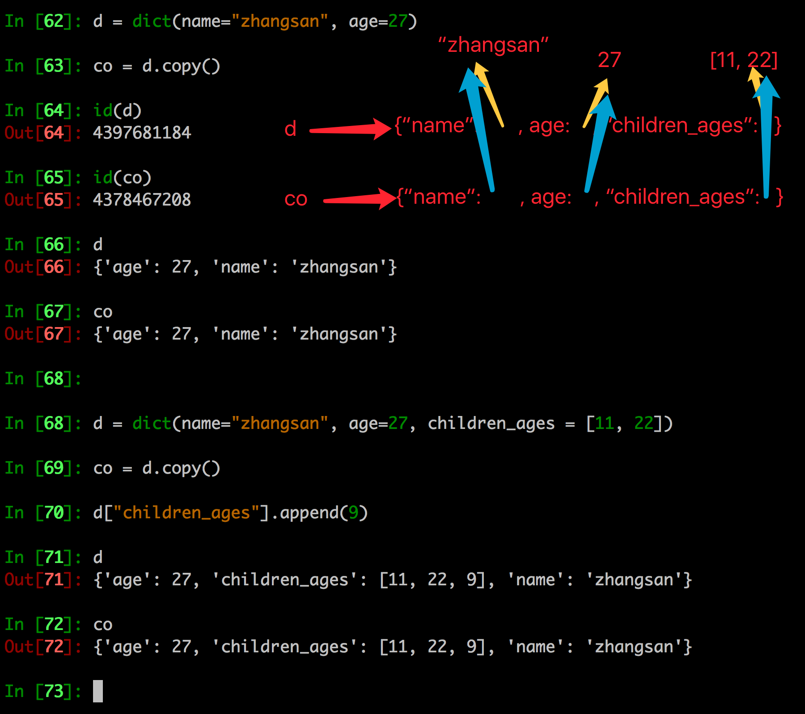
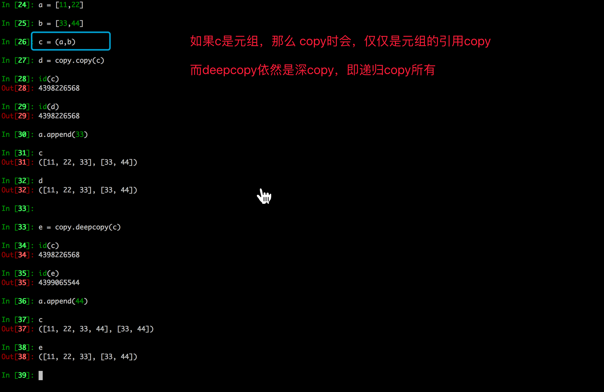

# 一、GIL（全局解释器锁）

#### GIL面试题

> 描述Python GIL的概念， 以及它对python多线程的影响？编写一个多线程抓取网页的程序，并阐明多线程抓取程序是否可比单线程性能有提升，并解释原因。

Guido的声明：http://www.artima.com/forums/flat.jsp?forum=106&thread=214235

he language doesn't require the GIL -- it's only the CPython virtual machine that has historically been unable to shed it.

**参考答案**:

> 1. **Python语言和GIL没有半毛钱关系**。仅仅是由于历史原因在`Cpython虚拟机`(解释器)，难以移除GIL。
> 2. GIL：全局解释器锁。每个线程在执行的过程都需要先获取GIL，保证同一时刻只有一个线程可以执行代码。
> 3. 线程释放GIL锁的情况： 在IO操作等可能会引起阻塞的system call之前,可以暂时释放GIL,但在执行完毕后,必须重新获取GIL Python 3.x使用计时器（执行时间达到阈值后，当前线程释放GIL）或Python 2.x，tickets计数达到100
> 4. Python使用多进程是可以利用多核的CPU资源的。
> 5. 多线程爬取比单线程性能有提升，因为遇到IO阻塞会自动释放GIL锁
> 6. 换解释器
> 7. 换其他语言，如c语言

**总结**

- **计算密集型：进程**

- **IO密集型：线程、协程**

# 二、深、浅拷贝

### 1. 浅拷贝

- 浅拷贝是对于一个对象的顶层拷贝

通俗的理解是：拷贝了引用，并没有拷贝内容




### 2. 深拷贝

- 深拷贝是对于一个对象所有层次的拷贝(递归)

- 

- ##### 进一步理解深拷贝


### 3. 拷贝的其他方式

- 分片表达式可以赋值一个序列



- 字典的copy方法可以拷贝一个字典



### 4. 注意点

#### 浅拷贝对不可变类型和可变类型的copy不同

1. copy.copy对于可变类型，会进行浅拷贝
2. copy.copy对于不可变类型，不会拷贝，仅仅是指向

```python
In [88]: a = [11,22,33]
In [89]: b = copy.copy(a)
In [90]: id(a)
Out[90]: 59275144
In [91]: id(b)
Out[91]: 59525600
In [92]: a.append(44)
In [93]: a
Out[93]: [11, 22, 33, 44]
In [94]: b
Out[94]: [11, 22, 33]


In [95]: a = (11,22,33)
In [96]: b = copy.copy(a)
In [97]: id(a)
Out[97]: 58890680
In [98]: id(b)
Out[98]: 58890680
```



#### copy.copy和copy.deepcopy的区别

> copy.copy


> copy.deepcopy


# 三、私有化

- xx: `公有变量`
- _x: `私有化属性或方法`，单前置下划线,from somemodule import *`禁止导入`,类对象和子类可以访问
- __xx：`私有变量`，双前置下划线,避免与子类中的属性命名冲突，无法在外部直接访问(名字重整所以访问不到)
- __xx__:双前后下划线,用户名字空间的魔法对象或属性。例如:`__init__` , __ 不要自己发明这样的名字，不推荐使用
- xx_:单后置下划线,用于避免与Python关键词的冲突，不推荐使用

通过name mangling（名字重整(目的就是以防子类意外重写基类的方法或者属性)如：_Class__object）机制就可以访问private了。

```python
#coding=utf-8

class Person(object):
    def __init__(self, name, age, taste):
        self.name = name
        self._age = age 
        self.__taste = taste

    def showperson(self):
        print(self.name)
        print(self._age)
        print(self.__taste)

    def dowork(self):
        self._work()
        self.__away()


    def _work(self):
        print('my _work')

    def __away(self):
        print('my __away')

class Student(Person):
    def construction(self, name, age, taste):
        self.name = name
        self._age = age 
        self.__taste = taste

    def showstudent(self):
        print(self.name)
        print(self._age)
        print(self.__taste)

    @staticmethod
    def testbug():
        _Bug.showbug()

# 模块内可以访问，当from  cur_module import *时，不导入
class _Bug(object):
    @staticmethod
    def showbug():
        print("showbug")

s1 = Student('jack', 25, 'football')
s1.showperson()
print('*'*20)

# 无法访问__taste,导致报错
# s1.showstudent() 
s1.construction('rose', 30, 'basketball')
s1.showperson()
print('*'*20)

s1.showstudent()
print('*'*20)

Student.testbug()
```


**总结**

- 父类中属性名为`__名字`的，子类不继承，子类不能访问
- 如果在子类中向`__名字`赋值，那么会在子类中定义的一个与父类相同名字的属性
- `_名`的变量、函数、类在使用`from xxx import *`时都不会被导入

# 四、import导入模块

### 1. import 搜索路径


**路径搜索 sys.path**

- 从上面列出的目录里依次查找要导入的模块文件
- '' 表示当前路径
- 列表中的路径的先后顺序代表了python解释器在搜索模块时的`先后顺序`

**程序执行时添加新的模块路径**

```python
sys.path.append('/home/itcast/xxx')
sys.path.insert(0, '/home/itcast/xxx')  # 可以确保先搜索这个路径
In [37]: sys.path.insert(0,"/home/python/xxxx")
In [38]: sys.path
Out[38]: 
['/home/python/xxxx',
 '',
 '/usr/bin',
 '/usr/lib/python35.zip',
 '/usr/lib/python3.5',
 '/usr/lib/python3.5/plat-x86_64-linux-gnu',
 '/usr/lib/python3.5/lib-dynload',
 '/usr/local/lib/python3.5/dist-packages',
 '/usr/lib/python3/dist-packages',
 '/usr/lib/python3/dist-packages/IPython/extensions',
 '/home/python/.ipython']
```

### 2. 重新导入模块

模块被导入后，`import module`不能重新导入模块，重新导入需用`reload`


### 3. 多模块开发时的注意点

```
recv_msg.py模块
from common import RECV_DATA_LIST
# from common import HANDLE_FLAG
import common


def recv_msg():
    """模拟接收到数据，然后添加到common模块中的列表中"""
    print("--->recv_msg")
    for i in range(5):
        RECV_DATA_LIST.append(i)


def test_recv_data():
    """测试接收到的数据"""
    print("--->test_recv_data")
    print(RECV_DATA_LIST)


def recv_msg_next():
    """已经处理完成后，再接收另外的其他数据"""
    print("--->recv_msg_next")
    # if HANDLE_FLAG:
    if common.HANDLE_FLAG:
        print("------发现之前的数据已经处理完成，这里进行接收其他的数据(模拟过程...)----")
    else:
        print("------发现之前的数据未处理完，等待中....------")
handle_msg.py模块
from common import RECV_DATA_LIST
# from common import HANDLE_FLAG
import common

def handle_data():
    """模拟处理recv_msg模块接收的数据"""
    print("--->handle_data")
    for i in RECV_DATA_LIST:
        print(i)

    # 既然处理完成了，那么将变量HANDLE_FLAG设置为True，意味着处理完成
    # global HANDLE_FLAG
    # HANDLE_FLAG = True
    common.HANDLE_FLAG = True

def test_handle_data():
    """测试处理是否完成，变量是否设置为True"""
    print("--->test_handle_data")
    # if HANDLE_FLAG:
    if common.HANDLE_FLAG:
        print("=====已经处理完成====")
    else:
        print("=====未处理完成====")
main.py模块
from recv_msg import *
from handle_msg import *


def main():
    # 1. 接收数据
    recv_msg()
    # 2. 测试是否接收完毕
    test_recv_data()
    # 3. 判断如果处理完成，则接收其它数据
    recv_msg_next()
    # 4. 处理数据
    handle_data()
    # 5. 测试是否处理完毕
    test_handle_data()
    # 6. 判断如果处理完成，则接收其它数据
    recv_msg_next()


if __name__ == "__main__":
    main()
```


# 五、详解函数中 (*args,**kwargs)参数


