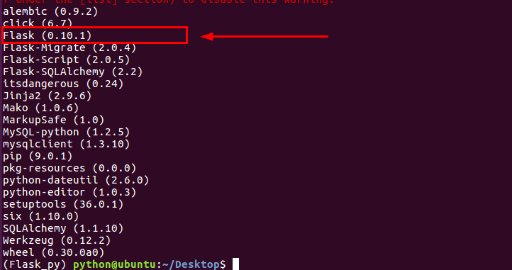
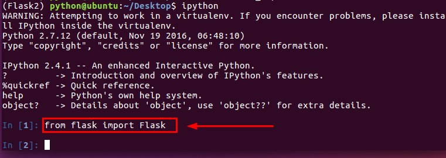

# 1.1 了解框架：

Flask作为Web框架，它的作用主要是为了开发Web应用程序。那么我们首先来了解下Web应用程序。Web应用程序 (World Wide Web)诞生最初的目的，是为了利用互联网交流工作文档。

	

- 一切从客户端发起请求开始。
  - 所有Flask程序都必须创建一个程序实例。
  - 当客户端想要获取资源时，一般会通过浏览器发起HTTP请求。
  - 此时，Web服务器使用一种名为WEB服务器网关接口的WSGI（Web Server Gateway Interface）协议，把来自客户端的请求都交给Flask程序实例。
  - Flask使用Werkzeug来做路由分发（URL请求和视图函数之间的对应关系）。根据每个URL请求，找到具体的视图函数。
  - 在Flask程序中，路由一般是通过程序实例的装饰器实现。通过调用视图函数，获取到数据后，把数据传入HTML模板文件中，模板引擎负责渲染HTTP响应数据，然后由Flask返回响应数据给浏览器，最后浏览器显示返回的结果。

### 为什么要用Web框架？

web网站发展至今，特别是服务器端，涉及到的知识、内容，非常广泛。这对程序员的要求会越来越高。如果采用成熟，稳健的框架，那么一些基础的工作，比如，网络操作、数据库访问、会话管理等都可以让框架来处理，那么程序开发人员可以把精力放在具体的业务逻辑上面。使用Web框架开发Web应用程序可以降低开发难度，提高开发效率。

总结一句话：避免重复造轮子。

### Flask框架的诞生：

Flask诞生于2010年，是Armin ronacher（人名）用Python语言基于Werkzeug工具箱编写的轻量级Web开发框架。它主要面向需求简单的小应用。

Flask本身相当于一个内核，其他几乎所有的功能都要用到扩展（邮件扩展Flask-Mail，用户认证Flask-Login），都需要用第三方的扩展来实现。比如可以用Flask-extension加入ORM、窗体验证工具，文件上传、身份验证等。Flask没有默认使用的数据库，你可以选择MySQL，也可以用NoSQL。其 WSGI 工具箱采用 Werkzeug（路由模块） ，模板引擎则使用 Jinja2 。

可以说Flask框架的核心就是Werkzeug和Jinja2。

Python最出名的框架要数Django，此外还有Flask、Tornado等框架。虽然Flask不是最出名的框架，但是Flask应该算是最灵活的框架之一，这也是Flask受到广大开发者喜爱的原因。

**Flask扩展包：**

- Flask-SQLalchemy：操作数据库；
- Flask-migrate：管理迁移数据库；
- Flask-Mail:邮件；
- Flask-WTF：表单；
- Flask-script：插入脚本；
- Flask-Login：认证用户状态；
- Flask-RESTful：开发REST API的工具；
- Flask-Bootstrap：集成前端Twitter Bootstrap框架；
- Flask-Moment：本地化日期和时间；

**Flask官方文档：**

[中文文档](http://docs.jinkan.org/docs/flask/)

[英文文档](http://flask.pocoo.org/docs/0.11/)


# 1.2 安装环境

使用虚拟环境安装Flask，可以避免包的混乱和版本的冲突，虚拟环境是Python解释器的副本，在虚拟环境中你可以安装扩展包，为每个程序单独创建的虚拟环境，可以保证程序只能访问虚拟环境中的包。而不会影响系统中安装的全局Python解释器，从而保证全局解释器的整洁。

虚拟环境使用virtualenv创建，可以查看系统是否安装了virtualenv：

```bash
$ virtualenv --version
```

**安装虚拟环境(须在联网状态下)**

```bash
$ sudo pip install virtualenv
$ sudo pip install virtualenvwrapper
```

**安装完虚拟环境后，如果提示找不到mkvirtualenv命令，须配置环境变量：**

```bash
# 1、创建目录用来存放虚拟环境
mkdir $HOME/.virtualenvs

# 2、打开~/.bashrc文件，并添加如下：
export WORKON_HOME=$HOME/.virtualenvs
source /usr/local/bin/virtualenvwrapper.sh

# 3、运行
source ~/.bashrc
```

**创建虚拟环境(ubuntu里须在联网状态下)**

```bash
$ mkvirtualenv Flask_py
```

**进入虚拟环境**

```bash
$ workon Flask_py
```

**退出虚拟环境**

如果所在环境为真实环境，会提示deactivate：未找到命令

```bash
$ deactivate Flask_py
```

## 1.2.1 安装Flask

```bash
指定Flask版本安装
$ pip install flask==0.10.1
```

Mac系统：

```bash
$ easy_install flask==0.10.1
```

## 1.2.2 安装Flask依赖包

安装依赖包（须在虚拟环境中）： 依赖就是开发以及程序运行需要使用的环境的集合。包括软件、插件等。我们一般会把需要使用的依赖给保存在一个文件中，命名为requirements的txt文件。如果在其它环境中要运行我们的项目，直接通过指令可以一次性安装所有依赖。

安装依赖包（须在虚拟环境中）：

```bash
$ pip install -r requirements.txt
```

生成依赖包（须在虚拟环境中）：

```bash
$ pip freeze > requirements.txt
```

**在ipython中测试安装是否成功**

```bash
$ from flask import Flask
```



