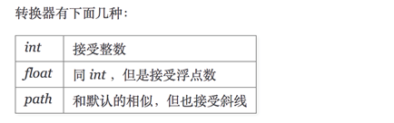
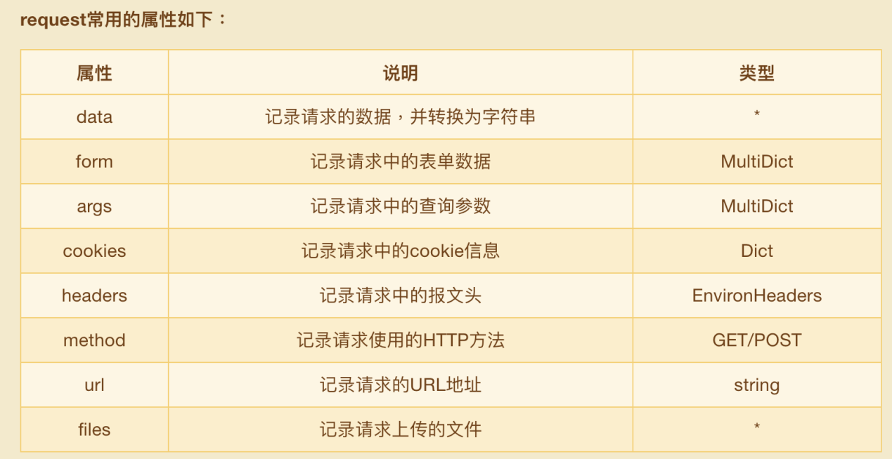

[TOC]


# 一、最简单用法


```python
from flask import Flask

# 实例化Flask对象
app = Flask(__name__)

# 路由
# 装饰器的作用是将路由映射到视图函数index
@app.route('/')
def index():
    return "hello world"

# Flask应用程序实例的run方法启动WEB服务器
app.run()
```


# 二、Flask创建app对象

## 1.  初始化参数 

```python
 app=Flask(__name__,static_folder="static",...)
    
0.import_name: 导入路径（寻找静态目录与模板目录位置的参数）
    __name__，表示当前的模块名字，
    flask以这个模块所在的目录为总目录，
    默认这个目录中的static为静态目录，templates为模板目录
    
1.template_folder="temp" 默认模板路径 templates

2.static_folder="static", 默认静态文件路径 static

3.static_url_path="/static" 访问静态文件路由地址 默认是"/"+static_folder

# 以下了解：
4.static_host=None 指定静态文件服务器地址
5.host_matching = False,  # 如果不是特别需要的话,慎用,否则所有的route 都需要host=""的参数
6.subdomain_matching = False,  # 理论上来说是用来限制SERVER_NAME子域名的,但是目前还没有感觉出来区别在哪里
7.instance_path = None,  # 指向另一个Flask实例的路径
8.instance_relative_config = False  # 是否加载另一个实例的配置
9.root_path = None  # 主模块所在的目录的绝对路径,默认项目目录
```

## 2. 配置参数

```python
# config.cfg
DEBUG=True
```

```python
# app.py

from flask import Flask


app = Flask(__name__)

# 配置参数的使用方式
# 方式1.使用配置文件--start--
app.config.from_pyfile(“config.cfg”)
# 方式1.使用配置文件--end--

#方式二、使用对象配置参数---start---
class Config(object):
	DEBUG = True	
    MA = "liang" # 自定义配置参数
    
app.config.from_object(Config)

#方式二、使用对象配置参数---end---

# 方式三、直接操作config的字典对象---start---
app.config["DEBUG"] = True
# 方式三、直接操作config的字典对象---end---


@app.route('/')
def index():
    # 获取配置参数
    app.config.get("MA") # 方式一：直接从全局对象app的config字典中取值
    current_app.config.get("MA") # 方式二：从全局对象app的代理人current_app中config字典中取值
    
    return "hello world"

app.run()
```


### 2.1 配置方式

- 配置参数单独放到一个文件config.cfg
- 从对象的方式导入，定义一个类，类也是一个对象
- 直接操作config的字典对象

### 2.2 在视图读取配置参数

- `app.config.get()` 

- `current_app.config.get()`

### 2.3 app的配置参数解析

```python
{
    'DEBUG': False,  # 是否开启Debug模式,代码只要发生改动,自动重启Flask程序(app.run)
    'TESTING': False,  # 是否开启测试模式
    'PROPAGATE_EXCEPTIONS': None,  # 异常传播(是否在控制台打印LOG) 当Debug或者testing开启后,自动为True
    'PRESERVE_CONTEXT_ON_EXCEPTION': None,  # 一两句话说不清楚,一般不用它
    'SECRET_KEY': None,  # 之前遇到过,在启用Session的时候,一定要有它
    'PERMANENT_SESSION_LIFETIME': 31,  # days , Session的生命周期(天)默认31天
    'USE_X_SENDFILE': False,  # 是否弃用 x_sendfile
    'LOGGER_NAME': None,  # 日志记录器的名称
    'LOGGER_HANDLER_POLICY': 'always',
    'SERVER_NAME': None,  # 服务访问域名
    'APPLICATION_ROOT': None,  # 项目的完整路径
    'SESSION_COOKIE_NAME': 'session',  # 在cookies中存放session加密字符串的名字
    'SESSION_COOKIE_DOMAIN': None,  # 在哪个域名下会产生session记录在cookies中
    'SESSION_COOKIE_PATH': None,  # cookies的路径
    'SESSION_COOKIE_HTTPONLY': True,  # 控制 cookie 是否应被设置 httponly 的标志，
    'SESSION_COOKIE_SECURE': False,  # 控制 cookie 是否应被设置安全标志
    'SESSION_REFRESH_EACH_REQUEST': True,  # 这个标志控制永久会话如何刷新
    'MAX_CONTENT_LENGTH': None,  # 如果设置为字节数， Flask 会拒绝内容长度大于此值的请求进入，并返回一个 413 状态码
    'SEND_FILE_MAX_AGE_DEFAULT': 12,  # hours 默认缓存控制的最大期限
    'TRAP_BAD_REQUEST_ERRORS': False,
    # 如果这个值被设置为 True ，Flask不会执行 HTTP 异常的错误处理，而是像对待其它异常一样，
    # 通过异常栈让它冒泡地抛出。这对于需要找出 HTTP 异常源头的可怕调试情形是有用的。
    'TRAP_HTTP_EXCEPTIONS': False,
    # Werkzeug 处理请求中的特定数据的内部数据结构会抛出同样也是“错误的请求”异常的特殊的 key errors 。
    # 同样地，为了保持一致，许多操作可以显式地抛出 BadRequest 异常。
    # 因为在调试中，你希望准确地找出异常的原因，这个设置用于在这些情形下调试。
    # 如果这个值被设置为 True ，你只会得到常规的回溯。
    'EXPLAIN_TEMPLATE_LOADING': False,
    'PREFERRED_URL_SCHEME': 'http',  # 生成URL的时候如果没有可用的 URL 模式话将使用这个值
    'JSON_AS_ASCII': True,
    # 默认情况下 Flask 使用 ascii 编码来序列化对象。如果这个值被设置为 False ，
    # Flask不会将其编码为 ASCII，并且按原样输出，返回它的 unicode 字符串。
    # 比如 jsonfiy 会自动地采用 utf-8 来编码它然后才进行传输。
    'JSON_SORT_KEYS': True,
    #默认情况下 Flask 按照 JSON 对象的键的顺序来序来序列化它。
    # 这样做是为了确保键的顺序不会受到字典的哈希种子的影响，从而返回的值每次都是一致的，不会造成无用的额外 HTTP 缓存。
    # 你可以通过修改这个配置的值来覆盖默认的操作。但这是不被推荐的做法因为这个默认的行为可能会给你在性能的代价上带来改善。
    'JSONIFY_PRETTYPRINT_REGULAR': True,
    'JSONIFY_MIMETYPE': 'application/json',
    'TEMPLATES_AUTO_RELOAD': None,
}
```


## 3. app.run的启动参数

```python

# app.run() # 默认
app.run(host=”0.0.0.0”, port=5000,debug=True)
```


# 三、 路由

## 1. 查看整个flask中的路由信息

```python
from flask import Flask

app = Flask(__name__)
app.config["DEBUG"] = True


@app.route('/')
def index():
    return "hello world"


if __name__ == '__main__':
    # 通过url_map可以查看整个flask中的路由信息
    print(app.url_map)
    app.run()

```

**结果输出：**

```python
Map([<Rule '/' (OPTIONS, HEAD, GET) -> index>,
 <Rule '/static/<filename>' (OPTIONS, HEAD, GET) -> static>])
```

## 2. 路由装饰器@app.route()

### 2.1 利用methods限制访问方式

```python
@app.route("/",methods=["GET","POST"])
def index(): # 视图函数
	return "hello,world!"
```

### 2.2 @app.route(...)中参数含义

```python
# flask中的路由参数：
    0.rule: "/",通过该路径访问该视图函数
	1.endpoint 反向生成url地址标志 默认视图函数名 url_for
	2.methods 视图函数允许的请求方式,["GET","POST"]
	6."/index/<page>" 动态路由路由参数
		def index(page)
		
	3.defaults={"nid":"123456"} 默认参数
	4.strict_slashes=True 是否严格遵循路由地址
	5.redirect_to="/login" 永久重定向 301
```


### 2.3 同一路由装饰多个视图函数

- 如果路径、请求方法完全一样，会按照app.url_map中顺序进行访问，哪个视图函数在前面就访问哪个
- 如果路径一样，访问方法不一样，就会依据路径和请求方法对视图函数进行匹配

```python
from flask import Flask

app = Flask(__name__)
app.config["DEBUG"] = True


@app.route('/')
def index():
    return "hello world"


# 同一路由装饰多个视图函数
@app.route("/hello", methods=["POST"])
def hello():
    return "hello1"


@app.route("/hello", methods=["GET"])
def hello2():
    return "hello2"

# 同一视图多个路由装饰器
@app.route("/h1")
@app.route("/h2")
def hi():
    return "hi page"

if __name__ == '__main__':
    # 通过url_map可以查看整个flask中的路由信息
    print(app.url_map)
    app.run()
```


### 2.4 同一视图多个路由装饰器

- 通过不同路径都能访问到同一视图函数

### 2.5 使用url_for进行反解析 类似Django中的reverse

- 通过视图函数的名字找到视图函数对应的url路径

```python
from flask import Flask, redirect, url_for

app = Flask(__name__)
app.config["DEBUG"] = True


@app.route('/')
def index():
    return "hello world"


@app.route("login")
def login():
    # 使用url_for函数，通过视图函数的名字找到视图函数对应的url路径
    return redirect(url_for("index"))


if __name__ == '__main__':
    app.run()

```

### 2.6 动态路由

#### 2.6.1 转换器`<int:id>`

```python
# 路由传递的参数默认当做string处理，这里指定int，尖括号中冒号后面的内容是动态的
@app.route('/user/<int:id>')
# @app.route('/user/<id>') # 不加转换器类型，默认是普通字符串规则（除了/的字符）
def hello_itcast(id):
    return 'hello itcast %d' %id

```




#### 2.6.2 自定义转换器

```python
from flask import Flask,redirect
from werkzeug.routing import BaseConverter

# 万能转换器
class Regex_url(BaseConverter):
    def __init__(self,url_map,*args):
        super(Regex_url,self).__init__(url_map)
        self.regex = args[0]
	
    def to_python(self,value): # 可以重写父类方法，对提取到参数进一步处理，value是在路径进行正则表达式匹配的时候提取的参数
        pass
    	return value # 返回值传回给视图函数中的id
    
    def to_url(self,value): # 使用url_for的时候调用
        pass
    	return value
        
app = Flask(__name__)
app.url_map.converters['re'] = Regex_url

# re(参数)
@app.route('/user/<re("[a-z]{3}"):id>')
def hello_itcast(id):
    return 'hello %s' %id


@app.route('/index')
def index():
    url = url_for("hello_itcast",id="abc") # url_for 反解析自定义转换器,参数使用键值对 
    return redirect(url)
```


# 四、 request对象

## 3.1 request请求参数

- `Flask` 中表示当前请求的 `request` 对象，`request`对象中保存了一次HTTP请求的一切信息。

```python
from flask import request
```



```python
request.data # 可以取得json字符串
```

```python
if request.method == "POST":
    pass
```


```python
# 读取表单数据中的值
name = request.form.get("name")

# 如果前端name参数出现重复值，后端的取值方法
name_li = request.form.getlist("name")
```


## 3.2 上传文件

- 已上传的文件存储在内存或是文件系统中一个临时的位置。

- 你可以通过请求对象的 `files` 属性访问它们。每个上传的文件都会存储在这个字典里。

- 它表现近乎为一个标准的 Python file 对象，但它还有一个 `save()` 方法，这个方法允许你把文件保存到服务器的文件系统上。

**这里是一个用它保存文件的例子:**

```python
from flask import request

@app.route('/upload', methods=['GET', 'POST'])
def upload_file():
    if request.method == 'POST':
        f = request.files.get('the_file')
        if f is not None:
        	f.save('/var/www/uploads/uploaded_file.txt')
    ...

```

**注意：**

- 如果你想知道上传前文件在客户端的文件名是什么，你可以访问 filename 属性。

- 但请记住， 永远不要信任这个值，这个值是可以伪造的。

- 如果你要把文件按客户端提供的文件名存储在服务器上，那么请把它传递给 `Werkzeug` 提供的 `secure_filename()` 函数:

```python
from flask import request
from werkzeug import secure_filename

@app.route('/upload', methods=['GET', 'POST'])
def upload_file():
    if request.method == 'POST':
        f = request.files.get('the_file')
        if f is not None:
        	f.save('/var/www/uploads/' + secure_filename(f.filename))

```


# 五、abort函数与自定义异常处理


## 4.4.1 abort函数

```python
from flask import Flask, abort, Response

@app.route("/login", methods=["POST"])
def login():
    name = request.form.get("name")
    if name != "zhangsan":
 		# 使用abort函数可以立即终止视图函数的执行,并可以返回给前端特定的信息
        #  1 传递状态码信息，必须是标准的http状态码
       	abort(403)
        
        # 2 传递响应体信息
        resp = Response("login faild")
        abort(resp)
        
    return "登录成功"
```


## 4.4.2 自定义异常处理

```python
# 只要出现404错误，就会自动调用这个视图函数
@app.errorhandler(404)
def handle_404_error(err):
    """自定义的处理错误方法"""
    # 这个函数的返回值是前端用户看到的最终结果
	return '您请求的页面不存在了，请确认后再次访问！%s' % err
```

# 六、 response_返回的响应数据 

## 1.  使用元组

可以返回一个元组，这样的元组必须是 **(response, status, headers)** 的形式，且至少包含一个元素。 

status 值会覆盖状态代码， headers 可以是一个列表或字典，作为额外的消息标头值。

```python
from flask import Flask


app = Flask(__name__)


@app.route('/')
def index():
    # 1 使用元祖，返回自定义的响应信息
    # 			响应体		状态码 				响应头
    return "hello world",  400, [("Itcast","python"),("City","Beijing")] # 列表

	return "hello world",  400, {"Itcast"："python","City"："Beijing"} # 字典

	return "hello world",  666, [("Itcast","python"),("City","Beijing")] # 状态码

	return "hello world",  600 my status, {"Itcast"："python","City"："Beijing"} # 给状态码添加描述

	return "hello world",  666 # 不传响应头是可以的

app.run()
```

## 2.  使用make_response构造响应信息

```python
from flask import Flask,make_response


app = Flask(__name__)


@app.route('/')
def index():
    # 2 使用make_response构造响应信息
    resp = make_response("index page 2")
    resp.status = "999 my status" # 设置状态码
    resp,headers["city"]="bj" # 设置响应头
	return resp


app.run()
```


# 七、使用jsonify返回json数据

- **`json` 就是字符串**
- `jsonify`帮助转为`json`数据，并设置响应头 `Content-Type` 为 `application/json`

```python
from flask import Flask,jsonify


app = Flask(__name__)


@app.route('/')
def index():
    data = {
        "name":"python",
        "age":24
    }
    # jsonify帮助转为json数据，并设置响应头 Content-Type 为 application/json
	return jsonify(data) 

	return jsonify(city="bj", country="zh") # 传入键值对也可以

app.run()
```

# 八、重定向

```python
from flask import redirect
```

# 九、设置和读取cookie

```python
from flask import Flask,make_response


app = Flask(__name__)


@app.route('/set_cookie')
def set_cookie():
    resp = make_response("success")
   
    resp.set_cookie("name","maliang") # 设置cookie,默认有效期是临时cookie，浏览器关闭就失效
	resp.set_cookie("age","20")
    
    resp.set_cookie("gender","male",max_age=3600) # 设置有效期，单位（秒）
    
    resp["Set-Cookie"] = "gender=male;Expires=Sat...;Max-Age=3600;" # 设置cookie的 本质就是在响应头里增加Set-Cookie的键值对
    return resp


"""获取cookie"""
@app.route("/get_cookie")
def get_cookie():
    name = request.cookie.get("name")
    return name

"""删除cookie"""
@app.route("/delete_cookie")
def delete_cookie():
    res = make_response("del cookie")
    resp.delete_cookie("age")
    return resp


if __name__ == "__main__":
	app.run()
```

# 十、session

```python
from flask import Flask,session


app = Flask(__name__)

# flask的session需要用到的密钥字符串
app.config["SECRET_KEY"] = "FAS11F1A21S2D2A2AD2FGA2"

# app.secret_key = "DragonFire"

"""设置session"""
@app.route('/set_session')
def set_session():
    session["name"] = "maliang"
   	session["age"] = "35"
    return "session success"

"""获取session"""
@app.route("/get_session")
def get_session():
    name = session.get("name")
    return name


if __name__ == "__main__":
	app.run()
```


 


# 十一、请求上下文与应用上下文

## 1. 请求上下文（request context）

- 前戏: 偏函数 ,线程安全local,LocalStack(栈，push,top)
- 本质就是在内存中开辟一块空间，存放各个线程所对应的request,seesion值
- 取出时按照各线程取出属于自己的request,seesion值

**ctx 请求上下文**

app.run -->app.__call__-->app.wsgi_app-->

- 上文：把request，session存入栈
- 下文：把request，session从栈中取出

- 入口：app.run()执行了run_simple(host, port, self, **options)，self 参数是是app ，在run_simple内部执行app() 而app=Flask(__name__),app是对象
  ，对象加括号执行Flask的\_\_call\_\_方法，也是相当于执行app.\_\_call_\_方法

看到这个：
```python
from werkzeug.serving import run_simple

try:
    //self 就是app
    run_simple(host, port, self, **options)
```
看看werkzeug是干什么的  
是监听端口和app的

```python
from werkzeug.serving import run_simple
from werkzeug.wrappers import Response,Request

@Request.application
def app(req):
    print(req.method)
    return Response("200 OK")


run_simple("0.0.0.0",5000,app)


```
浏览器输入地址访问，就能有响应

>run_simple内部会执行app()方法，实际上是app.\_\_call\_\_方法

从app__call__方法进入

```
 def __call__(self, environ, start_response): # self=app=Flask(__name__)
        # environ是请求的原始信息
        return self.wsgi_app(environ, start_response)

```

继续进入wsgi_app(self, environ, start_response)内部
```
// ctx = request_context 里面有request,session属性
ctx = self.request_context(environ) # self =app
继续进入
return RequestContext(self, environ)
继续


app.request_class(environ) # 孵化request

```

```
ctx.push()

```

Flask的request (用偏函数partial理解)
```
request = LocalProxy(partial(_lookup_req_object, "request"))
```
线程安全（参考，python基础中的线程安全）
```
request 是全局变量
如果线程不安全多个request请求进来时，  
后面的请求会覆盖掉前面的，  
所以就得用到线程安全 local

# 在内存中开辟一块空间，存放各个线程所对应的request,seesion值
"""
{
    7172:[request,session],
    8076:[request,session],
    5784:[request,session],
}
"""

```

```
ctx.push()

def push(self):self=ctx-request,session
    
    top = _request_ctx_stack.top
    
_request_ctx_stack = LocalStack()

class LocalStack(object):
    def __init__(self):
        self._local = Local()
        
class Local(object):
    __slots__ = ("__storage__", "__ident_func__")

    def __init__(self):
        object.__setattr__(self, "__storage__", {})
        object.__setattr__(self, "__ident_func__", get_ident)
```

## 2. 应用上下文（application context） 存取的是Flask对象（app）

> `current_app`和`g对象`都属于应用上下文对象。

- `current_app`：表示当前运行程序文件的程序实例。
- `g对象`：处理请求时，用于临时存储的对象，每次请求都会重设这个变量。只能在一次请求中进行传参，每次请求时候g对象会被重置

**`g对象`可以存储当前用户信息:**


```
from flask import Flask, g
```

```python
from flask import Flask,g,render_template,request
from utils import login_log
app = Flask(__name__)


@app.route('/')
def hello_world():
    return 'Hello World!'

@app.route('/login/',methods=['GET','POST'])
def login():
    if request.method == 'GET':
        return render_template('login.html')
    else:
        username = request.form.get('username')
        password = request.form.get('password')
        if username == '111' and password == '222':
            g.username = '111'
            login_log()
            return u'登录成功'
        else:
            return u'您的用户名或密码错误'

def login_log():
    print('当前登录用户是',g.usernmae)

if __name__ == '__main__':
    app.run()
```


应用上下文(application context)

current_app和g都属于应用上下文对象。

 

current_app:表示当前运行程序文件的程序实例。

g:处理请求时，用于临时存储的对象，每次请求都会重设这个变量。

#  十二、请求钩子（hook）

- 请求钩子是通过装饰器的形式实现，Flask支持如下四种请求钩子：

  - `@app.before_first_request`：在处理第一个请求前运行。

    

  - `@app.before_request`：在每次请求前运行。

   

  - `@app.after_request(response)`：如果没有未处理的异常抛出，在每次请求后运行。（**有异常抛出后，不会执行**）

   

  - `@teardown_request(response)`：在每次请求后运行，即使有未处理的异常抛出。（**在DEBUG模式关闭时，无论是否有异常抛出，都会执行**）

```python
from flask import Flask

# 实例化Flask对象
app = Flask(__name__)

# 路由
# 装饰器的作用是将路由映射到视图函数index
@app.route('/')
def index():
    print("index 被执行")
    return "hello world"

@app.before_first_request
def handle_before_first_request():
    """在第一次请求处理之前先被执行"""
    print("handle_before_first_request")

@app.before_request
def handle_before_request():
    """在每次次请求处理之前先被执行"""
    print("handle_before_request")

@app.after_request
def handle_after_request(response):
    """在每次请求（视图函数处理）之后都被执行，前提是视图视图函数没有出现异常"""
    print("handle_after_request")
    
@app.teardown_request    
def handle_teardown_request(response):
    """在每次请求（视图函数处理）之后都被执行，无论视图函数是否出现异常，都被执行"""
    print("handle_teardown_request")
    
# Flask应用程序实例的run方法启动WEB服务器
app.run()
```

**输出：**

```python
"handle_before_first_request"
"handle_before_request"
"index 被执行"
"handle_after_request"
"handle_teardown_request"
```

## 1. 多个before_request和after_request执行顺序

### 1.1 正常情况

```python
from flask import Flask


app = Flask(__name__)


@app.route('/')
def index():
    print("index 被执行")
    return "hello world"


@app.before_request
def be1():
    """在每次次请求处理之前先被执行"""
    print("我是before_request1")


@app.before_request
def be2():
    """在每次次请求处理之前先被执行"""
    print("我是before_request2")


@app.before_request
def be3():
    """在每次次请求处理之前先被执行"""
    print("我是before_request3")


@app.after_request
def af1(response):
    """在每次请求（视图函数处理）之后都被执行，前提是视图视图函数没有出现异常"""
    print("我是after_request1")
    return response


@app.after_request
def af2(response):
    """在每次请求（视图函数处理）之后都被执行，前提是视图视图函数没有出现异常"""
    print("我是after_request2")
    return response

@app.after_request
def af3(response):
    """在每次请求（视图函数处理）之后都被执行，前提是视图视图函数没有出现异常"""
    print("我是after_request3")
    return response

# Flask应用程序实例的run方法启动WEB服务器
app.run()
```

**输出：**

```PYTHON
我是before_request1
我是before_request2
我是before_request3
index 被执行
我是after_request3
我是after_request2
我是after_request1
```

**结论：**

- before_request是按照定义顺序执行

- after_request是按照定义顺序倒序执行

### 1.2 如果before_request有截断，执行顺序

```python
from flask import Flask

# 实例化Flask对象
app = Flask(__name__)


# 路由
# 装饰器的作用是将路由映射到视图函数index
@app.route('/')
def index():
    print("index 被执行")
    return "hello world"


@app.before_request
def be1():
    """在每次次请求处理之前先被执行"""
    print("我是before_request1")


@app.before_request
def be2():
    """在每次次请求处理之前先被执行"""
    print("我是before_request2")
    return "请使用合法客户端"   # 在be2被截断,不在执行be3


@app.before_request
def be3():
    """在每次次请求处理之前先被执行"""
    print("我是before_request3")


@app.after_request
def af1(response):
    """在每次请求（视图函数处理）之后都被执行，前提是视图视图函数没有出现异常"""
    print("我是after_request1")
    return response


@app.after_request
def af2(response):
    """在每次请求（视图函数处理）之后都被执行，前提是视图视图函数没有出现异常"""
    print("我是after_request2")
    return response

@app.after_request
def af3(response):
    """在每次请求（视图函数处理）之后都被执行，前提是视图视图函数没有出现异常"""
    print("我是after_request3")
    return response

# Flask应用程序实例的run方法启动WEB服务器
app.run()
```

**输出：**

```python
我是before_request1
我是before_request2
我是after_request3
我是after_request2
我是after_request1
```

**结论：**

- 在be2处被截断，不再执行be3，返回情况是：after_request执行顺序从af3开始倒序执行