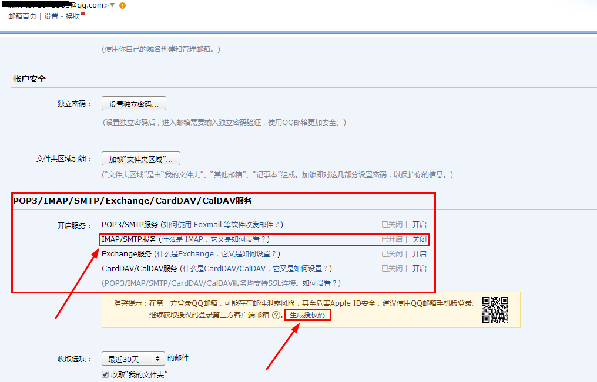

# .4 Flask—Mail

在开发过程中，很多应用程序都需要通过邮件提醒用户，Flask的扩展包Flask-Mail通过包装了Python内置的smtplib包，可以用在Flask程序中发送邮件。

Flask-Mail连接到简单邮件协议（Simple Mail Transfer Protocol,SMTP）服务器，并把邮件交给服务器发送。



如下示例，通过开启QQ邮箱SMTP服务设置，发送邮件。

```python
from flask import Flask
from flask_mail import Mail, Message

app = Flask(__name__)
#配置邮件：服务器／端口／传输层安全协议／邮箱名／密码
app.config.update(
    DEBUG = True,
    MAIL_SERVER='smtp.qq.com',
    MAIL_PROT=465,
    MAIL_USE_TLS = True,
    MAIL_USERNAME = '371673381@qq.com',
    MAIL_PASSWORD = 'goyubxohbtzfbidd',
)

mail = Mail(app)

@app.route('/')
def index():
 # sender 发送方，recipients 接收方列表
    msg = Message("This is a test ",sender='371673381@qq.com', recipients=['shengjun@itcast.cn','371673381@qq.com'])
    #邮件内容
    msg.body = "Flask test mail"
    #发送邮件
    mail.send(msg)
    print "Mail sent"
    return "Sent　Succeed"

if __name__ == "__main__":
    app.run()
```