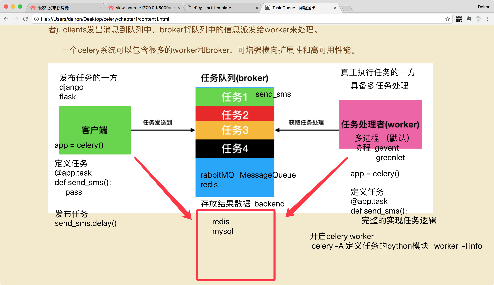
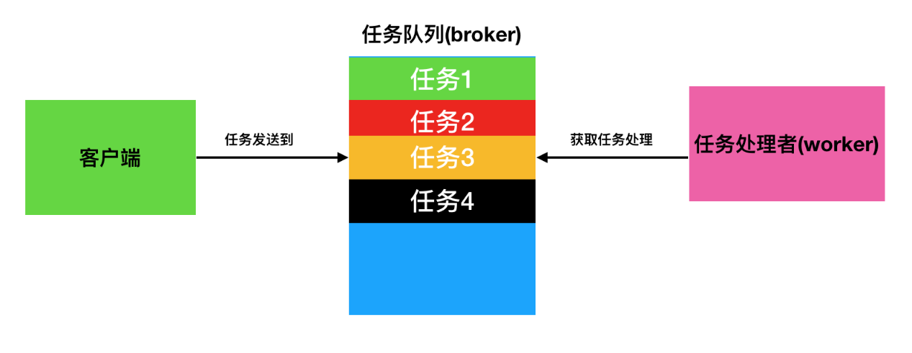
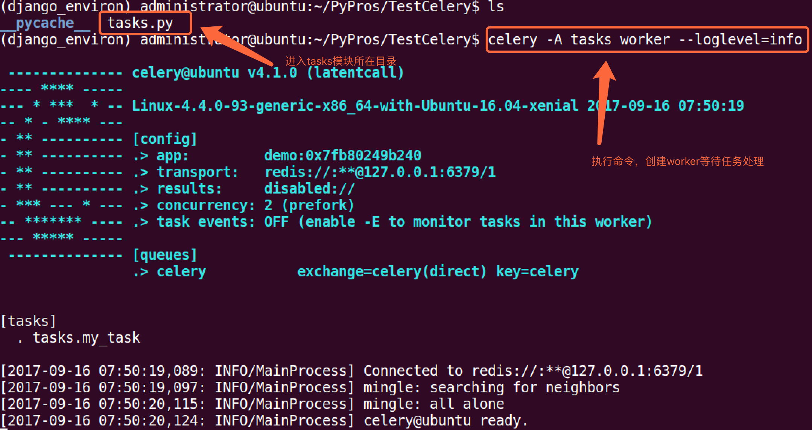
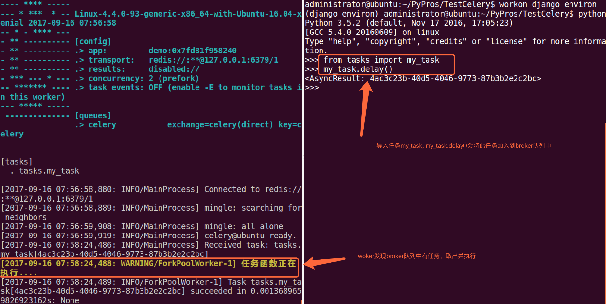
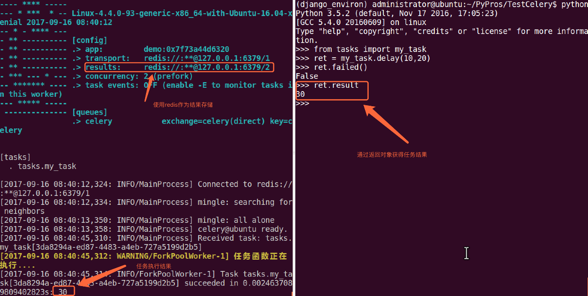

[TOC]

# 一、celery入门




## 1. celery介绍

> Celery是一个功能完备即插即用的任务队列。它使得我们不需要考虑复杂的问题，使用非常简单。celery看起来似乎很庞大，本章节我们先对其进行简单的了解，然后再去学习其他一些高级特性。 celery适用异步处理问题，当发送邮件、或者文件上传, 图像处理等等一些比较耗时的操作，我们可将其异步执行，这样用户不需要等待很久，提高用户体验。 celery的特点是：
>
> - 简单，易于使用和维护，有丰富的文档。
> - 高效，单个celery进程每分钟可以处理数百万个任务。
> - 灵活，celery中几乎每个部分都可以自定义扩展。
>
> celery非常易于集成到一些web开发框架中.


## 2. TaskQueue任务队列

任务队列是一种跨线程、跨机器工作的一种机制.

  任务队列中包含称作任务的工作单元。有专门的工作进程持续不断的监视任务队列，并从中获得新的任务并处理.

  celery通过消息进行通信，通常使用一个叫Broker(中间人)来协client(任务的发出者)和worker(任务的处理者). clients发出消息到队列中，broker将队列中的信息派发给worker来处理。

  一个celery系统可以包含很多的worker和broker，可增强横向扩展性和高可用性能。




## 3. celery安装

> 我们可以使用python的包管理器pip来安装:

```python
pip install -U Celery
```

> 也可从官方直接下载安装包:https://pypi.python.org/pypi/celery/

```python
tar xvfz celery-0.0.0.tar.gz
cd celery-0.0.0
python setup.py build
python setup.py install
```

## 4. Broker

> Celery需要一种解决消息的发送和接受的方式，我们把这种用来存储消息的的中间装置叫做message broker, 也可叫做消息中间人。 作为中间人，我们有几种方案可选择：

### 1）RabbitMQ

RabbitMQ是一个功能完备，稳定的并且易于安装的broker. 它是生产环境中最优的选择。使用RabbitMQ的细节参照以下链接：http://docs.celeryproject.org/en/latest/getting-started/brokers/rabbitmq.html#broker-rabbitmq

如果我们使用的是Ubuntu或者Debian发行版的Linux，可以直接通过下面的命令安装RabbitMQ: sudo apt-get install rabbitmq-server 安装完毕之后，RabbitMQ-server服务器就已经在后台运行。如果您用的并不是Ubuntu或Debian, 可以在以下网址： http://www.rabbitmq.com/download.html 去查找自己所需要的版本软件。

### 2）Redis

Redis也是一款功能完备的broker可选项，但是其更可能因意外中断或者电源故障导致数据丢失的情况。 关于是有那个Redis作为Broker，可访下面网址：http://docs.celeryproject.org/en/latest/getting-started/brokers/redis.html#broker-redis

## 5. Application

使用celery第一件要做的最为重要的事情是需要先创建一个Celery实例，我们一般叫做celery应用，或者更简单直接叫做一个app。app应用是我们使用celery所有功能的入口，比如创建任务，管理任务等，在使用celery的时候，app必须能够被其他的模块导入。

### 1）创建应用

我们首先创建tasks.py模块, 其内容为:

```python
from celery import Celery

# 我们这里案例使用redis作为broker
app = Celery('demo', broker='redis://:332572@127.0.0.1/1')

# 创建任务函数
@app.task
def my_task():
    print("任务函数正在执行....")
```

  Celery第一个参数是给其设定一个名字， 第二参数我们设定一个中间人broker, 在这里我们使用Redis作为中间人。my_task函数是我们编写的一个任务函数， 通过加上装饰器app.task, 将其注册到broker的队列中。

  现在我们在创建一个worker， 等待处理队列中的任务.打开终端，cd到tasks.py同级目录中，执行命令:

```
celery -A tasks worker --loglevel=info
```

显示效果如下: 



### 2）调用任务

  任务加入到broker队列中，以便刚才我们创建的celery workder服务器能够从队列中取出任务并执行。如何将任务函数加入到队列中，可使用delay()。

进入python终端, 执行如下代码:

```
from tasks import my_task
my_task.delay()
```

执行效果如下:

 

我们通过worker的控制台，可以看到我们的任务被worker处理。调用一个任务函数，将会返回一个AsyncResult对象，这个对象可以用来检查任务的状态或者获得任务的返回值。

### 3）存储结果

  如果我们想跟踪任务的状态，Celery需要将结果保存到某个地方。有几种保存的方案可选:SQLAlchemy、Django ORM、Memcached、 Redis、RPC (RabbitMQ/AMQP)。

  例子我们仍然使用Redis作为存储结果的方案，任务结果存储配置我们通过Celery的backend参数来设定。我们将tasks模块修改如下:

```python
from celery import Celery

# 我们这里案例使用redis作为broker
app = Celery('demo',
             backend='redis://:332572@127.0.0.1:6379/2',
             broker='redis://:332572@127.0.0.1:6379/1')

# 创建任务函数
@app.task
def my_task(a, b):
    print("任务函数正在执行....")
    return a + b
```

  我们给Celery增加了backend参数，指定redis作为结果存储,并将任务函数修改为两个参数，并且有返回值。 



更多关于result对象信息，请参阅下列网址:http://docs.celeryproject.org/en/latest/reference/celery.result.html#module-celery.result